# 期末试题答案汇总

整理范围：

- `Exam/2012.pdf`
- `Exam/2013A.pdf`
- `Exam/2013B.pdf`
- `Exam/2014.pdf`
- `Exam/2016.pdf`
- `Exam/2020.pdf`
- `Exam/2022.pdf`
- `Exam/2025.pdf`

说明：

- `2016-Ans.pdf`、`2020-Ans.pdf` 已作为参考材料纳入本答案稿。
- `2014.pdf` 是扫描版，普通文本抽取失败；本答案按页面图片可读题面整理。
- 图形题已在“图形题作图答案索引”中集中绘制，正文保留文字说明和接口代码。
- 接口题中的包名是本答案采用的命名约定，用于体现分层和依赖方向。

---

# 图形题作图答案索引

## 图 1：螺旋模型

对应 `Exam/2013A.pdf` 和 `Exam/2014.pdf` 的螺旋模型题。

<!-- LATEX_DIAGRAM: spiral-model -->

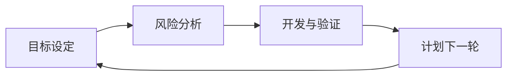

答题要点：每一圈围绕风险展开，顺序写目标设定、风险分析、开发验证、计划下一轮；内圈处理需求和原型风险，外圈处理设计、实现、测试和发布风险。

## 图 2：Web / 校园卡物理包图

对应 `Exam/2020.pdf` 和 `Exam/2022.pdf` 的物理包图题。

<!-- LATEX_DIAGRAM: campus-card-package -->

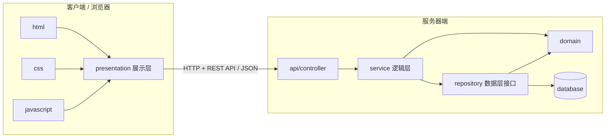

答题要点：客户端必须出现 `html`、`css`、`javascript` 和展示层；服务器端必须出现逻辑层和数据层；跨网络连线标注 `HTTP + REST API`。

## 图 3：Controller-Service-Repository 顺序图

对应 `Exam/2025.pdf` 的三层代码与顺序图题，也可用于 `Exam/2022.pdf` 充值服务。

<!-- LATEX_DIAGRAM: spring-three-layer-sequence -->

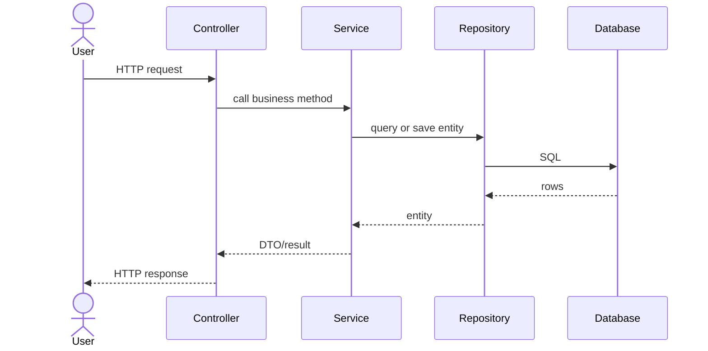

答题要点：Controller 用构造器注入 Service；Service 注入 Repository；Repository 只负责数据访问。

## 图 4：校园卡概念类图

对应 `Exam/2022.pdf` 的校园卡概念类图题。

<!-- LATEX_DIAGRAM: campus-card-concept-class -->

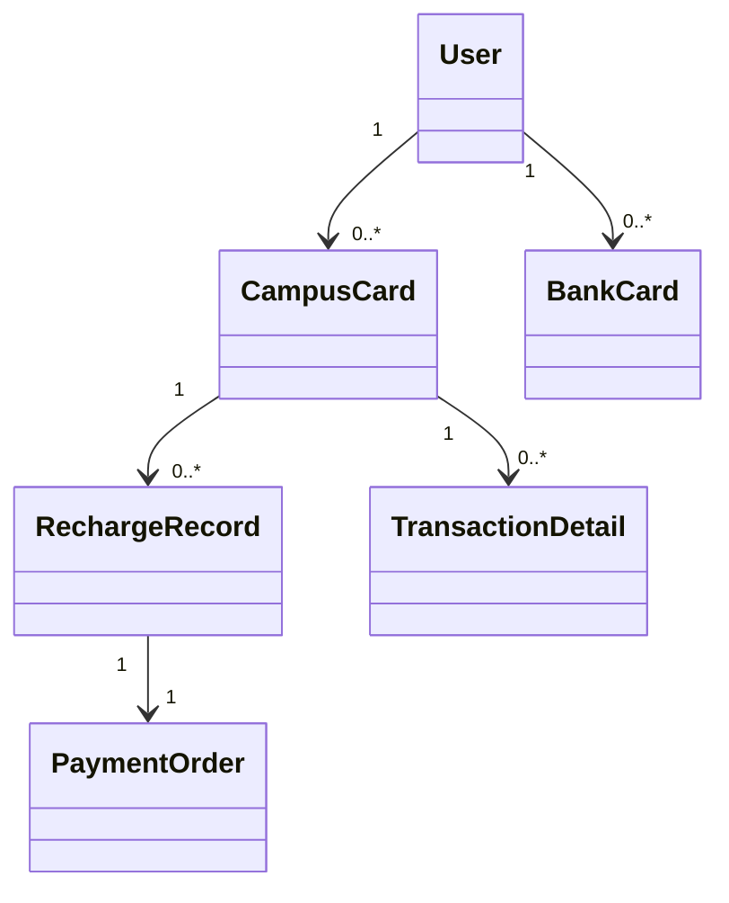

答题要点：概念类图只画问题域概念、属性、关联和多重性，不写 Controller、Service、Repository。

## 图 5：充值服务顺序图

对应 `Exam/2022.pdf` 的充值与查询充值记录题。

<!-- LATEX_DIAGRAM: recharge-sequence -->

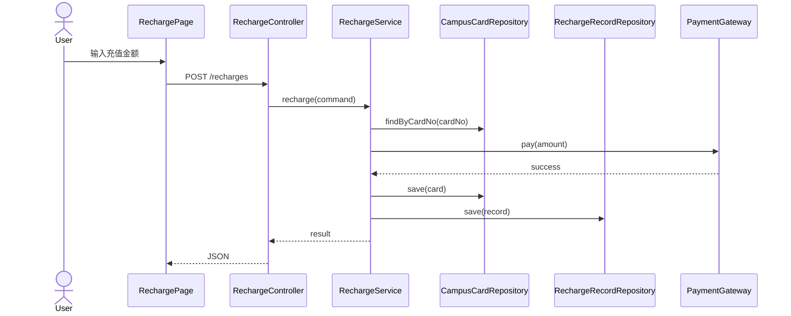

答题要点：支付接口属于外部接口；余额更新和充值记录保存属于 Service 事务范围。

## 图 6：Strategy 策略模式类图

对应 `Exam/2020.pdf`、`Exam/2022.pdf`、`Exam/2025.pdf` 中支付方式、优惠券、课程冲突检测等题。

<!-- LATEX_DIAGRAM: strategy-pattern-class -->

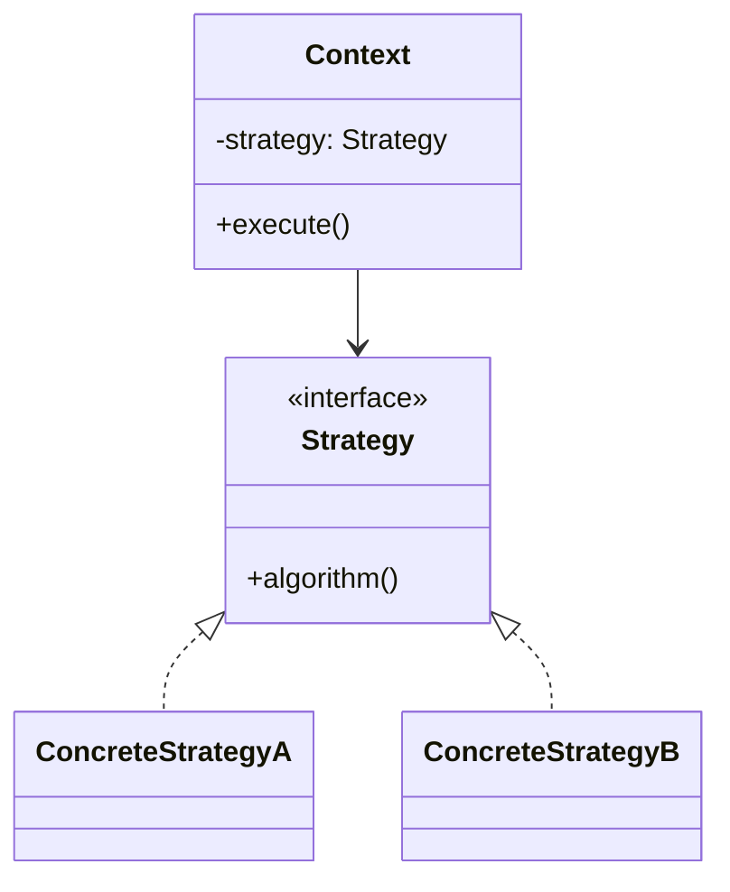

答题要点：把变化的算法抽成接口，新增策略时新增实现类，Context 不改核心流程。

## 图 7：Observer 观察者模式类图

对应 `Exam/2014.pdf` 的 `Student` 与多个 `Display` 更新题。

<!-- LATEX_DIAGRAM: observer-pattern-class -->

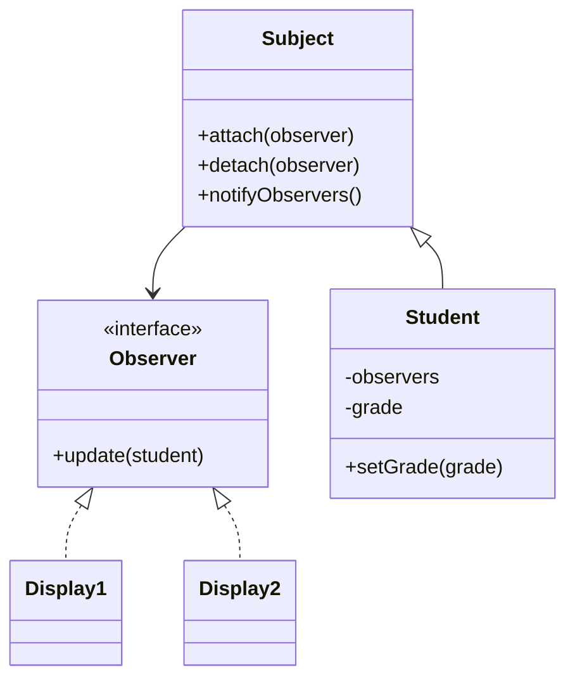

答题要点：`Student` 是 Subject，`Display1` 和 `Display2` 是 Observer；状态变化时通知所有观察者。

## 图 8：ATM 用例图与取款系统顺序图

对应 `Exam/2013B.pdf` 的 ATM 图形题。

<!-- LATEX_DIAGRAM: atm-usecase-sequence -->

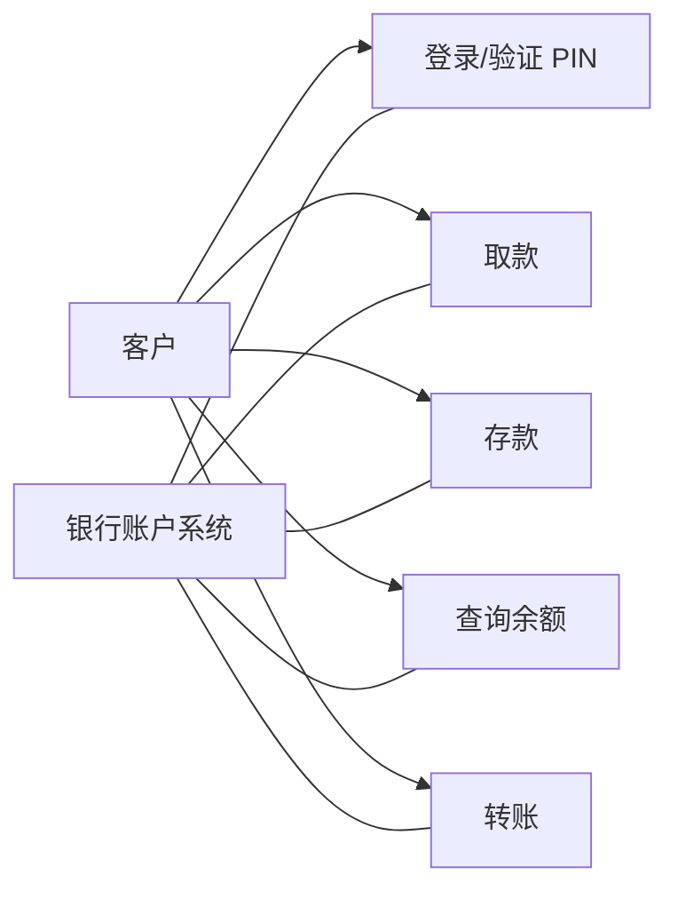

顺序图答题主线：客户插卡；系统验证 PIN；客户输入取款金额；系统向账户系统请求扣款；ATM 出钞；系统打印凭条并退卡。

## 图 9：图书馆系统用例图

对应 `Exam/2014.pdf` 的大学图书馆系统用例建模题。

<!-- LATEX_DIAGRAM: library-usecase -->

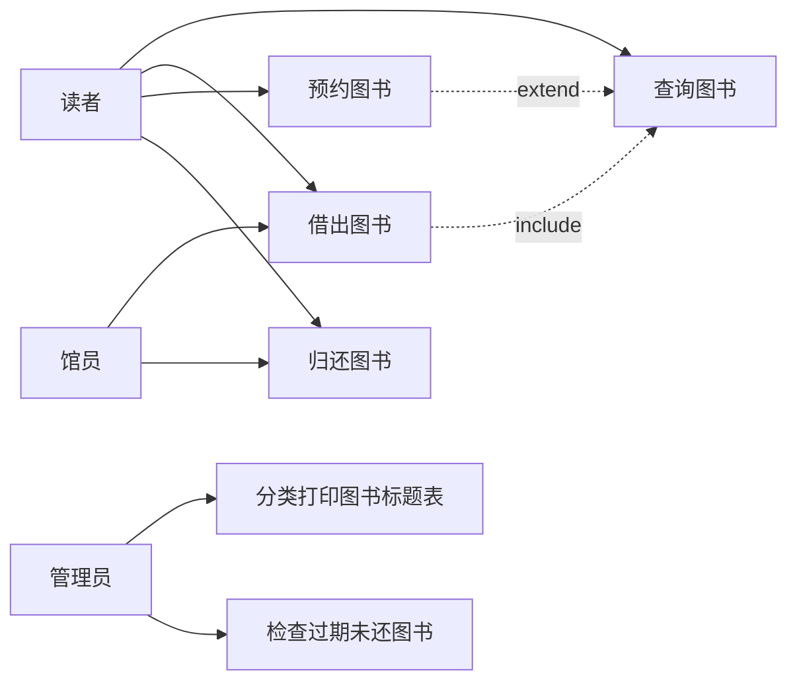

答题要点：参与者在系统边界外，用例在系统边界内；`include` 表示必做公共行为，`extend` 表示条件扩展。

## 图 10：付款模块物理包图

对应 `Exam/2016.pdf` 的支付宝付款模块物理包图题。

<!-- LATEX_DIAGRAM: payment-package -->

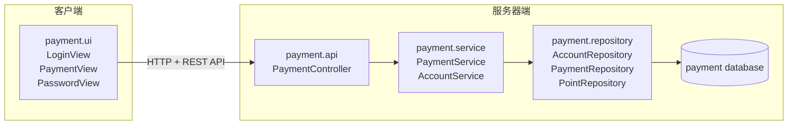

答题要点：展示层与逻辑层接口按界面需要定义；逻辑层与数据层接口按业务规则需要定义。

## 图 11：采购补货概念类图

对应 `Exam/2020.pdf` 的采购补货概念类图题。

<!-- LATEX_DIAGRAM: purchase-concept-class -->

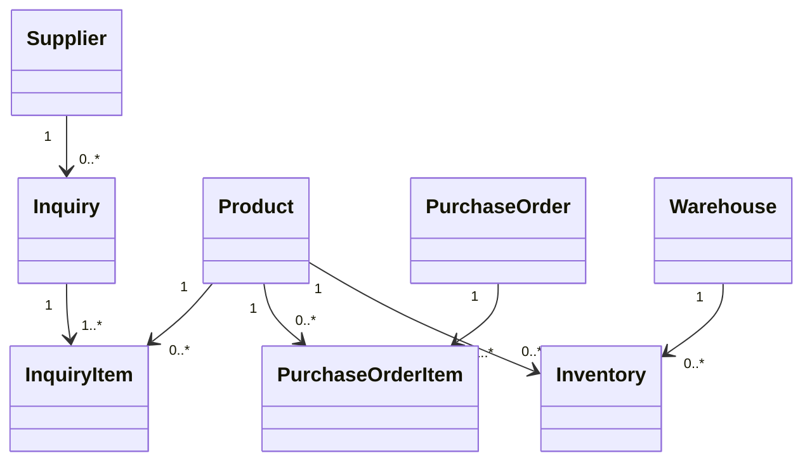

答题要点：先从采购、询价、商品、库存、供应商等名词建立概念，再补充一对多关系和明细类。

## 图 12：CD 推荐设计顺序图

对应 `Exam/2014.pdf` 的职责分配与详细设计顺序图题。

<!-- LATEX_DIAGRAM: cd-recommend-sequence -->

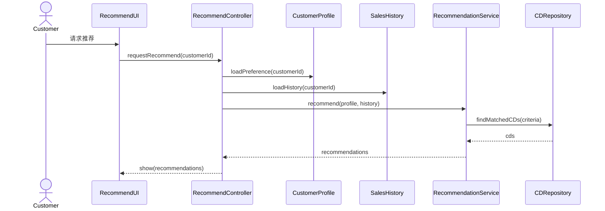

答题要点：信息专家负责掌握数据的对象；Controller 负责接收系统事件；推荐规则放在 Service 中，Repository 负责持久化查询。

# 2012 答案

## 一、名词解释

### 软件工程

软件工程是把系统化、规范化、可度量的方法应用于软件开发、运行和维护的工程活动，并研究这些方法。它关注程序、数据、文档和知识等完整软件制品，目标是在受控的质量、成本和进度下交付可维护的软件系统。

### 可用性

可用性是软件被指定用户在指定使用环境中有效、高效、满意地完成指定任务的程度。常用维度包括易学性、效率、易记性、错误率与恢复能力、用户满意度。

### 功能内聚

功能内聚是高内聚的一种形式，模块内部所有元素共同完成一个明确功能。模块只有一个清晰目标，内部语句和数据都服务于该功能。

## 二、增量交付模型与演化开发模型

增量交付模型把系统按功能优先级拆成多个增量，每个增量经历需求、设计、构造和测试，并交付可运行版本。优点是早交付、早反馈、风险分散；缺点是需要稳定架构和良好的增量规划。

演化开发模型先交付初始版本，再根据用户反馈持续修改和扩展。优点是适合需求变化和探索型系统；缺点是范围控制、进度控制和架构保持更难。

共同点：都不是一次性完成系统，都强调迭代和反馈。区别：增量交付更强调有计划地分批交付功能；演化开发更强调在使用和反馈中持续调整系统。

## 三、超市销售用例分析类图

概念类：

- `Cashier`：收银员。
- `Customer`：顾客。
- `Sale`：销售。
- `SalesLineItem`：销售明细项。
- `Product`：商品。
- `Payment`：付款。
- `Receipt`：收据。

关系：

- 一个 `Sale` 由一个 `Cashier` 处理。
- 一个 `Sale` 面向一个 `Customer`。
- 一个 `Sale` 组合多个 `SalesLineItem`。
- 每个 `SalesLineItem` 关联一个 `Product`，并记录数量和小计。
- 一个 `Sale` 关联一个 `Payment`。
- 一个 `Sale` 生成一个 `Receipt`。

重要属性：

```text
Sale: saleId, dateTime, total
SalesLineItem: quantity, subtotal
Product: productId, description, price
Payment: amount, change
Receipt: receiptNo, printTime
```

## 四、销售用例详细设计

题目要求所有销售设计因素写在一个模块、数据在 `Sales.txt`、集中式控制。可设计为：

```text
SalesModule
  SalesView
  SalesController
  SalesLogic
  SalesData
```

集中式顺序：

```text
Cashier -> SalesView: inputProduct(productId, quantity)
SalesView -> SalesController: enterItem(productId, quantity)
SalesController -> SalesLogic: addLineItem(productId, quantity)
SalesLogic -> SalesData: findProduct(productId)
SalesData --> SalesLogic: Product
SalesLogic -> SalesLogic: calculateSubtotal()
SalesController -> SalesView: showLineItem()
Cashier -> SalesView: finishSale()
SalesView -> SalesController: finish()
SalesController -> SalesLogic: calculateTotal()
SalesLogic -> SalesData: saveSale(sale)
SalesController -> SalesView: printReceipt()
```

设计过程：

1. 从用例事件识别界面事件。
2. 由 `SalesController` 集中接收系统事件。
3. 由 `SalesLogic` 处理销售规则。
4. 由 `SalesData` 隐藏 `Sales.txt` 读写。
5. 由 `SalesView` 只负责显示和输入。

## 五、信息隐藏分析

`SalesView` 隐藏界面控件和事件响应；`SalesLogic` 隐藏销售总额计算规则；`SalesData` 隐藏文件名、文件格式、记录读取和解析。

违反信息隐藏的点：`SalesLogic` 直接创建 `SalesData` 并依赖其具体实现，且调用数据层文件相关方法时会暴露存储细节。改进方式：

```java
public interface SalesRepository {
    int getTotalBySalesId(int id);
}

public class FileSalesRepository implements SalesRepository {
    public int getTotalBySalesId(int id) {
        return 0;
    }
}

public class SalesLogic {
    private final SalesRepository salesRepository;

    public SalesLogic(SalesRepository salesRepository) {
        this.salesRepository = salesRepository;
    }
}
```

## 六、DIP 分析

`SalesLogic` 直接依赖 `SalesData` 违反依赖倒置原则。高层业务逻辑不应依赖低层数据访问实现，二者都应依赖抽象接口。修正方式是定义 `SalesRepository` 接口，`SalesLogic` 依赖接口，文件存储和数据库存储分别实现接口。

## 七、Singleton

题目要求 `SalesData` 只有一个实例，可使用 Singleton。

```java
public final class SalesData {
    private static final SalesData INSTANCE = new SalesData();

    private SalesData() {
    }

    public static SalesData getInstance() {
        return INSTANCE;
    }
}
```

注意：现代项目中优先使用依赖注入管理单例生命周期，避免可变全局状态。

## 八、防御式编程与测试驱动

`num1` 范围是 `-1..22767`，`num2` 范围是 `-100..12767`。

```java
public int add(int num1, int num2) {
    if (num1 < -1 || num1 > 22767) {
        throw new IllegalArgumentException("num1 out of range");
    }
    if (num2 < -100 || num2 > 12767) {
        throw new IllegalArgumentException("num2 out of range");
    }
    return num1 + num2;
}
```

测试用例：

```text
(-1, -100) -> -101
(22767, 12767) -> 35534
(-2, 0) -> exception
(22768, 0) -> exception
(0, -101) -> exception
(0, 12768) -> exception
```

## 九、团队管理

团队管理要覆盖角色分工、任务拆分、进度跟踪、版本管理、代码审查、持续集成、测试计划、风险管理和沟通机制。答题时结合实验说明，可写：

- 需求和任务进入迭代计划。
- 每个任务有负责人和验收标准。
- 使用 Git 分支和 Pull Request。
- 合并前通过测试和审查。
- 每周同步风险、进度和接口变化。

---

# 2013A 答案

## 一、名词解释

### 软件工程

同 2012 第一题。

### 软件演化生命周期模型

软件经历初始开发、运行服务、持续演化、逐步淘汰和停止服务。它强调软件交付后仍会因需求、环境和技术变化而长期修改。

### 螺旋模型

螺旋模型以风险驱动为核心，每一轮包括目标设定、风险分析、开发验证和计划下一轮。它结合原型、迭代和风险控制，适合大型高风险系统。

## 二、应用描述代码重构

问题：

- `getDescriptionForiOS` 和 `getDescriptionForAndroid` 重复代码。
- 平台差异以方法重复表达，新增平台要修改 `Application`。
- 违反 DRY、SRP、OCP。

重构：使用 Strategy。

```java
public interface DescriptionStrategy {
    String platformLine(String applicationName);
    String rateSourceLine();
}

public class IosDescriptionStrategy implements DescriptionStrategy {
    public String platformLine(String applicationName) {
        return "This is " + applicationName + " for iOS platform\n";
    }

    public String rateSourceLine() {
        return "Average Rate from App Store\n";
    }
}

public class AndroidDescriptionStrategy implements DescriptionStrategy {
    public String platformLine(String applicationName) {
        return "This is " + applicationName + " for Android platform\n";
    }

    public String rateSourceLine() {
        return "Average Rate from Google Play\n";
    }
}
```

`Application`：

```java
public String getDescription(DescriptionStrategy strategy) {
    StringBuilder result = new StringBuilder();
    result.append(strategy.platformLine(applicationName));
    for (NewFeature feature : newFeatureItems) {
        result.append(feature.getDescription());
    }
    result.append(strategy.rateSourceLine());
    result.append(averageRate);
    return result.toString();
}
```

## 三、电影租赁积分

原设计问题：

- `Customer` 通过 `rental.getMovieRented().getPriceCode()` 访问深层对象，违反 Law of Demeter。
- 积分规则放在 `Customer` 中，信息专家不合适。
- 使用类型码判断电影类型，扩展性差。

改进：把积分计算放到 `Rental` 或 `Movie`。

```java
public class Customer {
    private Rental rental;

    int getNewRentPoint() {
        return rental.getPoint();
    }
}

public class Rental {
    private int daysRented;
    private Movie movieRented;

    int getPoint() {
        return movieRented.getPoint(daysRented);
    }
}

public class Movie {
    private int priceCode;

    int getPoint(int daysRented) {
        if (priceCode == NEW_RELEASE && daysRented > 1) {
            return 2;
        }
        return 1;
    }
}
```

顺序图答案：

```text
Customer -> Rental: getPoint()
Rental -> Movie: getPoint(daysRented)
Movie --> Rental: point
Rental --> Customer: point
```

## 四、继承设计

`MyStack extends Vector` 不合理。Stack 只需要压栈、弹栈、大小和空判断，继承 `Vector` 会暴露大量不属于栈的操作，违反封装和 LSP。改用组合：

```java
public class MyStack {
    private final Vector elements = new Vector();

    public void push(Object element) {
        elements.insertElementAt(element, 0);
    }

    public Object pop() {
        Object result = elements.firstElement();
        elements.removeElementAt(0);
        return result;
    }
}
```

`Employee extends Person` 合理，员工是人，子类没有改变父类语义。若题目关注领域职责，也可让 `Employee` 扩展工号、职位等属性。

## 五、耦合类型

第一段 `validate_request` 调用 `valid_month(date d)`，传入日期对象并只使用月份字段，属于印记耦合。改进：只传 `month`。

第二段 `valid(String s, int type)` 使用类型码控制内部逻辑，属于控制耦合。改进：拆成 `validString`、`validDate`，或使用 Validator 策略。

## 六、ATM 需求

业务需求：提供自助金融服务，减少柜台压力，提高存取款和查询效率。

用户需求：

- 用户插卡并输入密码后进行取款。
- 用户查询账户余额。
- 用户完成转账。

系统级需求：

- 当用户输入正确 PIN 时，系统应显示可用业务菜单。
- 当用户提交取款金额且余额充足时，系统应出钞并更新余额。

功能需求：存款、取款、余额查询、转账、打印凭条、退卡。

其他需求：安全性、性能、可靠性、可用性、对外接口、硬件接口、数据需求、约束。

## 七、栈测试

测试思路：

- 空栈判断。
- 单元素 push/pop。
- 多元素后进先出。
- 弹出后大小变化。
- 空栈 pop 异常。

示例：

```java
MyStack stack = new MyStack();
assertTrue(stack.isEmpty());
stack.push("A");
stack.push("B");
assertEquals("B", stack.pop());
assertEquals("A", stack.pop());
assertTrue(stack.isEmpty());
```

## 八、Eclipse HCI 优点

- 菜单和工具栏分类清楚，体现一致性和识别优于回忆。
- 编辑器、项目树、控制台布局稳定，体现空间记忆。
- 错误标记和自动提示反馈及时，体现系统状态可见。
- 快捷键和插件扩展支持专家用户，体现灵活性和效率。

## 九、税率代码改进

使用表驱动：

```java
private static final double[] LIMITS = {10000, 20000, 30000, 40000};
private static final double[] RATES = {0.10, 0.12, 0.15, 0.18, 0.20};

public double tax(double income) {
    if (income <= 0) {
        return 0;
    }
    double tax = 0;
    double previous = 0;
    for (int i = 0; i < LIMITS.length; i++) {
        if (income > LIMITS[i]) {
            tax += (LIMITS[i] - previous) * RATES[i];
            previous = LIMITS[i];
        } else {
            tax += (income - previous) * RATES[i];
            return tax;
        }
    }
    tax += (income - previous) * RATES[RATES.length - 1];
    return tax;
}
```

---

# 2013B 答案

## 一、名词解释

软件工程：同 2012 第一题。

软件验证与确认：

- 验证：检查软件是否正确实现规格说明，即“是否正确地构建产品”。
- 确认：检查软件是否满足用户真实需求，即“是否构建了正确的产品”。

增量开发模型和迭代开发模型：

- 增量强调分批交付功能。
- 迭代强调重复执行开发活动并逐步改进。
- 实际项目中常合并为迭代增量开发。

## 二、借阅者设计

原代码问题：

- 用整数类型码区分本科生、研究生、教师。
- `Borrower` 同时包含三类借阅规则，违反 OCP 和 SRP。
- 新增借阅者类型要修改原类。

改进：使用继承或策略。

```java
public abstract class Borrower {
    protected int maxBorrowCount;

    public abstract void borrowBook(Book book);
}

public class UndergraduateBorrower extends Borrower {
    public UndergraduateBorrower() {
        this.maxBorrowCount = 5;
    }

    public void borrowBook(Book book) {
        // borrow normal book
    }
}

public class GraduateBorrower extends Borrower {
    public GraduateBorrower() {
        this.maxBorrowCount = 10;
    }

    public void borrowBook(Book book) {
        // borrow book
    }
}

public class TeacherBorrower extends Borrower {
    public TeacherBorrower() {
        this.maxBorrowCount = 20;
    }

    public void borrowBook(Book book) {
        // borrow book and notify return when unavailable
    }
}
```

## 三、`getSubtotal` 内聚

原方法在 `Sales` 中根据商品 ID 找商品价格、找销售明细数量、计算小计。问题：

- `Sales` 过度了解 `Commodity` 和 `SalesLineItem`。
- 方法包含查找和计算两类职责，内聚不足。
- 违反信息专家原则。

改进：把小计计算放到 `SalesLineItem`。

```text
Sales -> SalesLineItem: getSubtotal()
SalesLineItem -> Commodity: getPrice()
Commodity --> SalesLineItem: price
SalesLineItem --> Sales: subtotal
```

## 四、正方形继承长方形

不合理。长方形允许独立设置长和宽，正方形要求长宽相等。正方形继承长方形后会加强父类不变式，违反 LSP。

改进：

```java
public interface Shape {
    int area();
}

public class Rectangle implements Shape {
    private int length;
    private int width;
    public int area() { return length * width; }
}

public class Square implements Shape {
    private int side;
    public int area() { return side * side; }
}
```

## 五、Top50 平均成绩

`Grade` 直接依赖 `ArrayList<Student>` 并调用排序，属于内容耦合或过强的具体类型耦合。改进：

- 参数改为 `List<Student>`。
- 排序逻辑独立为 `StudentRanker`。
- `Grade` 只负责平均值计算。

```java
public float averageGradeForTop50(List<Student> students) {
    List<Student> sorted = ranker.rankByGrade(students);
    return sorted.stream().limit(50)
            .mapToInt(Student::getGrade)
            .average()
            .orElse(0);
}
```

## 六、ATM 用例图与系统顺序图

参与者：用户、银行主机、维护人员。

用例：登录/验证 PIN、取款、存款、查询余额、转账、打印凭条、退卡、维护设备。

取款系统顺序图：

```text
User -> ATMSystem: insertCard(card)
User -> ATMSystem: inputPin(pin)
ATMSystem -> BankHost: verify(card, pin)
BankHost --> ATMSystem: verified
User -> ATMSystem: withdraw(amount)
ATMSystem -> BankHost: debit(account, amount)
BankHost --> ATMSystem: approved
ATMSystem -> User: dispenseCash(amount)
ATMSystem -> User: printReceipt()
```

## 七、有理数黑盒测试

等价类：

- 正数、负数、零。
- 分母为零。
- 可约分和不可约分。
- 除数为零。

测试：

```text
1/2 + 1/3 = 5/6
-1/2 + 1/2 = 0/1
2/4 规范化为 1/2
1/2 dividedBy 1/4 = 2/1
1/2 dividedBy 0/1 -> exception
1/0 -> exception
```

## 八、浏览器 HCI 优点

- 地址栏和搜索合一，减少记忆负担。
- 标签页支持并行任务，体现用户控制。
- 前进、后退、刷新图标标准化，体现一致性。
- 加载进度和安全锁图标显示系统状态。

## 九、月份天数表驱动

见 05 讲义表驱动示例。核心是使用数组替代长 `if-else`，并检查月份范围。

---

# 2014 答案

## 一、名词解释

软件工程：同 2012 第一题。

软件设计：在需求和实现之间建立解决方案结构的活动，决定系统如何分解为模块、组件、类、接口、数据结构和交互关系。

## 二、螺旋模型

螺旋模型每一轮围绕风险展开：

1. 确定目标、方案和约束。
2. 识别和分析风险，构建原型或验证方案。
3. 开发和验证当前版本。
4. 计划下一轮迭代。

优点：风险驱动，适合大型复杂系统；支持迭代和用户反馈；能在早期暴露关键风险。缺点：管理成本高，需要风险分析能力；不适合小型低风险项目。

## 三、质量保障活动

项目质量保障活动包括：

- 制定质量计划和质量标准。
- 需求评审、设计评审和代码审查。
- 单元测试、集成测试、系统测试和验收测试。
- 静态分析和度量。
- 配置管理和变更控制。
- 缺陷跟踪和回归测试。
- 过程审计和发布前检查。

## 四、图书馆系统用例建模

参与者：

- 借书人。
- 管理员。
- 外部大学数据库。
- 时间或定时器。

用例：

- 查询图书。
- 借出图书。
- 预约图书。
- 归还图书。
- 登记新书到达。
- 分类打印图书标题表。
- 检查过期未还图书。
- 下载借书人信息。

关系：

- 借出图书 include 查询图书可借状态。
- 预约图书 extend 图书不可借。
- 归还图书 include 更新图书状态。

## 五、代码内聚

`init()` 同时初始化 `FinancialReport`、`WeatherData` 和 `totalcount`，这些职责属于不同功能，属于偶然内聚或逻辑内聚，达不到功能内聚。

改进：

```java
void init() {
    initFinancialReport();
    initWeatherData();
    initMasterCount();
}

private void initFinancialReport() { }
private void initWeatherData() { }
private void initMasterCount() { }
```

进一步改进是把财务报表和天气数据的创建放到各自工厂或服务中。

## 六、CD 推荐用例职责分配

题面给出顾客查询、系统返回推荐列表、顾客选定 CD、系统返回详情、顾客购买的流程。

职责分配：

- `CustomerView` 负责展示输入和结果。
- `QueryController` 接收查询请求和购买请求。
- `RecommendationService` 生成推荐列表。
- `CDRepository` 查询 CD 基本信息和详细信息。
- `PurchaseService` 处理购买。
- `PurchaseRepository` 保存购买记录。

设计顺序图：

```text
Customer -> CustomerView: submitQuery(query)
CustomerView -> QueryController: query(query)
QueryController -> RecommendationService: recommend(query)
RecommendationService -> CDRepository: findMatchedCDs(query)
CDRepository --> RecommendationService: cdList
RecommendationService --> QueryController: recommendationList
QueryController --> CustomerView: showList(list)
Customer -> CustomerView: selectCD(cdId)
CustomerView -> QueryController: showDetail(cdId)
QueryController -> CDRepository: findDetail(cdId)
CDRepository --> QueryController: detail
QueryController --> CustomerView: showDetail(detail)
Customer -> CustomerView: buy(cdId)
CustomerView -> QueryController: buy(cdId)
QueryController -> PurchaseService: purchase(customerId, cdId)
PurchaseService -> PurchaseRepository: save(purchase)
```

## 七、Observer 模式

结构：

- `Student` 是 Subject，保存 `id`、`name`、`birthday`。
- `Display1` 和 `Display2` 是 Observer。
- `Display3` 修改 `Student`。
- `Student` 数据变化后通知 `Display1` 和 `Display2` 更新。

示例：

```java
public interface Observer {
    void update(Student student);
}

public class Student {
    private String id;
    private String name;
    private String birthday;
    private final List<Observer> observers = new ArrayList<>();

    public void attach(Observer observer) {
        observers.add(observer);
    }

    public void modify(String id, String name, String birthday) {
        this.id = id;
        this.name = name;
        this.birthday = birthday;
        notifyObservers();
    }

    private void notifyObservers() {
        for (Observer observer : observers) {
            observer.update(this);
        }
    }
}
```

## 八、HCI 原则

打印界面：

- 信息密度高，用户需要理解多个选项，增加记忆负担。
- 按钮和选项分组不够清晰，影响效率。
- 打印机、页码、份数等字段体现了系统状态可见。

Office 2010 Ribbon：

- 常用命令图形化，体现识别优于回忆。
- 相近功能分组，体现一致性和任务组织。
- 图标加文字降低学习成本。
- 功能较多，初学者仍有认知负担。

## 九、黑盒与白盒测试

黑盒测试根据需求规格设计测试，不关注内部代码结构。优点是贴近用户需求，适合功能、边界值和等价类测试；缺点是内部路径覆盖不可见。

白盒测试根据代码结构设计测试。优点是能覆盖语句、分支、条件和路径；缺点是依赖代码实现，对需求遗漏不敏感。

对正确性要求高且分支复杂的程序，使用路径覆盖或分支覆盖。随机选择不能保证覆盖关键分支；语句覆盖弱于分支覆盖；分支覆盖能覆盖每个判断结果；路径覆盖更强但成本高。

---

# 2016 答案

## 一、简答

软件工程：同 2012 第一题。

演化模型：同 01 讲义。优点是适合需求变化、用户反馈充分、逐步交付；缺点是范围和进度难控制，过程管理弱时会退化成随意修改。

正向工程与逆向工程：

- 正向工程从需求和设计到代码和文档。
- 逆向工程从已有系统分析其部件、关系、需求和设计。
- 正向工程关注构造，逆向工程关注理解和抽象恢复。

## 二、支付宝用例图

参与者：消费者、商家、支付平台、银行或第三方账户系统。

用例：

- 扫描商家二维码付款。
- 出示付款码付款。
- 输入金额。
- 输入支付密码。
- 选择付款方式。
- 使用优惠券或红包抵扣。
- 生成支付记录。

关系：

- 扫码付款 include 输入金额、选择付款方式、输入支付密码。
- 出示付款码付款 include 选择付款方式、验证支付密码。
- 使用优惠券或红包 extend 付款。

## 三、支付概念类图

概念类：

- `Consumer`
- `Merchant`
- `PaymentCode`
- `PaymentMethod`
- `HuabeiPayment`
- `BalancePayment`
- `YuEBaoPayment`
- `BankCardPayment`
- `Coupon`
- `RedPacket`
- `PaymentRecord`
- `AntPoint`

关系：

- `Consumer` 拥有多个 `PaymentMethod`、多个 `Coupon`、多个 `RedPacket`。
- `PaymentMethod` 是抽象概念，花呗、余额、余额宝、银行卡是具体方式。
- `Consumer` 产生 `PaymentCode`。
- `Consumer` 向 `Merchant` 发起支付。
- 一次支付生成一条 `PaymentRecord`。
- `PaymentRecord` 关联付款方式、商家、金额、时间。
- `AntPoint` 与消费者账户关联。

## 四、付款模块物理包图与接口

物理包图：

```text
Client
  html
  css
  javascript
  presentation.payment

Client.presentation.payment --HTTP/REST API--> Server.api

Server
  api.payment
  service.payment
  service.impl.payment
  repository.account
  repository.payment
  repository.point
  domain
  database
```

接口：

```java
package alipay.payment.service;

public interface PaymentService {
    LoginResult login(LoginCommand command);
    PaymentPreview fillAmount(PaymentAmountCommand command);
    PaymentResult pay(PaymentCommand command);
}
```

```java
package alipay.payment.repository;

public interface AccountRepository {
    Account findByLoginId(String loginId);
    void save(Account account);
}
```

```java
package alipay.payment.repository;

public interface PaymentRecordRepository {
    void save(PaymentRecord record);
}
```

```java
package alipay.payment.repository;

public interface PointRepository {
    void save(PointChange change);
}
```

## 五、支付详细设计关系

```text
PaymentView -> PaymentController
PaymentController -> PaymentService
PaymentService -> HuabeiService
PaymentService -> UserService
PaymentService -> PaymentRepository
HuabeiService -> HuabeiRepository
UserService -> UserRepository
PaymentService -> PointService
PointService -> PointRepository
```

顺序：

```text
PaymentView -> PaymentController: pay(command)
PaymentController -> PaymentService: pay(command)
PaymentService -> HuabeiService: debit(userId, amount)
PaymentService -> UserService: updateBalanceOrState(userId)
PaymentService -> PointService: addPoint(userId, amount)
PaymentService -> PaymentRepository: save(record)
PaymentService --> PaymentController: result
PaymentController --> PaymentView: result
```

## 六、消除印记耦合

印记耦合是传入整个对象或数据结构，但被调用方只使用其中一部分。消除方式：

- 只传需要的字段。
- 提取专用参数对象。
- 把行为移动到拥有数据的对象中。
- 不暴露完整内部结构。

## 七、会员等级积分策略

使用 Strategy。

```java
public interface PointStrategy {
    int calculate(int amount);
}

public class ALevelPointStrategy implements PointStrategy {
    public int calculate(int amount) { return amount; }
}

public class BLevelPointStrategy implements PointStrategy {
    public int calculate(int amount) { return amount / 2; }
}

public class SLevelPointStrategy implements PointStrategy {
    public int calculate(int amount) { return amount * 2; }
}
```

会员类持有 `PointStrategy`，新增 S 级时新增策略类。

## 八、表驱动

把等级和积分规则放入表或 Map：

```java
Map<MemberLevel, PointStrategy> strategies = Map.of(
        MemberLevel.A, new ALevelPointStrategy(),
        MemberLevel.B, new BLevelPointStrategy(),
        MemberLevel.S, new SLevelPointStrategy()
);
```

## 九、更改密码黑盒测试

测试维度：

- 用户存在/不存在。
- 旧密码正确/错误。
- 新密码合法/非法。
- 新密码与旧密码相同/不同。
- 连续错误导致锁定。

示例：

```text
user, old=123456, new=abcdef1 -> 成功
user, old=wrong, new=abcdef1 -> 失败
unknown, old=123456, new=abcdef1 -> 失败
user, old=123456, new=123456 -> 失败
user, old=123456, new=abc -> 失败
连续三次旧密码错误 -> 账户锁定
```

## 十、支付宝界面 HCI

语言切换界面：

- 使用语言自身显示选项，识别优于回忆。
- 列表结构清楚，一致性好。
- 当前选中项可见，反馈明确。

字体大小界面：

- 预览文本体现即时反馈。
- 滑块或分档控制降低记忆负担。
- 操作结果可逆，体现用户控制。

---

# 2020 答案

## 一、简答

软件工程：同 2012 第一题。

持续集成：

- 好处：早发现集成问题、减少手工构建错误、保证主干可运行、缩短反馈周期。
- 工具链：Git、GitHub/GitLab、Maven/Gradle、JUnit、静态分析、CI 服务、制品库、部署脚本。

软件生命周期：

软件从设想、需求、设计、构造、测试、部署、运行维护到退役的全过程。模型示例：瀑布模型、迭代增量模型、演化模型、螺旋模型。

## 二、采购补货用例与需求分类

用例 1：手工创建询价单。

- 参与者：采购人员。
- 流程：登录系统；进入询价单；新建询价单；输入供应商、产品、数量；保存。

用例 2：自动生成采购询价单。

- 参与者：库管员，仓库经理。
- 流程：仓库经理设置再订货规则；库管员运行排程；系统读取规则、销售订单和库存；系统生成采购询价单。

需求分类：

- “补货数含非数字字符时系统提示输入错误”是功能需求，因为它描述系统对非法输入的响应。
- “收入金额不能含非数字字符”是数据需求，因为它规定数据字段的格式约束。

## 三、采购补货概念类图

概念类：

- `WarehouseManager`
- `StockKeeper`
- `ReorderRule`
- `Schedule`
- `Inventory`
- `SalesOrder`
- `PurchaseRequisition`
- `Product`
- `Supplier`

关系：

- 仓库经理设置多个再订货规则。
- 库管员运行排程。
- 排程读取库存、销售订单和再订货规则。
- 排程生成采购询价单。
- 采购询价单包含多个产品项。
- 产品关联供应商。

重要属性：

```text
ReorderRule: ruleId, threshold, productId
Inventory: productId, quantity
SalesOrder: orderId, status
PurchaseRequisition: requisitionId, createdAt, status
Product: productId, name
Supplier: supplierId, name
```

## 四、物理包图与接口

物理包图按“图 2：Web / 校园卡物理包图”的分层方式绘制，功能模块替换为销售、采购、仓库、会计、发票、付款、收款。

接口：

```java
package erp.purchase.service;

public interface ReplenishmentService {
    ScheduleResult runSchedule(RunScheduleCommand command);
}
```

```java
package erp.purchase.repository;

public interface ReorderRuleRepository {
    List<ReorderRule> findActiveRules();
}
```

```java
package erp.purchase.repository;

public interface InventoryRepository {
    Inventory findByProductId(String productId);
}
```

```java
package erp.purchase.repository;

public interface PurchaseRequisitionRepository {
    void save(PurchaseRequisition requisition);
}
```

## 五、订货规则详细设计

具体天数和销量变化属于业务规则参数变化。用配置表、规则对象或策略对象封装。

新增活动计算方式属于算法变化。使用 Strategy：

```java
public interface ReorderPolicy {
    int calculate(ReorderContext context);
}

public class LeadTimeReorderPolicy implements ReorderPolicy {
    public int calculate(ReorderContext context) {
        return 0;
    }
}

public class PromotionReorderPolicy implements ReorderPolicy {
    public int calculate(ReorderContext context) {
        return context.promotionStock() * context.promotionScale()
                + context.baseStock();
    }
}
```

顺序图：

```text
ScheduleService -> ReorderPolicy: calculate(context)
ReorderPolicy -> Activity: getScale()
ReorderPolicy -> SalesVolume: getBaseStock()
ReorderPolicy --> ScheduleService: quantity
ScheduleService -> PurchaseOrder: create(product, quantity)
ScheduleService -> PurchaseOrderRepository: save(order)
```

## 六、耦合

第一段：`validate_request` 传入 `date`，`valid_month` 只用月份，属于印记耦合。改为传 `month`，或把 `isValidMonth()` 放到 `date` 对象中。

第二段：`valid(String s, int type)` 使用类型码控制分支，属于控制耦合。改为多个验证器：

```java
public interface Validator<T> {
    boolean valid(T value);
}
```

## 七、DAO 模式

使用 Abstract Factory 或 Factory Method 组织 DAO 创建。业务层依赖 DAO 接口，MySQL DAO 和 SQL Server DAO 是具体实现。

```text
DaoFactory
  createProductDao()
  createOrderDao()

MySqlDaoFactory
SqlServerDaoFactory

ProductDao
MySqlProductDao
SqlServerProductDao
```

使用原则：DIP、OCP、面向接口编程、信息隐藏。

## 八、订货规则代码问题

问题：

- 方法名和参数名无意义。
- `7`、`15`、`20`、`30`、`40` 是 magic number。
- 分支重复且边界表达不清。
- 没有处理非法输入。
- 题面规则缺少 16 到 19 天的处理，需要补充业务规则。

改进示例：

```java
public int calculateStockDays(int leadTimeDays) {
    if (leadTimeDays < 0) {
        throw new IllegalArgumentException("leadTimeDays must be non-negative");
    }
    if (leadTimeDays <= 3) return 7;
    if (leadTimeDays <= 7) return 15;
    if (leadTimeDays <= 10) return 20;
    if (leadTimeDays <= 15) return 30;
    if (leadTimeDays >= 20) return 40;
    throw new IllegalArgumentException("leadTimeDays rule missing");
}
```

## 九、HCI 点评

按截图可从以下角度答：

- 菜单层次和按钮布局是否符合任务顺序。
- 关键状态是否可见。
- 常用操作是否靠近操作对象。
- 错误信息是否可恢复。
- 是否保持术语、颜色、位置一致。

## 十、边界值测试

边界是 3、7、10、15、20。测试值：

```text
2, 3, 4
6, 7, 8
9, 10, 11
14, 15, 16
19, 20, 21
```

这些用例能暴露边界闭开区间错误，也能暴露 16 到 19 天规则缺口。

---

# 2022 答案

## 一、简答

软件工程：同 2012 第一题。

配置管理变更控制：提交 CR；影响分析；风险评估；CCB 审查；批准后制定实施和回滚计划；执行变更；更新基线；配置审计；上线验证；状态报告。

迭代增量模型和演化模型：见 01 讲义高频考点。

## 二、校园卡需求获取

用例：

- 登录。
- 查询余额。
- 校园卡充值。
- 查询充值记录。
- 绑定银行卡。
- 查询消费明细。
- 挂失校园卡。
- 解除挂失。
- 修改密码。

充值需求：

```text
业务需求：提高校园卡充值业务自助办理比例，减少人工窗口压力。
用户需求：持卡人希望在线完成充值并查看充值结果。
系统级需求：当支付平台返回成功结果时，系统应更新校园卡余额并生成充值记录。
```

API 供其他管理系统调用属于对外接口需求。其他接口包括支付平台接口、统一认证接口、校园卡中心接口、短信或消息通知接口。

## 三、校园卡概念类图

概念类：

- `User`
- `CampusCard`
- `RechargeRecord`
- `BankCard`
- `TransactionDetail`
- `PaymentOrder`

关系：

- 一个用户拥有零张或多张校园卡。
- 一张校园卡对应零条或多条充值记录。
- 一个用户绑定零张或多张银行卡。
- 一条充值记录对应一个支付订单。
- 一张校园卡对应零条或多条消费明细。

## 四、物理包图与充值接口

物理包图见“图 2：Web / 校园卡物理包图”，把功能模块填为登录、充值、充值记录、余额查询、挂失、交易记录。

展示层和逻辑层接口：

```java
package campus.card.service;

public interface RechargeService {
    RechargeResult recharge(RechargeCommand command);
    List<RechargeRecordView> findRechargeRecords(String cardNo);
}
```

逻辑层和数据层接口：

```java
package campus.card.repository;

public interface CampusCardRepository {
    Optional<CampusCard> findByCardNo(String cardNo);
    void save(CampusCard card);
}
```

```java
package campus.card.repository;

public interface RechargeRecordRepository {
    void save(RechargeRecord record);
    List<RechargeRecord> findByCardNo(String cardNo);
}
```

## 五、优惠券和支付方式设计

使用两个策略族：

- `CouponPolicy`：固定金额优惠、比例优惠。
- `PaymentStrategy`：支付宝支付、微信支付。

类图见“图 6：Strategy 策略模式类图”，结合本题业务可写成：

```text
User 1 ---- 0..* Coupon
User 1 ---- 1 Card
RechargeService --> CouponPolicy
RechargeService --> PaymentStrategy
RechargeService --> PaymentRecordRepository
CouponPolicy <|.. FixedAmountCouponPolicy
CouponPolicy <|.. PercentCouponPolicy
PaymentStrategy <|.. AlipayPaymentStrategy
PaymentStrategy <|.. WechatPaymentStrategy
PaymentRecord --> ThirdPayment
```

新增优惠券时新增 `CouponPolicy` 实现类，业务流程不改。

充值顺序：

```text
User -> RechargeController: recharge(command)
RechargeController -> RechargeService: recharge(command)
RechargeService -> CouponPolicy: discount(amount)
RechargeService -> PaymentStrategy: pay(payAmount)
RechargeService -> Card: recharge(payAmount)
RechargeService -> PaymentRecordRepository: save(record)
RechargeService --> RechargeController: result
```

## 六、模块化与信息隐藏

用户包和优惠券包互相依赖，违反无循环依赖原则，也违反低耦合。改进：

- 定义 `CouponIssueService` 作为协调者。
- 用户包只暴露 `UserRepository` 或 `UserService` 接口。
- 优惠券包只暴露 `CouponPolicy` 和 `CouponRepository` 接口。

`issueCoupon` 和 `addCoupon` 问题：

- `issueCoupon` 传入 `User` 并调用 `getType()`，存在访问耦合。
- `addCoupon` 用 `type` 控制分支，属于控制耦合。
- 可接受度低，因为新增用户类型或优惠券类型要修改分支。

改进：使用策略或工厂。

```java
public interface CouponIssuePolicy {
    Coupon issue(User user);
}
```

`user.addCoupon(...)` 多次调用可优化为：

```java
Coupon coupon = couponIssuePolicy.issue(user);
user.receiveCoupon(coupon);
```

## 七、设计模式

支付方式扩展使用 Strategy。

好处：

- 新增支付方式时新增策略类。
- 消除 `if-else` 或 `switch`。
- 支付上下文依赖抽象。

原则：

- OCP。
- DIP。
- SRP。
- 低耦合和高内聚。

## 八、`doPost` 构造分析

优点：

- 能读取请求参数并返回结果。
- 基本流程有成功和失败响应。

问题：

- 参数名 `new1`、`new2` 含义弱。
- `rsq` 是拼写错误风格，降低可读性。
- 使用 `indexOf` 判断密码一致性，逻辑错误；应使用 `equals`。
- 条件表达式过长，不可读，不可维护。
- `dao.rePassword(new1)` 未传入用户标识。
- Controller 中混入业务逻辑和数据访问。
- 没有异常处理和日志。
- 直接输出字符串 `"yes"`、`"no"`，接口语义弱。
- `PrintWriter` 手动关闭不适合由容器管理的响应流。

改进方向：

- Controller 调用 `PasswordService`。
- 服务中校验旧密码、新密码一致性、新旧密码不同、密码强度。
- DAO 只负责读取和保存。
- 返回结构化结果。

## 九、HCI

好的地方：

- 自助系统降低窗口排队。
- 余额、充值记录等任务入口明确。
- 交易结果可即时反馈。

问题和建议：

- 充值按钮和金额输入要靠近，遵循 Fitts 定律。
- 失败原因要明确，并提供重试入口。
- 高风险操作如挂失要二次确认。
- 充值处理中要显示状态，避免重复提交。
- 记录列表要支持时间、金额和状态筛选。

## 十、`doPost` 测试

圈复杂度：

```text
两个 if 判定，V(G)=2+1=3
```

条件覆盖原子条件：

```text
C1: new1.indexOf(new2) != -1
C2: old.indexOf(new1) == -1
C3: new2.indexOf(new1) != -1
C4: new1.indexOf(old) == -1
```

考虑短路，最小测试集：

| old | new1 | new2 | 覆盖点 |
| --- | --- | --- | --- |
| `x` | `abc` | `abc` | C1、C2、C3、C4 全为真 |
| `x` | `abc` | `d` | C1 为假 |
| `abcd` | `abc` | `ab` | C1 为真，C2 为假 |
| `x` | `abc` | `ab` | C1、C2 为真，C3 为假 |
| `a` | `abc` | `abc` | C1、C2、C3 为真，C4 为假 |

---

# 2025 答案

## 名词解释

软件工程：同 2012 第一题。

再工程：对已有软件系统进行分析、理解、改造和重新实现，以改善结构、质量、可维护性或适配新平台。再工程通常包括逆向工程、重构、迁移和重新文档化。

增量迭代模型和演化模型：见 01 讲义高频考点。

## 需求

判断需求级别：

- 组织目标和业务价值是业务需求。
- 用户任务和使用目标是用户需求。
- 系统输入、处理、输出和约束是系统级需求。

判断需求类型：

- 系统做什么：功能需求。
- 性能、安全、可用性等质量属性：非功能需求。
- 数据字段、取值范围、格式：数据需求。
- 和外部系统通信：对外接口需求。
- 技术栈、法规、平台限制：约束。

从用户级需求到系统需求：

1. 访谈利益相关者。
2. 写用户故事和用例。
3. 梳理基本流程和扩展流程。
4. 提取系统输入、处理和输出。
5. 补充数据、接口和非功能约束。
6. 写成可验证的 SRS 条目。

## 需求图

概念类图：根据题面名词提取领域概念，删除纯属性和界面词，补属性、关联和多重性。

顺序图：从一个用例基本流程开始，按参与者、界面、Controller、Service、Repository、外部系统排列消息。

## Spring Boot 三层

```text
Controller: 接收 HTTP 请求，解析参数，调用 Service，返回响应。
Service: 封装业务逻辑、事务和规则。
Repository: 访问数据库，隐藏持久化细节。
```

依赖注入示例：

```java
@RestController
public class ScheduleController {
    private final ScheduleService scheduleService;

    public ScheduleController(ScheduleService scheduleService) {
        this.scheduleService = scheduleService;
    }

    public ScheduleResult arrange(@RequestBody ScheduleCommand command) {
        return scheduleService.arrange(command);
    }
}
```

## 详细设计

Controller-Service-Repository 顺序图：

```text
User -> Controller: request
Controller -> Service: method(command)
Service -> Repository: query/save
Repository --> Service: entity
Service --> Controller: result
Controller --> User: response
```

控制策略：

- 集中式：流程集中，控制器臃肿。
- 分散式：流程分布广，追踪困难。
- 委托式：控制器保留主流程，把子任务交给专业对象。业务系统优先采用委托式。

## 代码好坏

坏代码特征：

- 方法过长。
- 分支复杂。
- 命名无意义。
- 重复代码。
- 直接访问内部结构。
- 多个职责混在一个类或方法。

好代码特征：

- 命名清楚。
- 职责单一。
- 依赖接口。
- 分支被策略或多态替代。
- 测试覆盖边界和异常。

## 策略模式：课程冲突检测

```java
public interface ConflictCheckStrategy {
    ConflictResult check(ScheduleContext context);
}

public class TeacherConflictCheckStrategy implements ConflictCheckStrategy {
    public ConflictResult check(ScheduleContext context) {
        return ConflictResult.pass();
    }
}

public class ClassroomConflictCheckStrategy implements ConflictCheckStrategy {
    public ConflictResult check(ScheduleContext context) {
        return ConflictResult.pass();
    }
}

public class StudentCourseConflictCheckStrategy implements ConflictCheckStrategy {
    public ConflictResult check(ScheduleContext context) {
        return ConflictResult.pass();
    }
}

public class ConflictCheckContext {
    private final List<ConflictCheckStrategy> strategies;

    public ConflictCheckContext(List<ConflictCheckStrategy> strategies) {
        this.strategies = strategies;
    }

    public List<ConflictResult> checkAll(ScheduleContext context) {
        return strategies.stream()
                .map(strategy -> strategy.check(context))
                .toList();
    }
}
```

优点：新增冲突类型时新增策略类，符合 OCP；上下文依赖接口，符合 DIP；每个策略职责单一。缺点是类数量增加，策略选择和组合需要管理。

## 改坏代码

一堆 AND/OR 条件的布尔方法可按下面方式改：

- 提取有语义的方法。
- 拆分中间变量。
- 使用早返回。
- 把规则对象化。

```java
public boolean canArrange(CourseArrangeRequest request) {
    return teacherAvailable(request)
            && classroomAvailable(request)
            && studentsAvailable(request)
            && timeSlotValid(request);
}
```

## 测试

圈复杂度：

```text
V(G)=判定节点数+1
```

分支覆盖：每个 `if` 的真分支和假分支至少执行一次。设计测试时列出每个判定条件，再为每个分支构造输入。

## HCI

评价截图按四步：

```text
现象 -> 原则 -> 影响 -> 改进
```

常用原则：系统状态可见、识别优于回忆、一致性、错误预防、用户控制、灵活性和效率、Fitts 定律。
