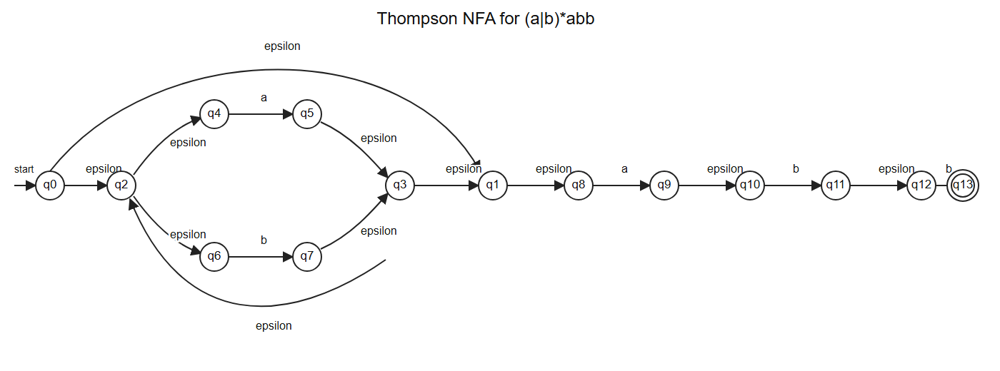

# 最简综合模拟卷

## A 卷题目

### 一、词法分析：正则表达式、NFA、DFA、最小化（20 分）

给定正则表达式：

```text
(a|b)*abb
```

1. 使用 Thompson 构造法给出等价 NFA。
2. 使用子集构造法构造 DFA，写出每个 DFA 状态对应的 NFA 状态集合。
3. 对 DFA 进行最小化。

### 二、LL(1) 分析（20 分）

文法：

```text
E -> E + T | T
T -> T * F | F
F -> ( E ) | id
```

1. 消除直接左递归。
2. 写出消除左递归后文法的 FIRST 集和 FOLLOW 集。
3. 构造预测分析表。
4. 判断消除左递归后的文法是否为 LL(1)。

### 三、LR(0) 项集族与 SLR 分析表（20 分）

文法：

```text
S' -> S
S  -> C C
C  -> c C | d
```

1. 构造规范 LR(0) 项集族。
2. 写出 GOTO 转移。
3. 写出 FOLLOW 集。
4. 写出 SLR 分析表中的 ACTION/GOTO 条目。

### 四、语义分析：S 属性与 L 属性（20 分）

1. 对下面声明文法设计 L 属性 SDD，把每个 `id` 加入符号表并记录类型。

```text
D  -> T L
T  -> int | float
L  -> id L'
L' -> , id L' | epsilon
```

2. 对下面表达式文法设计 S 属性 SDD，使属性 `code` 表示后缀表达式，并计算 `3 + 4 + 5` 的 `code`。

```text
E -> E + T | T
T -> num
```

### 五、中间代码：短路求值、回填、SSA（20 分）

1. 为下面语句生成带标签的三地址码，要求体现短路求值和回填后的跳转目标。

```text
if ((x < y) && (y < z) || (x == z))
  a = 2;
else
  a = 3;
```

2. 把下面循环翻译成 SSA 风格的三地址码，要求在循环头写出必要的 phi 函数。

```text
i = 0;
s = 0;
while (i < n) {
  s = s + i;
  i = i + 1;
}
```

## B 按考试标准重写答案

### 一、词法分析答案

本题要交三类内容：Thompson NFA 图或边表、子集构造 DFA 表、DFA 最小化分组过程。图如下，表格用于说明每个状态集合和转移来源。




#### 1. Thompson NFA

先把正则表达式拆成两部分：

```text
(a|b)* abb
```

`a|b` 用并联结构，`*` 在并联结构外加新入口和新出口，后面再顺序连接 `a`、`b`、`b`。按图中编号，可写为下面的 NFA 边表：

| 起点 | 边标号 | 终点 | 含义 |
| --- | --- | --- | --- |
| q0 | epsilon | q2 | 进入 `(a|b)*` 的循环体 |
| q0 | epsilon | q1 | `*` 允许重复 0 次 |
| q2 | epsilon | q4 | 选择 `a` 分支 |
| q2 | epsilon | q6 | 选择 `b` 分支 |
| q4 | a | q5 | 匹配分支 `a` |
| q6 | b | q7 | 匹配分支 `b` |
| q5 | epsilon | q3 | `a` 分支结束 |
| q7 | epsilon | q3 | `b` 分支结束 |
| q3 | epsilon | q2 | `*` 回到循环入口 |
| q3 | epsilon | q1 | `*` 退出循环 |
| q1 | epsilon | q8 | 连接后缀 `abb` |
| q8 | a | q9 | 匹配后缀第 1 个字符 `a` |
| q9 | epsilon | q10 | 连接 |
| q10 | b | q11 | 匹配后缀第 2 个字符 `b` |
| q11 | epsilon | q12 | 连接 |
| q12 | b | q13 | 匹配后缀第 3 个字符 `b` |

起始状态是 `q0`，接受状态是 `q13`。

#### 2. 子集构造 DFA

从初始状态的 epsilon-closure 开始：

```text
D0 = epsilon-closure({q0}) = {q0,q1,q2,q4,q6,q8}
```

对每个 DFA 状态分别计算 `move(状态集合, 输入符号)`，再取 epsilon-closure，得到：

| DFA 状态 | NFA 状态集合 | 输入 a 后 | 输入 b 后 | 是否接受 |
| --- | --- | --- | --- | --- |
| D0 | `{q0,q1,q2,q4,q6,q8}` | D1 | D2 | 否 |
| D1 | `{q1,q2,q3,q4,q5,q6,q8,q9,q10}` | D1 | D3 | 否 |
| D2 | `{q1,q2,q3,q4,q6,q7,q8}` | D1 | D2 | 否 |
| D3 | `{q1,q2,q3,q4,q6,q7,q8,q11,q12}` | D1 | D4 | 否 |
| D4 | `{q1,q2,q3,q4,q6,q7,q8,q13}` | D1 | D2 | 是 |

接受状态的判断依据是：DFA 状态集合中包含 NFA 接受状态 `q13`。因此只有 `D4` 是接受状态。

#### 3. DFA 最小化

初始按接受状态和非接受状态分组：

```text
P0 = { {D4}, {D0,D1,D2,D3} }
```

继续比较非接受状态在输入 `a`、`b` 上到达的分组：

| 状态 | a 转移 | b 转移 | 区分依据 |
| --- | --- | --- | --- |
| D0 | D1 | D2 | `b` 不到接受组 |
| D1 | D1 | D3 | 与 D3 同型 |
| D2 | D1 | D2 | 与 D0 同型 |
| D3 | D1 | D4 | `b` 到接受组 |

第一轮可以把 `D3` 与 `D0,D1,D2` 区分，因为 `D3` 在输入 `b` 后到达接受状态 `D4`。继续比较：

| 比较 | 输入 a | 输入 b | 结论 |
| --- | --- | --- | --- |
| D0 与 D2 | 都到 D1 | 都到 D2 | 等价，可合并 |
| D1 与 D0/D2 | `a` 到 D1 | `b` 到 D3，与 D0/D2 不同 | 不等价 |

最终最小化分组为：

```text
G0 = {D0,D2}
G1 = {D1}
G2 = {D3}
G3 = {D4}
```

最小 DFA 转移表：

| 最小状态 | 原 DFA 状态 | 输入 a | 输入 b | 说明 |
| --- | --- | --- | --- | --- |
| G0 | `{D0,D2}` | G1 | G0 | 初态 |
| G1 | `{D1}` | G1 | G2 | 已匹配后缀前缀 `a` |
| G2 | `{D3}` | G1 | G3 | 已匹配后缀前缀 `ab` |
| G3 | `{D4}` | G1 | G0 | 终态，已匹配 `abb` |

因此最小 DFA 的初态是 `G0`，终态是 `G3`。

### 二、LL(1) 分析答案

#### 1. 消除直接左递归

原文法中 `E -> E + T | T` 和 `T -> T * F | F` 都是直接左递归。套用规则：

```text
A  -> A alpha | beta
A  -> beta A'
A' -> alpha A' | epsilon
```

对 `E` 有 `alpha = + T`，`beta = T`；对 `T` 有 `alpha = * F`，`beta = F`。得到：

```text
E  -> T E'
E' -> + T E' | epsilon
T  -> F T'
T' -> * F T' | epsilon
F  -> ( E ) | id
```

#### 2. FIRST 集

| 符号 | 推导依据 | FIRST 集 |
| --- | --- | --- |
| F | `F -> ( E ) | id` | `{ (, id }` |
| T' | `T' -> * F T' | epsilon` | `{ *, epsilon }` |
| T | `T -> F T'`，F 不能推出 epsilon | `{ (, id }` |
| E' | `E' -> + T E' | epsilon` | `{ +, epsilon }` |
| E | `E -> T E'`，T 不能推出 epsilon | `{ (, id }` |

#### 3. FOLLOW 集

先放入开始符号的结束标记：

```text
FOLLOW(E) = { $ }
```

再逐条产生式传播：

| 产生式位置 | 推导规则 | 新增内容 |
| --- | --- | --- |
| `F -> ( E )` | E 后面是 `)` | `)` 加入 FOLLOW(E) |
| `E -> T E'` | T 后面是 E'，加入 FIRST(E') 去掉 epsilon | `+` 加入 FOLLOW(T) |
| `E -> T E'` | E' 在末尾，加入 FOLLOW(E) | `)`、`$` 加入 FOLLOW(E') |
| `E -> T E'` | E' 可推出 epsilon，FOLLOW(E) 加入 FOLLOW(T) | `)`、`$` 加入 FOLLOW(T) |
| `E' -> + T E'` | T 后面是 E'，加入 FIRST(E') 去掉 epsilon | `+` 加入 FOLLOW(T) |
| `E' -> + T E'` | E' 在末尾，加入 FOLLOW(E') | `)`、`$` 保持在 FOLLOW(E') |
| `T -> F T'` | F 后面是 T'，加入 FIRST(T') 去掉 epsilon | `*` 加入 FOLLOW(F) |
| `T -> F T'` | T' 可推出 epsilon，FOLLOW(T) 加入 FOLLOW(F) | `+`、`)`、`$` 加入 FOLLOW(F) |
| `T -> F T'` | T' 在末尾，加入 FOLLOW(T) | `+`、`)`、`$` 加入 FOLLOW(T') |

最终：

| 非终结符 | FOLLOW 集 |
| --- | --- |
| E | `{ ), $ }` |
| E' | `{ ), $ }` |
| T | `{ +, ), $ }` |
| T' | `{ +, ), $ }` |
| F | `{ *, +, ), $ }` |

#### 4. 预测分析表

填表规则：对 `A -> alpha`，把产生式填入 `FIRST(alpha)` 中的终结符列；若 `alpha` 可推出 epsilon，则填入 `FOLLOW(A)` 中的列。

| 产生式 | 填表依据 | 填入表项 |
| --- | --- | --- |
| `E -> T E'` | `FIRST(T E')={ (, id }` | `M[E,(]`，`M[E,id]` |
| `E' -> + T E'` | `FIRST(+ T E')={ + }` | `M[E',+]` |
| `E' -> epsilon` | `FOLLOW(E')={ ), $ }` | `M[E',)]`，`M[E',$]` |
| `T -> F T'` | `FIRST(F T')={ (, id }` | `M[T,(]`，`M[T,id]` |
| `T' -> * F T'` | `FIRST(* F T')={ * }` | `M[T',*]` |
| `T' -> epsilon` | `FOLLOW(T')={ +, ), $ }` | `M[T',+]`，`M[T',)]`，`M[T',$]` |
| `F -> ( E )` | `FIRST(( E ))={ ( }` | `M[F,(]` |
| `F -> id` | `FIRST(id)={ id }` | `M[F,id]` |

完整预测分析表如下，空白处为 error：

| 非终结符 | `(` | `id` | `+` | `*` | `)` | `$` |
| --- | --- | --- | --- | --- | --- | --- |
| E | `E -> T E'` | `E -> T E'` | error | error | error | error |
| E' | error | error | `E' -> + T E'` | error | `E' -> epsilon` | `E' -> epsilon` |
| T | `T -> F T'` | `T -> F T'` | error | error | error | error |
| T' | error | error | `T' -> epsilon` | `T' -> * F T'` | `T' -> epsilon` | `T' -> epsilon` |
| F | `F -> ( E )` | `F -> id` | error | error | error | error |

每个表项最多一条产生式，因此消除左递归后的文法是 LL(1) 文法。

### 三、LR(0) 项集族与 SLR 分析表答案

#### 1. 规范 LR(0) 项集族

增广文法为：

```text
S' -> S
S  -> C C
C  -> c C | d
```

从 `I0 = closure({S' -> . S})` 开始：

```text
I0:
S' -> . S
S  -> . C C
C  -> . c C
C  -> . d

I1 = GOTO(I0, S):
S' -> S .

I2 = GOTO(I0, C):
S -> C . C
C -> . c C
C -> . d

I3 = GOTO(I0, c):
C -> c . C
C -> . c C
C -> . d

I4 = GOTO(I0, d):
C -> d .

I5 = GOTO(I2, C):
S -> C C .

I6 = GOTO(I3, C):
C -> c C .
```

其中 `GOTO(I3,c)=I3`，因为 `C -> c . C` 移过 `c` 后再次得到 `C -> c . C` 并闭包出同样项目。

#### 2. GOTO 转移

| 来源状态 | 文法符号 | 目标状态 |
| --- | --- | --- |
| I0 | S | I1 |
| I0 | C | I2 |
| I0 | c | I3 |
| I0 | d | I4 |
| I2 | C | I5 |
| I2 | c | I3 |
| I2 | d | I4 |
| I3 | C | I6 |
| I3 | c | I3 |
| I3 | d | I4 |

#### 3. FOLLOW 集

| 非终结符 | 推导依据 | FOLLOW |
| --- | --- | --- |
| S | S 是开始符号 | `{ $ }` |
| C | `S -> C C` 中第一个 C 后面是 C，加入 FIRST(C)={c,d}；第二个 C 在末尾，加入 FOLLOW(S) | `{ c, d, $ }` |

#### 4. SLR ACTION/GOTO 表

填表规则：

```text
A -> alpha . a beta 形成移进项，ACTION[state,a] = shift。
A -> alpha . 且 A 不是 S' 时，在 FOLLOW(A) 上填 reduce。
S' -> S . 时，在 $ 上填 accept。
```

逐状态填表：

| 状态 | 项目依据 | 表项 |
| --- | --- | --- |
| 0 | `C -> . c C`，`C -> . d`，`S -> . C C`，`S' -> . S` | `ACTION[0,c]=s3`，`ACTION[0,d]=s4`，`GOTO[0,C]=2`，`GOTO[0,S]=1` |
| 1 | `S' -> S .` | `ACTION[1,$]=acc` |
| 2 | `C -> . c C`，`C -> . d`，`S -> C . C` | `ACTION[2,c]=s3`，`ACTION[2,d]=s4`，`GOTO[2,C]=5` |
| 3 | `C -> . c C`，`C -> . d`，`C -> c . C` | `ACTION[3,c]=s3`，`ACTION[3,d]=s4`，`GOTO[3,C]=6` |
| 4 | `C -> d .` | 在 FOLLOW(C)={c,d,$} 上填 `r(C -> d)` |
| 5 | `S -> C C .` | 在 FOLLOW(S)={$} 上填 `r(S -> C C)` |
| 6 | `C -> c C .` | 在 FOLLOW(C)={c,d,$} 上填 `r(C -> c C)` |

完整表：

| 状态 | ACTION c | ACTION d | ACTION $ | GOTO S | GOTO C |
| --- | --- | --- | --- | --- | --- |
| 0 | s3 | s4 | error | 1 | 2 |
| 1 | error | error | acc | error | error |
| 2 | s3 | s4 | error | error | 5 |
| 3 | s3 | s4 | error | error | 6 |
| 4 | r(C -> d) | r(C -> d) | r(C -> d) | error | error |
| 5 | error | error | r(S -> C C) | error | error |
| 6 | r(C -> c C) | r(C -> c C) | r(C -> c C) | error | error |

### 四、语义分析答案

#### 1. 声明文法的 L 属性 SDD

题目要求每个 `id` 都记录从 `T` 得到的类型。类型信息从左边的 `T` 传给右边的 `L`，所以需要继承属性。

| 产生式 | 语义规则或动作 |
| --- | --- |
| `D -> T L` | `L.in = T.type` |
| `T -> int` | `T.type = int` |
| `T -> float` | `T.type = float` |
| `L -> id L'` | `addType(id.name, L.in)`；`L'.in = L.in` |
| `L' -> , id L'1` | `addType(id.name, L'.in)`；`L'1.in = L'.in` |
| `L' -> epsilon` | 不需要插入新标识符 |

它是 L 属性定义的原因：

```text
L.in 只依赖父结点 D 中左侧兄弟 T.type。
L'.in 只依赖父结点 L 或 L' 的继承属性。
没有任何继承属性依赖右侧兄弟结点。
```

如果输入是 `float x, y`，执行顺序是：

| 步骤 | 动作 | 符号表效果 |
| --- | --- | --- |
| 1 | `T -> float` | `T.type=float` |
| 2 | `D -> T L` | `L.in=float` |
| 3 | 识别 `x` | 插入 `x : float` |
| 4 | 识别 `y` | 插入 `y : float` |

#### 2. 后缀表达式的 S 属性 SDD

题目要求 `code` 表示后缀表达式，只需要综合属性：

| 产生式 | 语义规则 |
| --- | --- |
| `E -> E1 + T` | `E.code = E1.code || T.code || "+"` |
| `E -> T` | `E.code = T.code` |
| `T -> num` | `T.code = num.lexeme` |

对 `3 + 4 + 5`，原文法左递归，表达式按左结合分析为 `((3 + 4) + 5)`：

| 子表达式 | 后缀 code |
| --- | --- |
| `3` | `3` |
| `4` | `4` |
| `3 + 4` | `3 4 +` |
| `5` | `5` |
| `(3 + 4) + 5` | `3 4 + 5 +` |

最终：

```text
E.code = 3 4 + 5 +
```

### 五、中间代码答案

#### 1. 短路求值与回填

布尔表达式是：

```text
((x < y) && (y < z)) || (x == z)
```

先看优先级：`&&` 高于 `||`，因此先求 `(x < y) && (y < z)`；如果左侧 `&&` 整体为真，则整个 `||` 为真，不再求 `x == z`；如果左侧 `&&` 为假，才去求 `x == z`。

回填思路如下：

| 判断 | 真出口 | 假出口 |
| --- | --- | --- |
| `x < y` | 继续判断 `y < z` | 去判断 `x == z` |
| `y < z` | then 分支 | 去判断 `x == z` |
| `x == z` | then 分支 | else 分支 |

回填后的三地址码：

```text
1: if x < y goto 3
2: goto 5
3: if y < z goto 7
4: goto 5
5: if x == z goto 7
6: goto 9
7: a = 2
8: goto 10
9: a = 3
10:
```

逐行检查：

| 行号 | 作用 |
| --- | --- |
| 1-2 | 判断 `x < y`，假时短路到 `||` 的右操作数 |
| 3-4 | 判断 `y < z`，假时继续判断 `x == z` |
| 5-6 | 判断 `x == z`，真到 then，假到 else |
| 7-10 | then/else 赋值并汇合 |

#### 2. 循环 SSA

循环变量 `i` 和 `s` 都在循环前有初值，又在循环体中被重新定义，因此循环头需要两个 phi 函数。

| 变量 | 循环前定义 | 循环体回边定义 | 循环头版本 |
| --- | --- | --- | --- |
| i | `i1 = 0` | `i3 = i2 + 1` | `i2 = phi(i1, i3)` |
| s | `s1 = 0` | `s3 = s2 + i2` | `s2 = phi(s1, s3)` |

SSA 风格三地址码：

```text
entry:
i1 = 0
s1 = 0
goto L_header

L_header:
i2 = phi(i1, i3)
s2 = phi(s1, s3)
t1 = i2 < n
if t1 goto L_body else L_exit

L_body:
s3 = s2 + i2
i3 = i2 + 1
goto L_header

L_exit:
```

phi 的位置在循环头 `L_header`，原因是控制流有两条路径到达循环头：一次来自 `entry`，另一次来自循环体回边。
