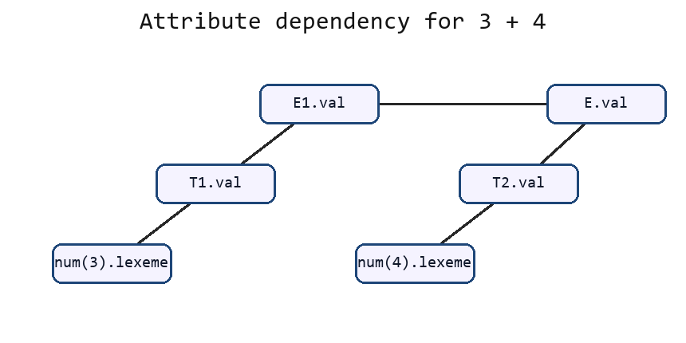
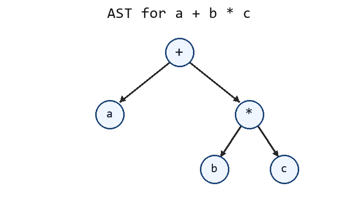

# 补充模拟卷 02：语义分析、AST、符号表补缺

## A 卷题目

### 一、依赖图与拓扑求值顺序（20 分）

考虑语义规则：

```text
E -> E1 + T
  E.val = E1.val + T.val

E -> T
  E.val = T.val

T -> num
  T.val = num.lexeme
```

对输入：

```text
3 + 4
```

1. 写出主要属性依赖关系。
2. 写出一种合法的属性求值顺序。
3. 计算最终 `E.val`。

### 二、受控副作用（20 分）

考虑声明翻译：

```text
D -> T id
T -> int
```

语义动作：

```text
addType(id.name, T.type)
```

1. 说明该语义动作的副作用是什么。
2. 为什么该动作必须在 `T.type` 已经确定之后执行。
3. 写出受控副作用应满足的基本要求。

### 三、CST 与 AST（20 分）

表达式：

```text
a + b * c
```

1. 说明 CST 和 AST 的区别。
2. 画出该表达式的 AST。
3. 说明为什么后续语义分析更常使用 AST。

### 四、符号表与作用域（20 分）

考虑程序片段：

```text
{
  int x;
  {
    float x;
  }
}
```

1. 说明进入和退出代码块时符号表栈如何变化。
2. 在内层代码块中查找 `x` 时应得到哪个声明。
3. 退出内层代码块后查找 `x` 时应得到哪个声明。

### 五、类型信息与标识符绑定（20 分）

回答：

1. 符号表通常记录哪些信息。
2. AST 中的标识符结点为什么要绑定符号表条目。
3. 符号表对类型检查有什么作用。

## B 按考试标准重写答案

### 一、依赖图与拓扑求值顺序答案

#### 1. 主要属性依赖关系

对输入 `3 + 4`，按左递归表达式文法可理解为：

```text
E -> E1 + T2
E1 -> T1
T1 -> num(3)
T2 -> num(4)
```

每条语义规则给出一条或多条依赖边：

| 语义规则 | 依赖边 | 说明 |
| --- | --- | --- |
| `T1.val = num(3).lexeme` | `num(3).lexeme -> T1.val` | 叶子词素值决定 T1 的值 |
| `E1.val = T1.val` | `T1.val -> E1.val` | `E -> T` 传递属性值 |
| `T2.val = num(4).lexeme` | `num(4).lexeme -> T2.val` | 叶子词素值决定 T2 的值 |
| `E.val = E1.val + T2.val` | `E1.val -> E.val`，`T2.val -> E.val` | 加法结点依赖左右操作数 |

依赖图如下：



用文字表示为：

```text
num(3).lexeme -> T1.val -> E1.val -> E.val
num(4).lexeme -> T2.val ----------^
```

#### 2. 一种合法拓扑求值顺序

属性求值顺序必须满足：一个属性被计算前，它依赖的属性已经计算完成。

| 顺序 | 计算 | 结果 |
| --- | --- | --- |
| 1 | `T1.val = num(3).lexeme` | `T1.val = 3` |
| 2 | `E1.val = T1.val` | `E1.val = 3` |
| 3 | `T2.val = num(4).lexeme` | `T2.val = 4` |
| 4 | `E.val = E1.val + T2.val` | `E.val = 3 + 4 = 7` |

`T2.val` 也可以在第 1 步或第 2 步之前计算，只要它在 `E.val` 之前完成即可。

#### 3. 最终结果

```text
E.val = 7
```

### 二、受控副作用答案

#### 1. 副作用是什么

语义动作：

```text
addType(id.name, T.type)
```

会修改符号表，把标识符名称和类型写入当前作用域的符号表条目。因此它的副作用是“改变编译器维护的外部状态”，不是单纯计算某个属性值。

| 动作输入 | 被修改的数据结构 | 修改内容 |
| --- | --- | --- |
| `id.name` | 当前符号表 | 新增或更新标识符名字 |
| `T.type` | 当前符号表 | 记录该标识符的类型 |

#### 2. 为什么必须在 `T.type` 确定之后执行

产生式是：

```text
D -> T id
T -> int
```

`id` 的类型来自 `T.type`。若 `T.type` 尚未确定就执行 `addType`，符号表会出现类型缺失或类型错误。

正确执行顺序为：

| 步骤 | 操作 | 得到的信息 |
| --- | --- | --- |
| 1 | 识别并归约 `T -> int` | `T.type = int` |
| 2 | 读到 `id.name` | 得到标识符名称 |
| 3 | 执行 `addType(id.name, T.type)` | 插入 `id.name : int` |

所以动作必须排在 `T.type` 之后。

#### 3. 受控副作用的基本要求

考试答题时要强调“可预测、可重复、与依赖关系一致”：

| 要求 | 具体含义 |
| --- | --- |
| 执行位置明确 | 语义动作放在固定产生式位置，不能随意提前或延后 |
| 执行顺序确定 | 多个动作之间有清晰先后顺序 |
| 依赖已满足 | 动作使用的属性值必须已经计算完成 |
| 不引入依赖环 | 不能让属性求值互相等待 |
| 不重复执行 | 不能因为回溯或错误恢复造成重复插入 |
| 错误可处理 | 遇到重复声明或类型错误时能报告并保持符号表一致 |

### 三、CST 与 AST 答案

#### 1. CST 和 AST 的区别

| 对比项 | CST | AST |
| --- | --- | --- |
| 全称 | Concrete Syntax Tree，具体语法树 | Abstract Syntax Tree，抽象语法树 |
| 主要用途 | 展示完整语法推导 | 表示程序语义结构 |
| 是否保留语法细节 | 保留括号、辅助非终结符、分隔符等 | 去掉冗余语法细节 |
| 结点内容 | 接近文法产生式 | 接近运算、声明、语句等语义结构 |

#### 2. `a + b * c` 的 AST

乘法优先级高于加法，因此根结点是 `+`，右子树是 `b * c`：



```text
      +
     / \
    a   *
       / \
      b   c
```

对应结构为：

```text
(+ a (* b c))
```

#### 3. 为什么后续语义分析更常使用 AST

AST 保留的是语义分析真正需要的信息：

| 后续任务 | AST 的作用 |
| --- | --- |
| 类型检查 | 直接检查运算符左右操作数类型 |
| 标识符绑定 | 在标识符结点绑定符号表条目 |
| 中间代码生成 | 按表达式和语句结构生成 IR |
| 优化 | 直接识别表达式、常量和控制结构 |

CST 中大量括号、辅助非终结符和推导细节会增加遍历复杂度；AST 更紧凑，更适合后续阶段。

### 四、符号表与作用域答案

#### 1. 进入和退出代码块时符号表栈变化

程序片段：

```text
{
  int x;
  {
    float x;
  }
}
```

符号表栈按“进入块 push，退出块 pop”的规则变化：

| 时刻 | 操作 | 符号表栈从底到顶 |
| --- | --- | --- |
| 进入外层 `{` | push 外层作用域 | `[outer]` |
| 读到 `int x;` | 在 outer 插入 `x:int` | `[outer{x:int}]` |
| 进入内层 `{` | push 内层作用域 | `[outer{x:int}, inner]` |
| 读到 `float x;` | 在 inner 插入 `x:float` | `[outer{x:int}, inner{x:float}]` |
| 退出内层 `}` | pop inner | `[outer{x:int}]` |
| 退出外层 `}` | pop outer | `[]` |

#### 2. 内层代码块中查找 `x`

查找标识符时从栈顶向栈底查找。内层块中栈顶是：

```text
inner{x:float}
```

因此内层代码块中查找 `x` 得到：

```text
x : float
```

这说明内层声明遮蔽了外层同名声明。

#### 3. 退出内层后查找 `x`

退出内层后，`inner{x:float}` 被弹出，栈中只剩：

```text
outer{x:int}
```

此时查找 `x` 得到：

```text
x : int
```

### 五、类型信息与标识符绑定答案

#### 1. 符号表通常记录的信息

符号表条目通常至少包含名称、类型、作用域和存储相关信息。可按表回答：

| 字段 | 含义 |
| --- | --- |
| 名字 | 标识符文本，例如 `x`、`f` |
| 种类 | 变量、函数、类型名、常量等 |
| 类型 | `int`、`float`、函数类型、数组类型等 |
| 作用域层级 | 标识符在哪个块或函数内有效 |
| 存储位置 | 栈帧偏移、全局地址、寄存器或对象位置 |
| 参数信息 | 函数形参个数、类型和顺序 |
| 返回类型 | 函数返回值类型 |
| 其他属性 | 是否已定义、是否可修改、声明位置等 |

#### 2. AST 中标识符结点为什么要绑定符号表条目

同名标识符可以出现在不同作用域中：

```text
int x;
{
  float x;
}
```

如果 AST 结点只保存文本 `x`，后续阶段无法直接知道它对应哪个声明。绑定符号表条目后，AST 中每个 `x` 都指向确定的声明。

| 不绑定 | 绑定后 |
| --- | --- |
| 只能看到名字文本 | 能找到声明、类型、作用域和存储位置 |
| 每次使用都要重新查表 | 后续类型检查和代码生成可直接使用绑定结果 |
| 同名变量容易混淆 | 内外层同名变量被区分 |

#### 3. 符号表对类型检查的作用

类型检查需要从符号表读取标识符和函数的类型信息：

| 检查场景 | 符号表提供的信息 | 判断内容 |
| --- | --- | --- |
| 赋值 `x = e` | `x` 的声明类型 | `e` 的类型是否可赋给 `x` |
| 表达式 `x + y` | `x`、`y` 的类型 | 运算符是否支持这些操作数 |
| 函数调用 `f(a,b)` | `f` 的参数类型和返回类型 | 实参个数和类型是否匹配 |
| 标识符使用 | 标识符是否有可见声明 | 是否未声明或越界使用 |

因此符号表是标识符绑定和类型检查的共同基础。
