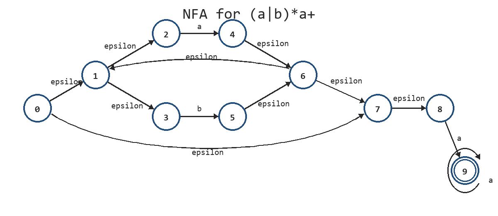
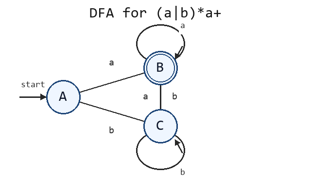

# 剩余知识点题型适配模拟卷

## 卷面说明

本卷只针对前面四套卷没有完全展开的 PPT 内容。题型按知识点适合方式安排。本版采用“题目后紧跟按考试标准重写答案”的排版，便于复习时对照。

```text
1. 背景型知识点：适合简答、判断、对比。
2. 理论细节：适合解释原因、说明规则。
3. 过程型知识点：适合小计算、小推导。
4. 次级但可出题内容：适合短流程题。
```

## 一、背景型简答：IR、NFA/DFA、SSA（20 分）

### 题目

回答下列问题：

1. 说明高层 IR 和低层 IR 的区别，各举一个特点。
2. 说明为什么 DFA 的执行通常比 NFA 的直接模拟更简单。
3. 说明 SSA 为什么有利于优化。
4. 说明工业编译器中使用 SSA 或类似 SSA 形式的原因。

### 按考试标准重写答案

#### 1. 高层 IR 和低层 IR 的区别

答题时要从“离源程序近还是离机器近”来区分：

| 类型 | 特点 | 适合阶段 | 例子 |
| --- | --- | --- | --- |
| 高层 IR | 保留较多源语言结构，如循环、函数、对象、异常等 | 前端语义分析、高层优化 | AST、带结构化控制流的 IR |
| 低层 IR | 更接近目标机器，显式表示跳转、load/store、寄存器、栈等 | 后端代码生成、寄存器分配、指令选择 | 接近汇编的三地址码或机器 IR |

因此，高层 IR 的优点是语义信息丰富；低层 IR 的优点是便于映射到机器指令。

#### 2. DFA 为什么比 NFA 直接模拟更简单

核心差异是“当前状态数量”：

| 自动机 | 读入一个字符时的状态变化 |
| --- | --- |
| DFA | 从一个当前状态唯一转移到下一个状态 |
| NFA | 可能从一组当前状态转移到另一组状态，还要处理 epsilon 转移 |

DFA 执行伪代码只需要：

```text
state = start
for ch in input:
  state = delta(state, ch)
```

NFA 直接模拟时需要维护状态集合：

```text
states = epsilon-closure({start})
for ch in input:
  states = epsilon-closure(move(states, ch))
```

所以 DFA 的实现更直接，运行时只维护一个当前状态。

#### 3. SSA 为什么有利于优化

SSA 的规则是每个变量版本只赋值一次。这样定义点和使用点关系清楚：

| 优化 | SSA 带来的便利 |
| --- | --- |
| 常量传播 | 一个版本若定义为常量，可直接沿 def-use 链传播 |
| 死代码删除 | 若某个定义版本没有使用点，可以删除 |
| 公共子表达式消除 | 操作数版本明确，判断两个表达式是否相同更容易 |
| 数据流分析 | 不必反复区分同名变量的不同定义 |

例子：

```text
x1 = 1
x2 = x1 + 2
y1 = x2
```

`x1`、`x2` 是不同版本，优化器能明确 `x2` 依赖 `x1`，不会把不同赋值混在一起。

#### 4. 工业编译器使用 SSA 或类似形式的原因

工业编译器要做大量优化，SSA 能把数据依赖显式化，降低实现复杂度。典型流程是：

```text
普通 IR -> 构造 SSA -> 在 SSA 上做优化 -> 消除 phi -> 进入后端
```

后端不能直接保留抽象 `phi` 函数，通常会把它展开为前驱边上的复制指令，再结合寄存器分配做合并。

## 二、理论细节：SDD、SDT、属性文法（20 分）

### 题目

回答下列问题：

1. 说明 SDD 和 SDT 的区别。
2. 说明属性文法和带副作用语义动作的区别。
3. 为什么属性依赖图中存在环时，属性值无法正常求值。
4. 什么是受控副作用，写出两个基本要求。

### 按考试标准重写答案

#### 1. SDD 和 SDT 的区别

| 概念 | 中文名 | 关注点 | 表达形式 |
| --- | --- | --- | --- |
| SDD | 语法制导定义 | “属性怎么算” | 给产生式配属性方程 |
| SDT | 语法制导翻译 | “动作何时执行” | 把语义动作嵌入产生式右部 |

SDD 更像规格说明，SDT 更接近实现。可以先写 SDD，再根据分析顺序把属性计算和语义动作安排成 SDT。

#### 2. 属性文法和带副作用语义动作的区别

| 对比项 | 属性文法 | 带副作用语义动作 |
| --- | --- | --- |
| 主要方式 | 通过属性方程计算值 | 执行动作并修改外部状态 |
| 外部状态 | 通常不依赖修改全局结构 | 可能修改符号表、输出代码、更新计数器 |
| 分析重点 | 属性依赖是否有合法求值顺序 | 动作执行时机是否正确、是否重复 |

例子：

```text
T.type = int
```

是属性计算；

```text
addType(id.name, T.type)
```

会修改符号表，是带副作用动作。

#### 3. 依赖图中存在环时为什么无法正常求值

属性依赖图的边表示“先算谁，再算谁”。若有环：

```text
A.x -> B.y -> A.x
```

则 `A.x` 要等 `B.y`，同时 `B.y` 又要等 `A.x`。此时不存在拓扑序，无法安排一个合法的属性求值先后顺序。

| 图结构 | 是否可拓扑排序 | 属性能否按顺序求值 |
| --- | --- | --- |
| 无环 | 可以 | 可以 |
| 有环 | 不可以 | 不能按普通属性方程求值 |

#### 4. 受控副作用及基本要求

受控副作用是指语义动作虽然修改外部结构，但修改发生在明确、可预测、满足依赖关系的位置。

基本要求：

| 要求 | 含义 |
| --- | --- |
| 所需属性已计算 | 例如 `addType(id.name,T.type)` 必须等 `T.type` 已知 |
| 执行位置固定 | 不能因分析策略不同而提前或延后到错误位置 |
| 不引入依赖环 | 副作用不能让属性互相等待 |
| 不重复、不漏执行 | 特别是声明插入、代码输出等动作 |
| 错误可恢复 | 发生重复声明等错误时符号表仍保持一致 |

## 三、过程型小题：LR 表格驱动分析器（20 分）

### 题目

已知某 LR 分析表有如下条目：

```text
ACTION[0,id] = s1
ACTION[1,+]  = r(E -> id)
ACTION[1,$]  = r(E -> id)
ACTION[2,+]  = s3
ACTION[2,$]  = acc
ACTION[3,id] = s4
ACTION[4,$]  = r(E -> E + id)

GOTO[0,E] = 2
```

输入串：

```text
id + id $
```

要求：

1. 说明 ACTION 表和 GOTO 表分别在什么时候使用。
2. 写出分析过程中栈和输入的大致变化。
3. 说明什么时候接受输入。

### 按考试标准重写答案

#### 1. ACTION 表和 GOTO 表什么时候用

LR 分析器每一步都看“状态栈顶状态”和“当前输入符号”：

| 表 | 下标 | 使用时机 | 表项含义 |
| --- | --- | --- | --- |
| ACTION | `[状态, 终结符]` | 当前要处理输入符号时 | 移进、规约、接受或报错 |
| GOTO | `[状态, 非终结符]` | 规约出某个非终结符之后 | 决定压入的新状态 |

动作解释：

```text
s1：移进当前输入符号，并压入状态 1。
r(E -> id)：把栈顶与产生式右部 id 对应的内容弹出，规约成 E。
acc：接受输入串。
```

#### 2. 分析过程

输入串：

```text
id + id $
```

完整表格如下：

| 步骤 | 状态栈 | 符号栈 | 剩余输入 | 查表与动作 |
| --- | --- | --- | --- | --- |
| 1 | `0` | 空 | `id + id $` | `ACTION[0,id]=s1`，移进 `id` |
| 2 | `0 1` | `id` | `+ id $` | `ACTION[1,+]=r(E -> id)`，规约 |
| 3 | `0 2` | `E` | `+ id $` | 规约后查 `GOTO[0,E]=2` |
| 4 | `0 2` | `E` | `+ id $` | `ACTION[2,+]=s3`，移进 `+` |
| 5 | `0 2 3` | `E +` | `id $` | `ACTION[3,id]=s4`，移进 `id` |
| 6 | `0 2 3 4` | `E + id` | `$` | `ACTION[4,$]=r(E -> E + id)`，规约 |
| 7 | `0 2` | `E` | `$` | 规约后回到状态 0 查 `GOTO[0,E]=2` |
| 8 | `0 2` | `E` | `$` | `ACTION[2,$]=acc`，接受 |

第 6 步规约 `E -> E + id` 时，右部长度为 3，所以弹出符号栈中的 `E + id` 和对应的 3 个状态，再把 `E` 压入，并按弹出后的状态查 GOTO。

#### 3. 什么时候接受输入

接受条件不是“输入刚好读完”本身，而是：

```text
当前状态 = 2
当前输入符号 = $
ACTION[2,$] = acc
```

因此当状态栈为 `0 2`、符号栈为 `E`、剩余输入为 `$` 时，分析器接受输入串。

## 四、次级流程题：通用左递归消除（20 分）

### 题目

文法：

```text
S -> A a | b
A -> S d | c
```

按非终结符顺序：

```text
S, A
```

1. 判断该文法是否存在间接左递归。
2. 按通用左递归消除思路，先把 `A -> S d` 中的 `S` 用 `S` 的产生式替换。
3. 消除替换后 `A` 的直接左递归。

### 按考试标准重写答案

#### 1. 判断间接左递归

原文法：

```text
S -> A a | b
A -> S d | c
```

如果某个非终结符能经过一步或多步推导重新以自己开头，就是左递归。这里：

```text
S => A a
  => S d a
```

因此 `S` 存在间接左递归。`A` 也可以推出：

```text
A => S d
  => A a d
```

所以这个文法确实存在间接左递归。

#### 2. 按顺序 `S, A` 替换

通用算法按非终结符顺序处理。处理 `S` 时，前面没有非终结符，不替换。

处理 `A` 时，产生式中有：

```text
A -> S d
```

因为 `S` 在顺序中排在 `A` 前面，所以要把 `S` 的右部代入：

```text
S -> A a | b
```

代入 `A -> S d` 得：

```text
A -> A a d | b d
```

再保留原来的 `A -> c`：

```text
A -> A a d | b d | c
```

#### 3. 消除 `A` 的直接左递归

现在 `A` 的产生式分成两类：

| 类型 | 产生式 | 记号 |
| --- | --- | --- |
| 左递归部分 | `A -> A a d` | `alpha = a d` |
| 非左递归部分 | `A -> b d`、`A -> c` | `beta1 = b d`，`beta2 = c` |

套用规则：

```text
A  -> beta A'
A' -> alpha A' | epsilon
```

得到：

```text
A  -> b d A' | c A'
A' -> a d A' | epsilon
```

最终文法为：

```text
S  -> A a | b
A  -> b d A' | c A'
A' -> a d A' | epsilon
```

注意：`S -> A a | b` 保留不变，因为本题指定按顺序 `S, A` 处理，替换发生在处理 `A` 时。

## 五、次级流程题：数组类型的 L 属性定义（20 分）

### 题目

考虑数组类型声明：

```text
T -> B C
B -> int | float
C -> [ num ] C | epsilon
```

设计一个 L 属性 SDD，用于计算类型 `T.type`。要求：

1. `B.type` 表示基本类型。
2. `C.in` 表示从左侧传入的已有类型。
3. `C.type` 表示加上数组维度后的类型。
4. 对声明形式 `int[10][20]` 写出类型构造顺序。

### 按考试标准重写答案

#### 1. 属性含义

题目已经规定属性方向，按这个方向设计：

| 属性 | 含义 |
| --- | --- |
| `B.type` | 基本类型，如 `int`、`float` |
| `C.in` | 从左侧传入的当前已构造类型 |
| `C.type` | 处理完当前及后续数组维度后的类型 |
| `T.type` | 整个类型表达式的最终类型 |

#### 2. L 属性 SDD

```text
T -> B C
  C.in = B.type
  T.type = C.type

B -> int
  B.type = int

B -> float
  B.type = float

C -> [ num ] C1
  C1.in = array(num.val, C.in)
  C.type = C1.type

C -> epsilon
  C.type = C.in
```

该定义是 L 属性定义，因为 `C.in` 只依赖左侧兄弟 `B.type` 或父结点传下来的属性，不依赖右侧兄弟。

#### 3. `int[10][20]` 的类型构造顺序

按题目给定的继承属性方向，从左到右构造：

| 步骤 | 产生式或动作 | 得到的类型 |
| --- | --- | --- |
| 1 | `B -> int` | `B.type = int` |
| 2 | `T -> B C` | `C.in = int` |
| 3 | 读到 `[10]` | `C1.in = array(10, int)` |
| 4 | 读到 `[20]` | `C2.in = array(20, array(10, int))` |
| 5 | `C2 -> epsilon` | `C2.type = array(20, array(10, int))` |
| 6 | 属性逐层返回 | `T.type = array(20, array(10, int))` |

最终答案：

```text
T.type = array(20, array(10, int))
```

本题按给定的 `C.in` 从左向右规则计算，因此以上结果就是本题答案。

## 六、词法题原型补齐：词素、词法单元与 PPT 原题自动机（20 分）

### 题目

回答并完成下列小题：

1. 说明词素和词法单元的区别。
2. 对正则表达式 `r = (a|b)*a+`，写出一个 Thompson NFA 的边表。
3. 按子集构造法写出该 NFA 对应 DFA 的主要状态集合和转移。
4. 对密码识别规则写出正则表达式：字符只含 `a,b,0,1`，必须以字母开头，必须以 `abb` 结尾，中间不能出现连续两个数字。

### 按考试标准重写答案

#### 1. 词素和词法单元

| 概念 | 含义 | 例子 |
| --- | --- | --- |
| 词素 | 源程序中实际出现的字符序列 | `count`、`123`、`if` |
| 词法单元 | 词法分析器输出的类别或记号 | `id`、`num`、`keyword_if` |

同一个词法单元可以对应多个词素。例如 `count`、`sum`、`x` 都可以属于词法单元 `id`。

#### 2. `r = (a|b)*a+` 的 Thompson NFA

将表达式拆成：

```text
(a|b)* a+
```

其中 `(a|b)*` 匹配任意个 `a` 或 `b`，`a+` 匹配至少一个 `a`。一种 Thompson NFA 如图：



边表：

| 起点 | 边标号 | 终点 |
| --- | --- | --- |
| 0 | epsilon | 1 |
| 0 | epsilon | 7 |
| 1 | epsilon | 2 |
| 1 | epsilon | 3 |
| 2 | a | 4 |
| 3 | b | 5 |
| 4 | epsilon | 6 |
| 5 | epsilon | 6 |
| 6 | epsilon | 1 |
| 6 | epsilon | 7 |
| 7 | epsilon | 8 |
| 8 | a | 9 |
| 9 | a | 9 |

起点是 `0`，终点是 `9`。

#### 3. 子集构造 DFA

初态：

```text
A = epsilon-closure({0}) = {0,1,2,3,7,8}
```

从 A 出发：

```text
move(A,a) 包含 4 和 9，取 epsilon-closure 后得到 B
B = {1,2,3,4,6,7,8,9}

move(A,b) 包含 5，取 epsilon-closure 后得到 C
C = {1,2,3,5,6,7,8}
```

继续计算 B、C 的转移，得到：

| DFA 状态 | NFA 状态集合 | on a | on b | 是否终态 |
| --- | --- | --- | --- | --- |
| A | `{0,1,2,3,7,8}` | B | C | 否 |
| B | `{1,2,3,4,6,7,8,9}` | B | C | 是 |
| C | `{1,2,3,5,6,7,8}` | B | C | 否 |

终态判断依据：集合中包含 NFA 终态 `9`。因此只有 B 是终态。



#### 4. 密码识别规则的正则表达式

要求：

```text
字符只含 a,b,0,1
必须以字母开头
必须以 abb 结尾
中间不能出现连续两个数字
```

可写为：

```text
(a|b)((a|b)|0(a|b)|1(a|b))*abb
```

解释：

| 片段 | 作用 |
| --- | --- |
| `(a|b)` | 保证以字母开头 |
| `((a|b)|0(a|b)|1(a|b))*` | 中间部分中，数字后必须接字母，因此不会有连续两个数字 |
| `abb` | 保证以 `abb` 结尾 |

该表达式中的每个字符都来自集合 `{a,b,0,1}`。

## 七、LL(1) 原题文法与二进制小数 SDD（20 分）

### 题目

给定文法：

```text
S -> c S | A B
A -> a A | epsilon
B -> b B a | d
```

1. 计算 FIRST 集和 FOLLOW 集。
2. 构造 LL(1) 预测分析表。
3. 判断该文法是否为 LL(1) 文法。

再给定文法：

```text
S -> L . L | L
L -> L B | B
B -> 0 | 1
```

4. 设计 SDD，计算二进制小数对应的十进制值。
5. 用该 SDD 计算 `101.101`。

### 按考试标准重写答案

#### 1. FIRST 集

文法：

```text
S -> c S | A B
A -> a A | epsilon
B -> b B a | d
```

先算 A、B：

| 非终结符 | 产生式 | FIRST |
| --- | --- | --- |
| A | `A -> a A | epsilon` | `{ a, epsilon }` |
| B | `B -> b B a | d` | `{ b, d }` |

再算 S：

```text
S -> c S          给出 c
S -> A B          A 可推出 epsilon，所以 FIRST(A B) = {a} union FIRST(B) = {a,b,d}
```

因此：

| 非终结符 | FIRST |
| --- | --- |
| S | `{ a, b, c, d }` |
| A | `{ a, epsilon }` |
| B | `{ b, d }` |

#### 2. FOLLOW 集

开始符号：

```text
FOLLOW(S) = { $ }
```

逐条产生式传播：

| 位置 | 推导依据 | 新增到 FOLLOW |
| --- | --- | --- |
| `S -> A B` 中 A 后面是 B | 加入 FIRST(B) | `b,d` 加入 FOLLOW(A) |
| `S -> A B` 中 B 在末尾 | 加入 FOLLOW(S) | `$` 加入 FOLLOW(B) |
| `B -> b B a` 中 B 后面是 a | 加入 `a` | `a` 加入 FOLLOW(B) |

最终：

| 非终结符 | FOLLOW |
| --- | --- |
| S | `{ $ }` |
| A | `{ b, d }` |
| B | `{ a, $ }` |

#### 3. 预测分析表

填表依据：

| 产生式 | FIRST/FOLLOW 依据 | 填入表项 |
| --- | --- | --- |
| `S -> c S` | FIRST 为 `{c}` | `M[S,c]` |
| `S -> A B` | FIRST(A B) 为 `{a,b,d}` | `M[S,a]`，`M[S,b]`，`M[S,d]` |
| `A -> a A` | FIRST 为 `{a}` | `M[A,a]` |
| `A -> epsilon` | FOLLOW(A) 为 `{b,d}` | `M[A,b]`，`M[A,d]` |
| `B -> b B a` | FIRST 为 `{b}` | `M[B,b]` |
| `B -> d` | FIRST 为 `{d}` | `M[B,d]` |

完整预测分析表，空白处为 error：

| 非终结符 | a | b | c | d | $ |
| --- | --- | --- | --- | --- | --- |
| S | `S -> A B` | `S -> A B` | `S -> c S` | `S -> A B` | error |
| A | `A -> a A` | `A -> epsilon` | error | `A -> epsilon` | error |
| B | error | `B -> b B a` | error | `B -> d` | error |

#### 4. LL(1) 判断

每个表项最多只有一条产生式，所以该文法是 LL(1) 文法。

#### 5. 二进制小数 SDD

文法：

```text
S -> L . L | L
L -> L B | B
B -> 0 | 1
```

属性设计：

| 属性 | 含义 |
| --- | --- |
| `B.v` | 当前二进制位的值 |
| `L.v` | 当前二进制串按整数读法得到的值 |
| `L.len` | 当前二进制串长度 |
| `S.v` | 最终十进制值 |

SDD：

```text
S -> L1 . L2
  S.v = L1.v + L2.v / 2 ^ L2.len

S -> L
  S.v = L.v

L -> L1 B
  L.v = 2 * L1.v + B.v
  L.len = L1.len + 1

L -> B
  L.v = B.v
  L.len = 1

B -> 0
  B.v = 0

B -> 1
  B.v = 1
```

#### 6. 计算 `101.101`

左侧 `101`：

| 前缀 | 计算 | 值 | 长度 |
| --- | --- | --- | --- |
| `1` | `1` | 1 | 1 |
| `10` | `2*1+0` | 2 | 2 |
| `101` | `2*2+1` | 5 | 3 |

右侧 `101` 同样按整数读法得到：

```text
L2.v = 5
L2.len = 3
```

代入：

```text
S.v = 5 + 5 / 2^3
    = 5 + 5/8
    = 5.625
```

最终十进制值是 `5.625`。

## 八、AST 构造 SDD 与语法树结点表示（20 分）

### 题目

给定表达式文法：

```text
E -> E + T | T
T -> T * F | F
F -> ( E ) | id
```

1. 设计构造 AST 的 SDD。
2. 说明 AST 结点对象通常需要保存哪些域。
3. 画出 `a + b * c` 的 AST。

### 按考试标准重写答案

#### 1. 构造 AST 的 SDD

原则：运算符产生式创建内部结点，括号不创建新结点，标识符创建叶子结点。

| 产生式 | 语义规则 |
| --- | --- |
| `E -> E1 + T` | `E.node = Node("+", E1.node, T.node)` |
| `E -> T` | `E.node = T.node` |
| `T -> T1 * F` | `T.node = Node("*", T1.node, F.node)` |
| `T -> F` | `T.node = F.node` |
| `F -> ( E )` | `F.node = E.node` |
| `F -> id` | `F.node = Leaf(id.lexeme)` |

该 SDD 是 S 属性定义，因为每个 `node` 都由子结点属性综合得到。

#### 2. AST 结点对象通常保存的域

| 域 | 作用 |
| --- | --- |
| `kind` 或 `op` | 表示结点类别，如 `+`、`*`、`id` |
| `children` | 指向子结点 |
| `name` 或 `value` | 叶子结点保存标识符名或常量值 |
| `type` | 类型检查后记录表达式类型 |
| `entry` | 标识符结点绑定符号表条目 |
| `sourceSpan` | 记录源码位置，便于报错 |

#### 3. `a + b * c` 的 AST

由于 `*` 优先级高于 `+`，所以 `b * c` 作为 `+` 的右子树：


```text
      +
     / \
    a   *
       / \
      b   c
```

构造过程：

| 子表达式 | AST 结点 |
| --- | --- |
| `a` | `Leaf(a)` |
| `b` | `Leaf(b)` |
| `c` | `Leaf(c)` |
| `b * c` | `Node("*", Leaf(b), Leaf(c))` |
| `a + b * c` | `Node("+", Leaf(a), Node("*", Leaf(b), Leaf(c)))` |

## 九、IR 分类、设计维度与 phi 实现策略（20 分）

### 题目

回答下列问题：

1. 说明高层 IR、中层 IR、低层 IR 的区别。
2. 列出 IR 设计与分析的关键维度。
3. 说明树形 IR、三地址码、SSA、堆栈式 IR 的特点。
4. 说明 phi 函数在后端通常如何展开。

### 按考试标准重写答案

#### 1. 高层 IR、中层 IR、低层 IR 的区别

| 层次 | 特点 | 适合任务 |
| --- | --- | --- |
| 高层 IR | 保留源语言结构，如函数、循环、对象、异常 | 语义分析、高层优化 |
| 中层 IR | 抽象掉大部分源语言语法，常见为 TAC、四元式、SSA | 数据流分析、机器无关优化 |
| 低层 IR | 接近机器，显式表示寄存器、栈、load/store、分支、调用约定 | 指令选择、寄存器分配、指令调度 |

从高层到低层，源语言信息逐渐减少，机器细节逐渐增加。

#### 2. IR 设计与分析的关键维度

| 维度 | 需要考虑的问题 |
| --- | --- |
| 控制流表示 | 使用结构化控制流，还是基本块和显式跳转 |
| 数据表示 | 使用临时变量、寄存器、栈操作数还是内存位置 |
| 赋值模型 | 普通多次赋值，还是 SSA 静态单赋值 |
| 类型信息 | 强类型 IR 还是弱类型 IR |
| 内存模型 | 是否显式表示 load/store、指针、别名 |
| 异常和运行时语义 | 是否保留异常、边界检查、GC 屏障 |
| 可分析性 | 是否容易构造 CFG、DFG、def-use 链 |
| 可生成性 | 是否容易映射到目标机器指令 |

#### 3. 几种 IR 的特点

| IR 形式 | 特点 | 优点 | 局限 |
| --- | --- | --- | --- |
| 树形 IR | 用树表示表达式和语句结构 | 接近语法结构，适合前端 | 控制流和数据流不够显式 |
| 三地址码 | 每条指令最多一个运算符 | 简单、线性、便于构造 CFG | 变量版本和 def-use 需要额外分析 |
| SSA | 每个变量版本只赋值一次，汇合处用 phi | 优化友好，def-use 清晰 | 后端前需要消除 phi |
| 堆栈式 IR | 操作数隐含在栈上 | 指令紧凑 | 数据依赖不如三地址码显式 |

#### 4. phi 函数在后端如何展开

phi 的语义是在控制流汇合处按前驱边选择值：

```text
x3 = phi(x1 from L1, x2 from L2)
```

后端通常不能保留 phi，因此在前驱块末尾插入复制：

```text
L1:
  x1 = -1
  x3 = x1
  goto L3

L2:
  x2 = 1
  x3 = x2
  goto L3

L3:
  y = x3 * a
```

展开要点：

| 问题 | 处理方式 |
| --- | --- |
| phi 是并行赋值 | 多个 phi 同时展开时要避免复制顺序破坏值 |
| 前驱边不能直接插入指令 | 拆分边，增加中间基本块 |
| 复制可能冗余 | 寄存器分配时可合并不冲突的变量版本 |

因此，phi 在 SSA 中用于表达数据流汇合，在后端变成普通 move 或被寄存器合并消除。

## 十、控制流翻译：穿越、回填表项与布尔值求值（20 分）

### 题目

回答并完成下列小题：

1. 说明 `truelist`、`falselist`、`nextlist` 的含义。
2. 说明 `makelist`、`merge`、`backpatch`、`nextquad` 的作用。
3. 说明标记非终结符 `M` 和 `N` 的作用。
4. 写出 `B1 && B2`、`B1 || B2` 的回填规则。
5. 说明“穿越”和 `fall-through` 的关系。
6. 将赋值语句 `x = a < b && c < d` 翻译为三地址码，要求得到布尔值 `0` 或 `1`。

### 按考试标准重写答案

#### 1. `truelist`、`falselist`、`nextlist`

| 列表 | 含义 | 常见来源 |
| --- | --- | --- |
| `B.truelist` | 布尔表达式 B 为真时应跳转、但目标未确定的指令位置 | `if relop goto _` |
| `B.falselist` | 布尔表达式 B 为假时应跳转、但目标未确定的指令位置 | `goto _` |
| `S.nextlist` | 语句 S 执行完后应跳到后继语句、但目标未确定的位置 | 语句末尾的跳转坯 |

这些列表记录的是“待回填的指令编号”。

#### 2. `makelist`、`merge`、`backpatch`、`nextquad`

| 函数或变量 | 作用 |
| --- | --- |
| `makelist(i)` | 创建只含指令位置 `i` 的列表 |
| `merge(p1,p2)` | 合并两个待回填列表 |
| `backpatch(p,L)` | 把列表 `p` 中每条跳转指令的目标填成 `L` |
| `nextquad` | 下一条将要生成的三地址指令编号 |

例子：

```text
100: if a < b goto _
101: goto _
```

此时：

```text
truelist = makelist(100)
falselist = makelist(101)
```

若真出口确定为 `120`，执行 `backpatch(truelist,120)` 后第 100 行目标变为 `120`。

#### 3. 标记非终结符 `M` 和 `N`

```text
M -> epsilon
  M.instr = nextquad
```

`M` 不产生实际代码，用来记录“后面这段代码的起始位置”。

```text
N -> epsilon
  N.nextlist = makelist(nextquad)
  emit("goto _")
```

`N` 会生成一个尚未确定目标的 `goto`，用于跳过某段代码。

| 标记 | 作用 |
| --- | --- |
| M | 记录代码入口，供前面列表回填 |
| N | 生成跳转坯，避免 then 分支执行完后继续落入 else 分支 |

#### 4. `B1 && B2`、`B1 || B2` 的回填规则

`&&`：只有 `B1` 为真时才检查 `B2`。

```text
B -> B1 && M B2
  backpatch(B1.truelist, M.instr)
  B.truelist = B2.truelist
  B.falselist = merge(B1.falselist, B2.falselist)
```

`||`：只有 `B1` 为假时才检查 `B2`。

```text
B -> B1 || M B2
  backpatch(B1.falselist, M.instr)
  B.truelist = merge(B1.truelist, B2.truelist)
  B.falselist = B2.falselist
```

关系运算的基本生成规则：

```text
B -> E1 relop E2
  B.truelist = makelist(nextquad)
  emit("if E1 relop E2 goto _")
  B.falselist = makelist(nextquad)
  emit("goto _")
```

#### 5. “穿越”和 fall-through 的关系

穿越是语法制导翻译中的目标传递思想：把某个语句或布尔表达式的出口目标向下传给子结构。fall-through 是具体代码生成策略：不写显式 `goto`，让控制流自然进入下一条指令。

| 概念 | 层次 | 作用 |
| --- | --- | --- |
| 穿越 | 翻译方案层面 | 传递目标标签 |
| fall-through | 生成代码层面 | 减少冗余跳转 |

在控制流翻译中，可以把某个真出口或假出口设计为 fall-through，从而少生成一条 `goto`。

#### 6. `x = a < b && c < d` 的布尔值求值

这里右侧不是只控制分支，而是要得到布尔值 `0` 或 `1`，所以必须设置真分支赋 `1`，假分支赋 `0`。

短路逻辑：

| 子条件 | 为真时 | 为假时 |
| --- | --- | --- |
| `a < b` | 继续判断 `c < d` | 整体为假 |
| `c < d` | 整体为真 | 整体为假 |

三地址码：

```text
if a < b goto L_check2
goto L_false

L_check2:
if c < d goto L_true
goto L_false

L_true:
x = 1
goto L_next

L_false:
x = 0

L_next:
```

检查：

| 路径 | 结果 |
| --- | --- |
| `a < b` 为假 | 跳到 `L_false`，`x=0` |
| `a < b` 为真且 `c < d` 为真 | 跳到 `L_true`，`x=1` |
| `a < b` 为真且 `c < d` 为假 | 跳到 `L_false`，`x=0` |
