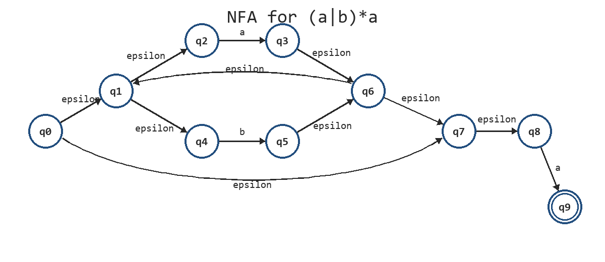
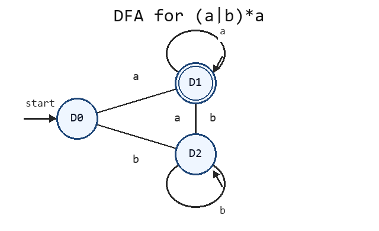
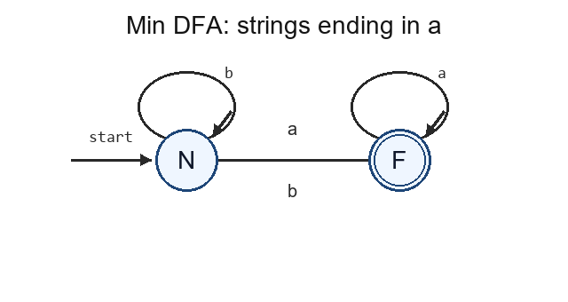
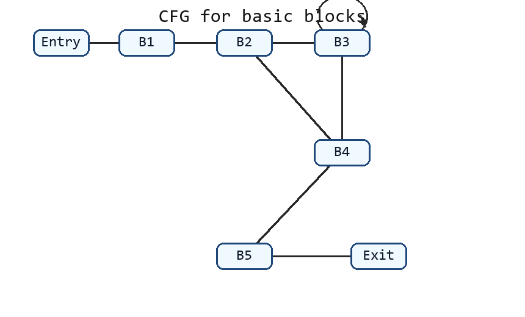

# 期末复习 PPT 完整模拟卷 02（题目与完整解析）

## 卷面说明

```text
考试时间：150 分钟
总分：100 分
题型：计算、构造、翻译与简答
说明：本卷题面给出了全部文法、控制流、数据流和目标机条件，不需要查阅其他文件。
```

## A 卷题目

### 一、词法分析与 LL(1) 分析（20 分）

#### （一）词法分析（10 分）

给定正则表达式：

```text
(a|b)*a
```

1. 使用 Thompson 构造法构造等价 NFA，写出起始状态、接受状态和全部转移。
2. 使用子集构造法构造 DFA，写出每个 DFA 状态对应的 NFA 状态集合及转移表。
3. 最小化 DFA，写出最终状态集合和转移表。

#### （二）LL(1) 分析（10 分）

给定文法，`p、r、t、u` 均为终结符：

```text
A -> B C
B -> B p | r
C -> t | u
```

1. 消除直接左递归。
2. 计算所有非终结符的 FIRST 和 FOLLOW。
3. 构造预测分析表。
4. 判断改写后的文法是否为 LL(1)，并写出依据。

### 二、LR 分析与语义分析（20 分）

#### （一）SLR 分析（12 分）

给定增广文法：

```text
(0) S' -> S
(1) S  -> C C
(2) C  -> c C
(3) C  -> d
```

1. 构造完整规范 LR(0) 项集族，并写出全部 GOTO 转移。
2. 计算 FOLLOW(S) 和 FOLLOW(C)。
3. 构造完整 SLR ACTION/GOTO 表。
4. 判断是否存在移进-规约或规约-规约冲突。

#### （二）L 属性 SDD（8 分）

给定声明文法：

```text
D  -> T L
T  -> int | float
L  -> id L'
L' -> , id L' | epsilon
```

设计一个 L 属性 SDD，将每个 `id` 及其类型加入符号表；再写出分析输入 `float x, y` 时的属性传递顺序和最终符号表。

### 三、中间代码、控制流与 SSA（20 分）

给定程序片段，假定数组元素宽度为 4：

```text
while (i < n) {
    if (a[i] > 0)
        sum = sum + a[i];
    i = i + 1;
}
```

1. 生成完整三地址码，要求显式写出标签和跳转目标。
2. 划分基本块并写出 CFG 边。
3. 把程序改写成 SSA，要求正确放置 `i` 和 `sum` 的 phi 函数。
4. 说明两个 phi 函数在退出 SSA 时应在哪些控制流边上插入复制。

### 四、运行时环境与目标代码生成（20 分）

#### （一）运行时环境（10 分）

函数调用如下：

```text
int add(int a, int b) {
    int t = a + b;
    return t;
}

int main() {
    int x = 3;
    int y = 4;
    int z = add(x, y);
    return z;
}
```

1. 写出 `add` 的活动记录中至少应包含的内容。
2. 按“参数从右到左压栈”的约定，写出调用 `add(x, y)` 时的压栈顺序。
3. 说明 BP、SP、返回地址和返回值在调用/返回过程中的作用。
4. 比较引用计数与标记-清扫回收，指出引用计数无法处理的结构。

#### （二）目标代码生成（10 分）

三地址码如下，目标机只有寄存器 `R0、R1`：

```text
t1 = a - b
t2 = t1 + c
x  = t2
```

目标机指令为：

```text
LD R, x
ST x, R
ADD Rd, Rs
SUB Rd, Rs
```

其中 `ADD Rd, Rs` 表示 `Rd = Rd + Rs`，`SUB Rd, Rs` 表示 `Rd = Rd - Rs`。

1. 生成一组完整目标代码。
2. 逐条写出寄存器描述符变化。
3. 写出最终地址描述符中 `x` 的位置。

### 五、数据流分析、支配与自然循环（20 分）

CFG 和基本块定值如下：

```text
Entry -> B1
B1 -> B2
B2 -> B3
B2 -> B4
B3 -> B2
B4 -> Exit

B1:
  d1: x = 1
  d2: y = 2

B2:
  d3: z = x + y

B3:
  d4: x = z

B4:
  use(z)
```

1. 写出到达定值分析的方向、交汇运算和传递方程。
2. 写出每个基本块的 gen/kill。
3. 从空集初始化，计算各基本块最终 IN/OUT。
4. 计算各基本块的支配集合和直接支配者。
5. 找出回边，并写出对应自然循环。

## B 完整解析

### 一、词法分析与 LL(1) 分析解析

#### （一）词法分析解析

采用如下 Thompson NFA，起始状态为 `q0`，接受状态为 `q9`：




```text
q0 --epsilon--> q1
q0 --epsilon--> q7

q1 --epsilon--> q2
q1 --epsilon--> q4
q2 --a-------> q3
q4 --b-------> q5
q3 --epsilon--> q6
q5 --epsilon--> q6

q6 --epsilon--> q1
q6 --epsilon--> q7

q7 --epsilon--> q8
q8 --a-------> q9
```

含义：`q1` 到 `q6` 表示 `a|b`，`q0、q7` 实现 Kleene 星，`q8 --a--> q9` 表示末尾必须再读一个 `a`。

初始 epsilon-closure：

```text
D0 = epsilon-closure({q0})
   = {q0,q1,q2,q4,q7,q8}
```

子集构造：

```text
D0 --a--> epsilon-closure({q3,q9})
         = {q1,q2,q3,q4,q6,q7,q8,q9}
         = D1

D0 --b--> epsilon-closure({q5})
         = {q1,q2,q4,q5,q6,q7,q8}
         = D2

D1 --a--> D1
D1 --b--> D2
D2 --a--> D1
D2 --b--> D2
```

DFA 状态表：




```text
状态  NFA 状态集合                         a   b   接受
D0    {q0,q1,q2,q4,q7,q8}                 D1  D2  否
D1    {q1,q2,q3,q4,q6,q7,q8,q9}           D1  D2  是
D2    {q1,q2,q4,q5,q6,q7,q8}              D1  D2  否
```

DFA 状态表（表格形式）：

| 状态 | NFA 状态集合 | a | b | 接受 |
| --- | --- | --- | --- | --- |
| D0 | {q0,q1,q2,q4,q7,q8} | D1 | D2 | 否 |
| D1 | {q1,q2,q3,q4,q6,q7,q8,q9} | D1 | D2 | 是 |
| D2 | {q1,q2,q4,q5,q6,q7,q8} | D1 | D2 | 否 |


最小化：

```text
初始划分：{D1}、{D0,D2}
D0 和 D2 在 a 上都到 D1，在 b 上都到 {D0,D2}，因此等价。

令 N={D0,D2}，F={D1}。

状态  a  b  接受
N     F  N  否
F     F  N  是
```




最小 DFA 识别所有以 `a` 结尾的 `{a,b}` 串。

#### （二）LL(1) 分析解析

消除 `B` 的直接左递归：

```text
A  -> B C
B  -> r B'
B' -> p B' | epsilon
C  -> t | u
```

FIRST：

```text
FIRST(A)  = {r}
FIRST(B)  = {r}
FIRST(B') = {p, epsilon}
FIRST(C)  = {t, u}
```

FOLLOW：

```text
FOLLOW(A)  = {$}
FOLLOW(B)  = {t, u}
FOLLOW(B') = {t, u}
FOLLOW(C)  = {$}
```

预测分析表，空白处均为 error：

```text
       r          p              t               u           $
A      A->BC
B      B->rB'
B'                B'->pB'       B'->epsilon     B'->epsilon
C                                C->t            C->u
```

预测分析表（表格形式）：

| 非终结符 | 输入符号 | 产生式 |
| --- | --- | --- |
| A | r | A -> B C |
| B | r | B -> r B' |
| B' | p | B' -> p B' |
| B' | t | B' -> epsilon |
| B' | u | B' -> epsilon |
| C | t | C -> t |
| C | u | C -> u |


每个表项至多一条产生式，且 `FIRST(pB')={p}` 与 `FOLLOW(B')={t,u}` 不相交，所以改写后的文法是 LL(1)。

### 二、LR 分析与语义分析解析

#### （一）SLR 分析解析

规范 LR(0) 项集族：

```text
I0:
S' -> . S
S  -> . C C
C  -> . c C
C  -> . d

I1:
S' -> S .

I2:
S  -> C . C
C  -> . c C
C  -> . d

I3:
C  -> c . C
C  -> . c C
C  -> . d

I4:
C  -> d .

I5:
S  -> C C .

I6:
C  -> c C .
```

GOTO 转移：

```text
GOTO(I0,S)=I1
GOTO(I0,C)=I2
GOTO(I0,c)=I3
GOTO(I0,d)=I4

GOTO(I2,C)=I5
GOTO(I2,c)=I3
GOTO(I2,d)=I4

GOTO(I3,C)=I6
GOTO(I3,c)=I3
GOTO(I3,d)=I4
```

FOLLOW：

```text
FOLLOW(S) = {$}
FOLLOW(C) = {c,d,$}
```

SLR 表：

```text
状态 | ACTION(c) | ACTION(d) | ACTION($) | GOTO(S) | GOTO(C)
0    | s3        | s4        |           | 1       | 2
1    |           |           | acc       |         |
2    | s3        | s4        |           |         | 5
3    | s3        | s4        |           |         | 6
4    | r3        | r3        | r3        |         |
5    |           |           | r1        |         |
6    | r2        | r2        | r2        |         |
```

SLR ACTION/GOTO 表（表格形式）：

| 状态 | ACTION(c) | ACTION(d) | ACTION($) | GOTO(S) | GOTO(C) |
| --- | --- | --- | --- | --- | --- |
| 0 | s3 | s4 | error | 1 | 2 |
| 1 | error | error | acc | error | error |
| 2 | s3 | s4 | error | error | 5 |
| 3 | s3 | s4 | error | error | 6 |
| 4 | r3 | r3 | r3 | error | error |
| 5 | error | error | r1 | error | error |
| 6 | r2 | r2 | r2 | error | error |


表中没有多重动作，因此没有移进-规约冲突或规约-规约冲突，该文法是 SLR 文法。

#### （二）L 属性 SDD 解析

```text
D -> T L
     { L.in = T.type }

T -> int
     { T.type = int }

T -> float
     { T.type = float }

L -> id L'
     { addType(id.entry, L.in); L'.in = L.in }

L' -> , id L'1
      { addType(id.entry, L'.in); L'1.in = L'.in }

L' -> epsilon
      { }
```

输入 `float x, y` 的属性传递：

```text
T.type = float
L.in = float
addType(x, float)
L'.in = float
addType(y, float)
L'1.in = float
```

最终符号表：

```text
名字  类型
x     float
y     float
```

继承属性只依赖父结点或左侧兄弟结点，符合 L 属性限制。

### 三、中间代码、控制流与 SSA 解析

完整三地址码：

```text
L1: if i < n goto L2
    goto L6

L2: t1 = i * 4
    t2 = a[t1]
    if t2 > 0 goto L3
    goto L4

L3: sum = sum + t2
    goto L4

L4: i = i + 1
    goto L1

L6:
```

基本块与 CFG：




```text
B1: L1 的条件与 goto L6
B2: L2 的地址计算、数组读取和条件分支
B3: L3 的 sum 更新与 goto L4
B4: L4 的 i 更新与 goto L1
B5: L6

边：
B1->B2
B1->B5
B2->B3
B2->B4
B3->B4
B4->B1
```

设循环前初值为 `i0、sum0`，SSA：

```text
L1:
i1   = phi(i0, i2)
sum1 = phi(sum0, sum3)
if i1 < n goto L2
goto L6

L2:
t1 = i1 * 4
t2 = a[t1]
if t2 > 0 goto L3
goto L4

L3:
sum2 = sum1 + t2
goto L4

L4:
sum3 = phi(sum2, sum1)
i2 = i1 + 1
goto L1

L6:
```

退出 SSA 时的边复制：

```text
进入 L1 的循环前边：i1=i0，sum1=sum0
L4->L1 回边：i1=i2，sum1=sum3
L3->L4 边：sum3=sum2
L2->L4 的假分支边：sum3=sum1
```

并行复制需要在对应前驱边上执行；必要时拆分临界边。

### 四、运行时环境与目标代码生成解析

#### （一）运行时环境解析

`add` 的活动记录至少包含：

```text
参数 a、b
局部变量 t
返回值位置
返回地址
旧 BP 或控制链
保存的寄存器/机器状态
```

参数从右到左压栈：

```text
先压入 y 的值 4，作为参数 b。
再压入 x 的值 3，作为参数 a。
然后执行 call，保存返回地址并进入 add。
```

调用/返回：

```text
SP 指向当前栈顶，压栈和退栈会修改 SP。
BP 作为当前活动记录的稳定基址，用固定偏移访问参数和局部变量。
返回地址指出 add 返回后 main 中继续执行的位置。
返回值按约定放入指定寄存器或活动记录的返回值区域，再传给 z。
返回时恢复旧 BP、SP 和保存的寄存器，再跳到返回地址。
```

垃圾回收比较：

```text
引用计数在引用变化时立即维护计数，计数为 0 就可回收，暂停短；但无法回收不可达循环。
标记-清扫从根集出发标记可达对象，再清扫未标记对象，能回收不可达循环，但需要遍历堆并产生暂停。
```

#### （二）目标代码生成解析

完整目标代码：

```text
LD  R0, a       ; R0=a
LD  R1, b       ; R1=b
SUB R0, R1      ; R0=t1=a-b
LD  R1, c       ; R1=c
ADD R0, R1      ; R0=t2=t1+c
ST  x, R0       ; x=R0
```

寄存器描述符：

```text
初始：R0={}，R1={}
LD R0,a 后：R0={a}
LD R1,b 后：R1={b}
SUB 后：R0={t1}，R1={b}
LD R1,c 后：R0={t1}，R1={c}
ADD 后：R0={t2,x的新值}，R1={c}
ST 后：R0={x}，R1={c}
```

最终地址描述符：

```text
Addr(x)={内存位置 x, R0}
```

### 五、数据流分析、支配与自然循环解析

到达定值是正向 may 分析，交汇运算为并集：

```text
IN[B]  = union OUT[P]，P 为 B 的前驱
OUT[B] = gen[B] union (IN[B] - kill[B])
OUT[Entry] = {}
```

gen/kill：

```text
gen[B1]={d1,d2}   kill[B1]={d4}
gen[B2]={d3}      kill[B2]={}
gen[B3]={d4}      kill[B3]={d1}
gen[B4]={}        kill[B4]={}
```

不动点结果：

```text
IN[B1]  = {}
OUT[B1] = {d1,d2}

IN[B2]  = {d1,d2,d3,d4}
OUT[B2] = {d1,d2,d3,d4}

IN[B3]  = {d1,d2,d3,d4}
OUT[B3] = {d2,d3,d4}

IN[B4]  = {d1,d2,d3,d4}
OUT[B4] = {d1,d2,d3,d4}
```

支配集合：

```text
Dom(Entry)={Entry}
Dom(B1)={Entry,B1}
Dom(B2)={Entry,B1,B2}
Dom(B3)={Entry,B1,B2,B3}
Dom(B4)={Entry,B1,B2,B4}
Dom(Exit)={Entry,B1,B2,B4,Exit}
```

直接支配者：

```text
idom(B1)=Entry
idom(B2)=B1
idom(B3)=B2
idom(B4)=B2
idom(Exit)=B4
```

回边与自然循环：

```text
B3->B2 是回边，因为 B2 支配 B3。
对应自然循环为 {B2,B3}。
```
