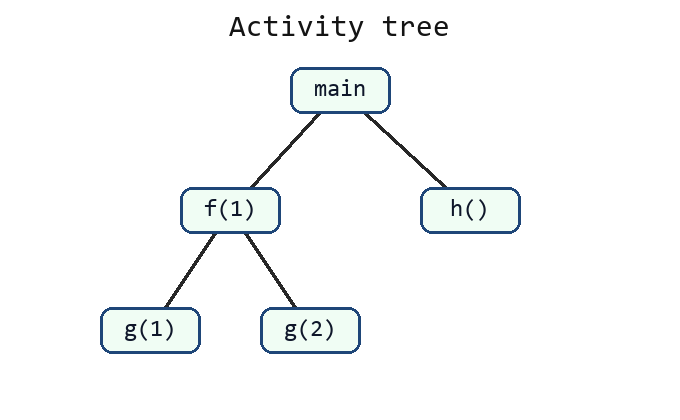
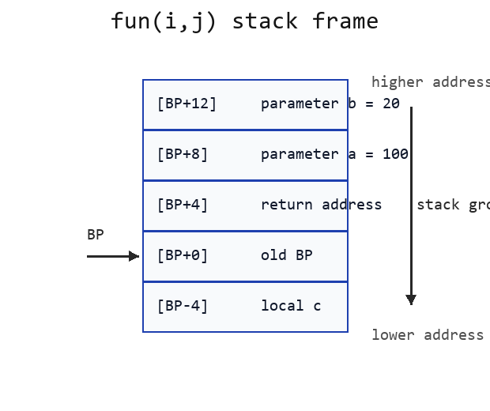
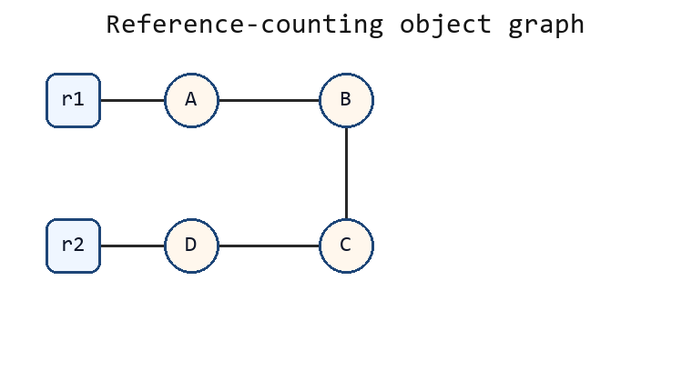
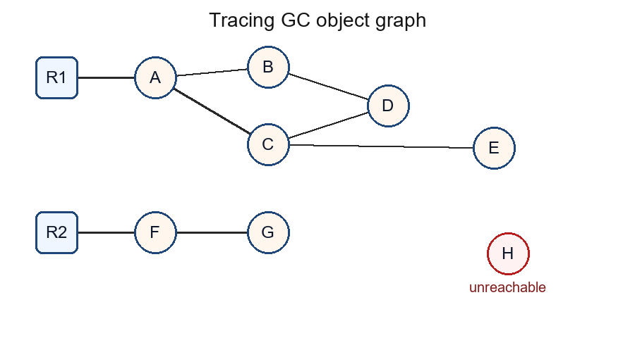

# 运行时环境完整模拟卷 04（题目与完整解析）

## 卷面说明

```text
考试时间：120 分钟
总分：100 分
说明：本卷独立覆盖存储分配、活动树、栈帧、堆管理、引用计数和跟踪式垃圾回收。
所有调用约定、对象图和内存数据均在题面中给出。
```

## A 卷题目

### 一、存储区、活动树与控制栈（20 分）

某程序的一次执行产生如下动态调用关系，子结点从左到右表示实际调用顺序：

```text
main
├─ f(1)
│  ├─ g(1)
│  └─ g(2)
└─ h()
```

1. 静态区、栈区、堆区分别存放什么数据，各举一个例子。
2. 写出本次执行的过程调用顺序。
3. 写出过程返回顺序。
4. 当控制流位于 `g(2)` 内部时，哪些活动尚未结束；控制栈从栈底到栈顶有哪些活动记录。
5. 说明活动树的前序/后序遍历与调用/返回顺序的关系。

### 二、栈帧布局与调用/返回（20 分）

程序：

```text
int fun(int a, int b) {
    int c = a - b;
    return c;
}

int main() {
    int i = 100;
    int j = 20;
    int m = fun(i, j);
    return m;
}
```

采用如下明确约定：

```text
机器字长 4 字节；栈向低地址增长。
调用者按从右到左顺序压入参数。
call 指令把返回地址压栈。
被调用者执行 push BP；BP=SP；再为局部变量分配 4 字节。
函数返回值放入寄存器 R0。
```

1. 写出调用 `fun(i,j)` 时，从压入第一个参数到完成函数序言的指令顺序。
2. 以 BP 为基准，写出 `c、旧BP、返回地址、a、b` 的地址偏移。
3. 写出执行 `c=a-b` 和设置返回值的伪汇编。
4. 写出函数尾声和返回过程。
5. 说明返回后 `main` 如何得到 `m=80`。

### 三、堆分配、碎片与分配策略（20 分）

堆中空闲块按地址从低到高排列，初始大小为：

```text
[6, 14, 8, 20]
```

依次发出三个分配请求：

```text
7, 5, 12
```

分配时从选中空闲块的低地址端切出所需空间，不考虑对齐和块头开销。

1. 使用 First-Fit，写出每次选中的块及最终空闲块大小。
2. 使用 Best-Fit，写出每次选中的块及最终空闲块大小。
3. 比较两种策略最终最大连续空闲块。
4. 区分内部碎片和外部碎片。
5. 写出存储管理器的空间效率、程序效率和低开销三个评价维度。

### 四、引用计数与不可达环（20 分）

根和对象引用关系如下：

```text
r1 -> A
r2 -> D
A  -> B
B  -> C
C  -> B
D  -> C
```

引用计数只统计根引用和对象字段引用。

1. 写出初始时 A、B、C、D 的引用计数。
2. 执行 `r1=null` 后，按引用计数规则写出回收过程和新计数。
3. 再执行 `r2=null` 后，写出回收过程和新计数。
4. 指出此时哪些对象不可达但不能被引用计数回收。
5. 说明跟踪式垃圾回收为什么能回收它们。

### 五、标记-清扫、压缩、拷贝与分代（20 分）

根和对象图：

```text
R1 -> A        R2 -> F
A -> B, C
B -> D
C -> D, E
D -> B
F -> G
H 无入边
```

对象在堆中按地址排列：

```text
对象  起始地址  大小
A     0         2
H     2         2
B     4         3
C     7         2
D     9         1
E     10        2
F     12        1
G     13        2
```

1. 从根集出发列出全部可达对象和垃圾对象。
2. 写出标记-清扫两个阶段及清扫结果。
3. 按对象原有顺序向低地址压缩，写出每个存活对象的新起始地址。
4. 说明半空间拷贝回收的 From/To 过程及空间代价。
5. 说明分代回收依据的经验规律，以及记忆集的作用。

## B 按考试标准重写答案

### 一、存储区、活动树与控制栈答案

#### 1. 静态区、栈区、堆区

| 存储区 | 存放内容 | 例子 |
| --- | --- | --- |
| 静态区 | 编译期可确定大小、生命周期贯穿程序运行的数据和代码 | 全局变量、静态变量、常量、目标代码 |
| 栈区 | 随过程调用创建、随过程返回销毁的活动记录 | 参数、返回地址、局部变量、保存的 BP |
| 堆区 | 生命周期不严格服从调用嵌套关系的动态对象 | `malloc` 或 `new` 分配的对象 |

#### 2. 过程调用顺序

活动树如下：



子结点从左到右就是实际调用顺序。调用发生在进入过程时，所以调用顺序是活动树的前序遍历：

```text
main -> f(1) -> g(1) -> g(2) -> h()
```

#### 3. 过程返回顺序

一个过程必须等它调用的子过程全部返回后才能返回，所以返回顺序是后序遍历：

```text
g(1) -> g(2) -> f(1) -> h() -> main
```

#### 4. 位于 `g(2)` 内部时的控制栈

执行到 `g(2)` 时，`g(1)` 已经返回，`h()` 尚未调用。

| 活动 | 状态 |
| --- | --- |
| main | 已调用，尚未结束 |
| f(1) | 已调用，尚未结束 |
| g(1) | 已返回 |
| g(2) | 当前正在执行 |
| h() | 尚未调用 |

因此尚未结束的活动是：

```text
main, f(1), g(2)
```

控制栈从栈底到栈顶为：

```text
AR(main), AR(f(1)), AR(g(2))
```

#### 5. 活动树遍历与调用/返回顺序

| 遍历 | 对应含义 |
| --- | --- |
| 前序遍历 | 先访问当前结点，再访问子结点；对应过程调用顺序 |
| 后序遍历 | 先访问子结点，再访问当前结点；对应过程返回顺序 |

当前控制栈对应活动树中“根结点到当前活动结点”的路径。

### 二、栈帧布局与调用/返回答案

#### 1. 从压入参数到完成函数序言的指令顺序

题目约定参数从右到左压栈。调用 `fun(i,j)` 时，右侧参数 `j` 对应形参 `b`，左侧参数 `i` 对应形参 `a`。

```text
push j          ; 压入参数 b=20
push i          ; 压入参数 a=100
call fun        ; 压入返回地址，并跳转到 fun

fun:
push BP         ; 保存 main 的旧 BP
mov  BP, SP     ; 令 BP 指向刚压入的旧 BP
sub  SP, 4      ; 为局部变量 c 分配 4 字节
```

执行 `push BP` 后，栈顶位置保存的是旧 BP；随后 `BP=SP`，所以旧 BP 位于 `[BP+0]`。

#### 2. 以 BP 为基准的偏移

题目约定机器字长 4 字节，栈向低地址增长。完成函数序言后布局如下：



| 位置 | 内容 | 原因 |
| --- | --- | --- |
| `[BP-4]` | 局部变量 `c` | `sub SP,4` 在 BP 下方分配 4 字节 |
| `[BP+0]` | 旧 BP | `push BP` 后立刻 `BP=SP` |
| `[BP+4]` | 返回地址 | `call fun` 压入 |
| `[BP+8]` | 参数 `a=100` | 调用者后压入 `i`，离返回地址更近 |
| `[BP+12]` | 参数 `b=20` | 调用者先压入 `j`，位置更高 |

#### 3. `c=a-b` 和设置返回值

```text
LD   R0, [BP+8]       ; R0 = a = 100
SUB  R0, [BP+12]      ; R0 = a - b = 80
ST   [BP-4], R0       ; c = 80
LD   R0, [BP-4]       ; 返回值放入 R0
```

也可以在 `SUB` 后直接把 `R0` 作为返回值；这里按题目中的局部变量 `c` 明确写出存储和读取。

#### 4. 函数尾声和返回过程

```text
mov  SP, BP           ; 释放局部变量 c
pop  BP               ; 恢复调用者 BP
ret                   ; 弹出返回地址并跳回 main
```

解释：

| 指令 | 作用 |
| --- | --- |
| `mov SP,BP` | SP 回到旧 BP 所在位置，局部变量空间失效 |
| `pop BP` | 取出旧 BP，恢复 main 的栈帧基址 |
| `ret` | 取出返回地址，跳回调用点之后 |

#### 5. `main` 如何得到 `m=80`

`fun` 返回时，返回值已经放在 `R0`。回到 `main` 后，调用者清理参数并保存返回值：

```text
add SP, 8             ; 清理两个 4 字节参数
ST  m, R0             ; m = 80
```

因此 `main` 中的 `m` 得到 `80`。

### 三、堆分配、碎片与分配策略答案

#### 1. First-Fit

First-Fit 从低地址到高地址扫描，选择第一个能满足请求的空闲块。

初始：

```text
[6, 14, 8, 20]
```

| 请求 | 扫描选择 | 分配后空闲块 |
| --- | --- | --- |
| 7 | 6 不够，14 够，从 14 中切出 7 | `[6, 7, 8, 20]` |
| 5 | 第一个块 6 够，从 6 中切出 5 | `[1, 7, 8, 20]` |
| 12 | 1、7、8 不够，20 够，从 20 中切出 12 | `[1, 7, 8, 8]` |

最终空闲块大小：

```text
[1, 7, 8, 8]
```

#### 2. Best-Fit

Best-Fit 选择所有可满足请求的块中最小的那个。

| 请求 | 可选块 | 选择 | 分配后空闲块 |
| --- | --- | --- | --- |
| 7 | 14, 8, 20 | 8 | `[6, 14, 1, 20]` |
| 5 | 6, 14, 20 | 6 | `[1, 14, 1, 20]` |
| 12 | 14, 20 | 14 | `[1, 2, 1, 20]` |

最终空闲块大小：

```text
[1, 2, 1, 20]
```

#### 3. 最大连续空闲块比较

| 策略 | 最终空闲块 | 最大连续空闲块 |
| --- | --- | --- |
| First-Fit | `[1,7,8,8]` | 8 |
| Best-Fit | `[1,2,1,20]` | 20 |

本题给定请求序列下，Best-Fit 最终留下的最大连续空闲块更大。

#### 4. 内部碎片和外部碎片

| 碎片类型 | 定义 | 例子 |
| --- | --- | --- |
| 内部碎片 | 已分配块内部没有被实际使用的空间 | 请求 13，但按 16 字节块分配，浪费 3 |
| 外部碎片 | 空闲空间总量足够，但分散成多个不连续小块 | 空闲 5+5+5，总量 15，但无法满足连续 12 的请求 |

#### 5. 存储管理器评价维度

| 维度 | 含义 |
| --- | --- |
| 空间效率 | 降低碎片和总堆占用 |
| 程序效率 | 分配布局有利于访问局部性和缓存 |
| 低开销 | 分配、释放、回收、维护元数据的成本低 |

### 四、引用计数与不可达环答案

对象图如下：



#### 1. 初始引用计数

引用来源：

```text
r1 -> A
r2 -> D
A  -> B
B  -> C
C  -> B
D  -> C
```

| 对象 | 入边来源 | 初始 RC |
| --- | --- | --- |
| A | r1 | 1 |
| B | A, C | 2 |
| C | B, D | 2 |
| D | r2 | 1 |

#### 2. 执行 `r1=null`

`r1` 不再指向 A：

```text
RC(A): 1 -> 0
```

A 被回收。回收 A 时删除 A 的出边 `A -> B`：

```text
RC(B): 2 -> 1
```

此时：

| 对象 | RC |
| --- | --- |
| B | 1 |
| C | 2 |
| D | 1 |

#### 3. 再执行 `r2=null`

`r2` 不再指向 D：

```text
RC(D): 1 -> 0
```

D 被回收。回收 D 时删除 D 的出边 `D -> C`：

```text
RC(C): 2 -> 1
```

此时：

| 对象 | RC |
| --- | --- |
| B | 1 |
| C | 1 |

#### 4. 不可达但不能被引用计数回收的对象

根 `r1`、`r2` 都为 null 后，根集已经无法到达 B 和 C。但 B 和 C 互相引用：

```text
B -> C
C -> B
```

所以：

```text
RC(B)=1
RC(C)=1
```

它们都不是 0，引用计数不会触发回收。不可达但不能被引用计数回收的对象是：

```text
B, C
```

#### 5. 跟踪式垃圾回收为什么能回收

跟踪式 GC 从根集出发，只标记从根可达的对象。此时根集为空或不指向 B/C，因此 B、C 不会被标记。清扫阶段回收所有未标记对象，所以能回收不可达环。

### 五、标记-清扫、压缩、拷贝与分代答案

对象图如下：



#### 1. 可达对象和垃圾对象

从根出发：

```text
R1 -> A -> B -> D
R1 -> A -> C -> D
R1 -> A -> C -> E
R2 -> F -> G
```

可达集合：

```text
{A, B, C, D, E, F, G}
```

垃圾对象：

```text
{H}
```

#### 2. 标记-清扫过程

| 阶段 | 操作 |
| --- | --- |
| 标记 | 从 R1、R2 出发遍历引用图，标记 A、B、C、D、E、F、G |
| 清扫 | 线性扫描堆，发现 H 未标记，释放 H 的空间 |

清扫后 H 的地址区间 `[2,4)` 成为空闲块。

#### 3. 压缩后的新地址

按原有地址顺序保留存活对象，并向低地址压缩。H 被删除，后面的存活对象前移。

| 对象 | 旧起始地址 | 大小 | 新起始地址 |
| --- | --- | --- | --- |
| A | 0 | 2 | 0 |
| B | 4 | 3 | 2 |
| C | 7 | 2 | 5 |
| D | 9 | 1 | 7 |
| E | 10 | 2 | 8 |
| F | 12 | 1 | 10 |
| G | 13 | 2 | 11 |

压缩后存活对象占用连续区间：

```text
[0, 13)
```

所有根和对象字段中的旧地址都必须更新为新地址。

#### 4. 半空间拷贝回收

半空间拷贝把堆分成 From 和 To 两个半空间：

| 阶段 | 动作 |
| --- | --- |
| 正常分配 | 只在 From 空间中顺序分配 |
| 回收开始 | 从根出发，把可达对象复制到 To 空间 |
| 更新引用 | 用复制后的新地址更新根和对象字段 |
| 回收结束 | 交换 From 和 To；旧 From 中未复制对象自然被丢弃 |

空间代价：同一时刻通常只有一半堆空间用于分配，因为另一半要作为 To 空间。

#### 5. 分代回收与记忆集

分代回收依据经验规律：

```text
多数对象很快死亡，少数对象存活很久。
```

因此把堆分为新生代和老年代：

| 区域 | 回收特点 |
| --- | --- |
| 新生代 | 容量较小，回收频繁 |
| 老年代 | 存活时间长，回收频率低 |

记忆集记录“老年代对象指向新生代对象”的引用。回收新生代时，除了栈和全局变量等根，还要把记忆集中的引用当作额外根，这样不用扫描整个老年代。
