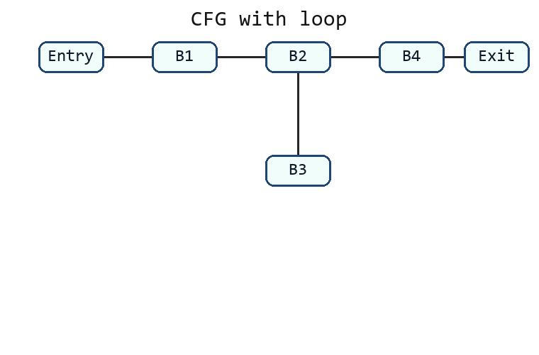
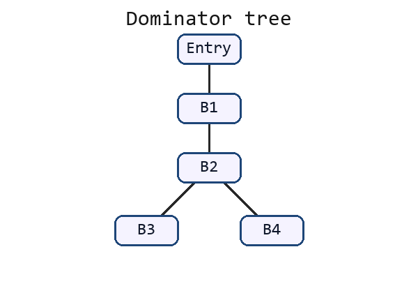

# 机器无关优化完整模拟卷 06（题目与完整解析）

## 卷面说明

```text
考试时间：120 分钟
总分：100 分
说明：本卷独立覆盖局部优化、到达定值、活跃变量、可用表达式、复制传播、支配与自然循环。
所有 CFG、gen/kill、use/def 和表达式全集均在题面中给出。
```

## A 卷题目

### 一、语义不变优化与数据流框架（20 分）

给定基本块：

```text
(1) t1 = a + b
(2) t2 = a + b
(3) x  = t2
(4) y  = x
(5) z  = 3 * 4
```

块出口只有 `x` 活跃。

1. 指出公共子表达式并消除。
2. 对复制语句做传播。
3. 对常量表达式做折叠。
4. 删除死代码，写出最终基本块。
5. 说明正向/逆向数据流分析中 IN、OUT、transfer 和 meet 的作用。

### 二、到达定值分析（20 分）

CFG：

```text
Entry -> B1
B1 -> B2
B2 -> B3
B2 -> B4
B3 -> B4
B4 -> B2
```

给定：

```text
gen[B1] ={d1,d2,d3}    kill[B1]={d4,d5,d6,d7}
gen[B2] ={d4,d5}       kill[B2]={d1,d2,d7}
gen[B3] ={d6}          kill[B3]={d3}
gen[B4] ={d7}          kill[B4]={d1,d4}
```

1. 写出分析方向、meet 和 transfer 方程。
2. 从所有 OUT 为空集开始，采用就地更新并按 `B1、B2、B3、B4` 顺序处理，写出第一轮 OUT。
3. 继续迭代到不动点，写出所有 IN/OUT。
4. 说明为什么该分析使用并集而不是交集。
5. 写出 worklist 算法的停止条件。

### 三、活跃变量分析（20 分）

CFG：

```text
B1 -> B2
B2 -> B3
B2 -> B4
B3 -> B2
B4 -> Exit
```

基本块集合：

```text
use[B1]={}       def[B1]={x,y}
use[B2]={x,y}    def[B2]={z}
use[B3]={z}      def[B3]={x}
use[B4]={z}      def[B4]={}
```

1. 写出活跃变量的定义。
2. 写出方向、meet 和 transfer 方程。
3. 从所有 IN/OUT 为空集开始迭代，写出最终 IN/OUT。
4. 根据结果判断 `x`、`y` 在 B3 出口是否活跃。
5. 说明活跃变量分析在寄存器分配和死代码删除中的用途。

### 四、可用表达式与复制传播（20 分）

表达式全集：

```text
U={a+b, c*d}
```

CFG 与局部集合：

```text
Entry -> B1
B1 -> B2
B1 -> B3
B2 -> B4
B3 -> B4

e_gen[B1]={a+b}  e_kill[B1]={}
e_gen[B2]={c*d}  e_kill[B2]={a+b}
e_gen[B3]={a+b}  e_kill[B3]={}
e_gen[B4]={}     e_kill[B4]={}
```

1. 写出可用表达式定义。
2. 写出分析方向、meet、边界条件和 transfer 方程。
3. 计算所有基本块最终 IN/OUT。
4. 判断进入 B4 时 `a+b` 和 `c*d` 是否可用。
5. 写出在使用点把 `x` 替换为 `y` 所需的复制传播条件。

### 五、支配、后支配、回边与自然循环（20 分）

给定 CFG：

```text
Entry -> B1
B1 -> B2
B2 -> B3
B2 -> B4
B3 -> B2
B4 -> Exit
```

1. 计算所有结点的 Dom 集和 idom。
2. 写出支配树。
3. 计算所有结点的 PostDom 集和 ipdom。
4. 找出全部回边并构造自然循环。
5. 判断该 CFG 是否可归约，并写出依据。

## B 完整解析

### 一、语义不变优化与数据流框架解析

公共子表达式：

```text
(2) 的 a+b 与 (1) 相同，且中间没有修改 a 或 b。
因此把 (2) 改成 t2=t1。
```

复制传播：

```text
(3) x=t2 可改为 x=t1。
(4) y=x 可传播为 y=t1，但 y 在出口不活跃，随后会删除。
```

常量折叠：

```text
(5) z=3*4  =>  z=12。
```

死代码删除后：

```text
t1 = a + b
x  = t1
```

`t2、y、z` 在出口都不活跃，且它们的定义没有副作用，所以删除。

数据流框架：

```text
IN[B]：进入基本块 B 前的数据流事实。
OUT[B]：离开基本块 B 后的数据流事实。
transfer：根据 B 内语句把 IN[B] 转换为 OUT[B]，或逆向分析时把 OUT[B] 转换为 IN[B]。
meet：在多个控制流前驱或后继的信息汇合时进行并集或交集。
正向分析沿 CFG 边方向传播，逆向分析沿 CFG 边反方向传播。
```

### 二、到达定值分析解析

到达定值是正向 may 分析：

```text
OUT[Entry]={}
IN[B]=union OUT[P]，P 为 B 的前驱
OUT[B]=gen[B] union (IN[B]-kill[B])
```

第一轮按 `B1、B2、B3、B4` 顺序计算：

```text
OUT[B1]={d1,d2,d3}
OUT[B2]={d3,d4,d5}
OUT[B3]={d4,d5,d6}
OUT[B4]={d3,d5,d6,d7}
```

到达定值 OUT 表：

| 基本块 | OUT |
| --- | --- |
| B1 | {d1,d2,d3} |
| B2 | {d3,d4,d5} |
| B3 | {d4,d5,d6} |
| B4 | {d3,d5,d6,d7} |


继续迭代到不动点：

```text
IN[B1] ={}
OUT[B1]={d1,d2,d3}

IN[B2] ={d1,d2,d3,d5,d6,d7}
OUT[B2]={d3,d4,d5,d6}

IN[B3] ={d3,d4,d5,d6}
OUT[B3]={d4,d5,d6}

IN[B4] ={d3,d4,d5,d6}
OUT[B4]={d3,d5,d6,d7}
```

使用并集的原因：

```text
只要存在一条从定值到程序点且中途未被杀死的路径，该定值就可能到达该点。
因此任一前驱带来的定值都应保留，meet 为并集。
```

worklist 停止条件：

```text
当一次处理后所有基本块的 IN/OUT 都不再变化，工作队列为空，达到不动点，算法停止。
```

### 三、活跃变量分析解析

定义：

```text
变量 v 在程序点 p 活跃，当且仅当存在一条从 p 出发的路径，在 v 再次被定值前使用 v。
```

活跃变量是逆向 may 分析：

```text
IN[Exit]={}
OUT[B]=union IN[S]，S 为 B 的后继
IN[B]=use[B] union (OUT[B]-def[B])
```

不动点结果：

```text
IN[B1] ={}
OUT[B1]={x,y}

IN[B2] ={x,y}
OUT[B2]={y,z}

IN[B3] ={y,z}
OUT[B3]={x,y}

IN[B4] ={z}
OUT[B4]={}
```

活跃变量 IN/OUT 表：

| 基本块 | IN | OUT |
| --- | --- | --- |
| B1 | {} | {x,y} |
| B2 | {x,y} | {y,z} |
| B3 | {y,z} | {x,y} |
| B4 | {z} | {} |


B3 出口：

```text
x 活跃，因为回到 B2 后 B2 在重新定义 x 前使用 x。
y 活跃，因为回到 B2 后使用 y，且 B3 不定义 y。
```

用途：

```text
寄存器分配：不活跃值所在寄存器可以被覆盖，活跃值需要保留或 spill。
死代码删除：若赋值结果在语句后不活跃且语句无副作用，该赋值可以删除。
```

### 四、可用表达式与复制传播解析

定义：

```text
表达式 e 在程序点 p 可用，当且仅当从 Entry 到 p 的每条路径都计算过 e，且最后一次计算后没有修改 e 的任何操作数。
```

可用表达式是正向 must 分析：

```text
OUT[Entry]={}
除 Entry 外，迭代初值可设为全集 U。
IN[B]=intersection OUT[P]，P 为 B 的前驱
OUT[B]=e_gen[B] union (IN[B]-e_kill[B])
```

结果：

```text
IN[B1] ={}
OUT[B1]={a+b}

IN[B2] ={a+b}
OUT[B2]={c*d}

IN[B3] ={a+b}
OUT[B3]={a+b}

IN[B4] =OUT[B2] intersection OUT[B3]
       ={c*d} intersection {a+b}
       ={}
OUT[B4]={}
```

进入 B4 时：

```text
a+b 不可用，因为经过 B2 的路径杀死了 a+b。
c*d 不可用，因为经过 B3 的路径没有计算 c*d。
```

复制传播条件：

```text
若要在使用点 u 把 x 替换成 y：
1. 从 Entry 到 u 的每条路径上都必须有到达 u 的复制 x=y。
2. 从该复制到 u 之间不能重新定义 x。
3. 从该复制到 u 之间不能重新定义 y，否则 x 保存的旧 y 值不等于当前 y。
```

### 五、支配、后支配、回边与自然循环解析




Dom 集：

```text
Dom(Entry)={Entry}
Dom(B1)={Entry,B1}
Dom(B2)={Entry,B1,B2}
Dom(B3)={Entry,B1,B2,B3}
Dom(B4)={Entry,B1,B2,B4}
Dom(Exit)={Entry,B1,B2,B4,Exit}
```

idom：

```text
idom(B1)=Entry
idom(B2)=B1
idom(B3)=B2
idom(B4)=B2
idom(Exit)=B4
```

支配树：




```text
Entry
  B1
    B2
      B3
      B4
        Exit
```

PostDom 集：

```text
PostDom(Exit)={Exit}
PostDom(B4)={B4,Exit}
PostDom(B3)={B3,B2,B4,Exit}
PostDom(B2)={B2,B4,Exit}
PostDom(B1)={B1,B2,B4,Exit}
PostDom(Entry)={Entry,B1,B2,B4,Exit}
```

ipdom：

```text
ipdom(Entry)=B1
ipdom(B1)=B2
ipdom(B2)=B4
ipdom(B3)=B2
ipdom(B4)=Exit
```

回边和自然循环：

```text
B3->B2 是回边，因为 B2 支配 B3。
从 B3 反向沿前驱搜索，遇到 B2 停止，得到自然循环 {B2,B3}。
```

该 CFG 可归约：

```text
循环只有唯一入口 B2，后退边 B3->B2 的头 B2 支配尾 B3，因此该后退边是回边。
图中没有多入口不可归约循环。
```
