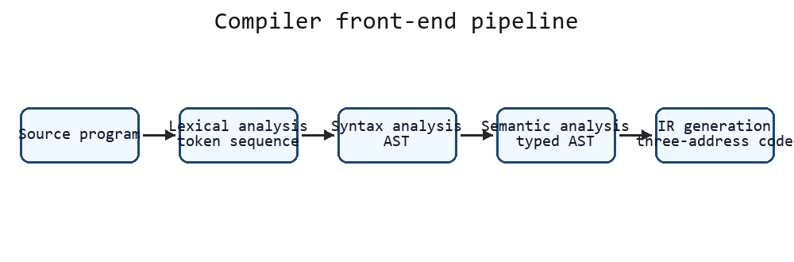
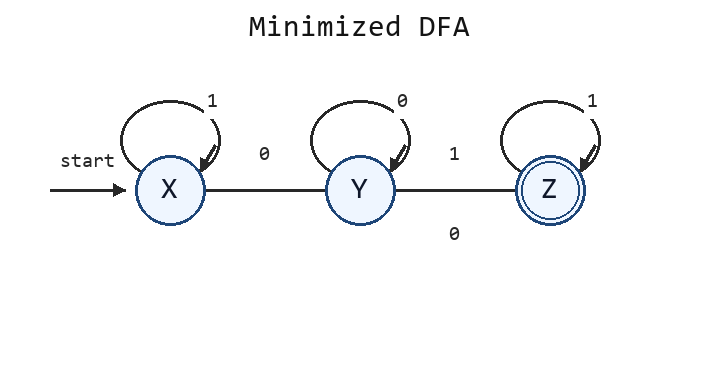
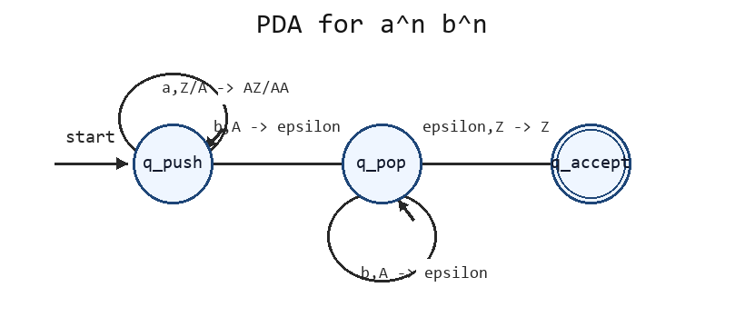

# Slides 前端完整模拟卷 07（题目与完整解析）

## 卷面说明

```text
考试时间：120 分钟
总分：100 分
说明：本卷独立覆盖 Slides 中编译器导论、有限自动机、CFG/PDA、二义性和 LL(1)。
所有题目所需数据均在题面中给出。
```

## A 卷题目

### 一、编译流程与中间表示（20 分）

某编译器处理下面程序：

```text
int x;
x = 2 + 3 * 4;
```

现有以下中间结果，顺序被打乱：

```text
① token 序列：int id ; id = num + num * num ;
② AST：Assign(x, Add(2, Mul(3,4)))
③ 带类型 AST：Assign<int>(x:int, Add<int>(2, Mul<int>(3,4)))
④ 三地址码：t1=3*4; t2=2+t1; x=t2
⑤ 目标代码：LOAD/ADD/MUL/STORE 指令序列
```

1. 写出 ① 到 ⑤ 的正确生成顺序及对应编译阶段。
2. 指出哪些阶段属于前端、中端和后端。
3. 说明 AST 与三地址码的结构差异。
4. 说明引入 IR 的两个直接好处。
5. 解释 phase 与 pass 的区别。

### 二、DFA 最小化与等价性（20 分）

给定 DFA：

```text
状态：A, B, C, D, E
字母表：0, 1
初态：A
终态：D, E

状态  0  1
A     B  C
B     B  D
C     B  C
D     B  E
E     B  E
```

1. 写出 DFA 五元组。
2. 使用划分细化法给出每轮状态划分。
3. 写出最小 DFA 的状态和转移表。
4. 写出原 DFA 接受的三个长度不超过 3 的串和三个拒绝串。
5. 说明用乘积自动机检查两个 DFA 等价的判定条件。

### 三、CFG、推导与 PDA（20 分）

给定文法：

```text
S -> a S b | epsilon
```

1. 写出串 `aabb` 的最左推导。
2. 写出串 `aabb` 的最右推导。
3. 写出该语言的集合描述。
4. 设计识别该语言的 PDA，写出状态、栈符号和转移规则。
5. 写出 PDA 处理 `aabb` 时的主要配置变化。

### 四、二义性与 CFL 性质（20 分）

给定文法：

```text
E -> E + E | E * E | id
```

1. 对 `id + id * id` 写出两种不同的最左推导，证明文法二义。
2. 改写文法，使 `*` 优先于 `+`，且二者均左结合。
3. 说明改写后的文法为什么消除了本题中的二义性。
4. 判断：所有正则语言是否都是 CFL。
5. 判断 CFL 对并、连接、Kleene 星、交、补是否封闭。

### 五、LL(1) 预测分析（20 分）

给定文法：

```text
S -> a A | b
A -> c A | d
```

1. 计算 FIRST(S)、FIRST(A)、FOLLOW(S)、FOLLOW(A)。
2. 构造完整预测分析表，空白项写 `error`。
3. 判断文法是否为 LL(1)。
4. 使用非递归预测分析器分析输入 `a c d $`，逐步写出分析栈、剩余输入和动作。
5. 写出输入 `a c c $` 发生错误的具体表项。

## B 按考试标准重写答案

### 一、编译流程与中间表示答案

#### 1. 正确生成顺序和阶段



| 顺序 | 中间结果 | 编译阶段 |
| --- | --- | --- |
| ① | token 序列 | 词法分析 |
| ② | AST | 语法分析 |
| ③ | 带类型 AST | 语义分析 |
| ④ | 三地址码 | 中间代码生成 |
| ⑤ | 目标代码 | 目标代码生成 |

完整顺序：

```text
源程序 -> ① -> ② -> ③ -> ④ -> ⑤
```

#### 2. 前端、中端、后端

| 部分 | 包含阶段 | 主要任务 |
| --- | --- | --- |
| 前端 | 词法分析、语法分析、语义分析、中间代码生成 | 理解源程序并生成 IR |
| 中端 | 机器无关优化 | 在 IR 上做常量折叠、数据流优化、SSA 优化 |
| 后端 | 指令选择、寄存器分配、指令调度、目标代码生成 | 把 IR 映射到目标机器 |

#### 3. AST 与三地址码的结构差异

| 对比项 | AST | 三地址码 |
| --- | --- | --- |
| 结构 | 树形 | 线性指令序列 |
| 表达重点 | 源语言层次结构和优先级 | 显式运算步骤和临时变量 |
| 例子 | `Add(2, Mul(3,4))` | `t1=3*4; t2=2+t1; x=t2` |
| 适合任务 | 语义分析、类型检查 | 控制流、数据流、代码生成 |

#### 4. 引入 IR 的两个好处

```text
1. 解耦源语言和目标机器：多个前端可以生成同一种 IR，多个后端可以复用同一种 IR。
2. 提供统一优化载体：优化器只需处理 IR，不必分别处理不同源语言语法。
```

#### 5. phase 与 pass

| 概念 | 含义 | 例子 |
| --- | --- | --- |
| phase | 逻辑功能阶段 | 词法分析、语义分析、寄存器分配 |
| pass | 对程序表示的一次遍历或处理 | 一次常量传播遍历、一次死代码删除遍历 |

一个 phase 可以由多个 pass 实现；一个 pass 也可以合并几个小的处理任务。

### 二、DFA 最小化与等价性答案

#### 1. DFA 五元组

```text
Q={A,B,C,D,E}
Sigma={0,1}
q0=A
F={D,E}
delta 由题目转移表给出
```

#### 2. 划分细化

初始按终态和非终态分组：

```text
P0 = { {D,E}, {A,B,C} }
```

细化 `{A,B,C}`：

| 状态 | 输入 0 到 | 输入 1 到 | 分组特征 |
| --- | --- | --- | --- |
| A | B，非终态组 | C，非终态组 | 非终态，非终态 |
| B | B，非终态组 | D，终态组 | 非终态，终态 |
| C | B，非终态组 | C，非终态组 | 非终态，非终态 |

因此 `{A,B,C}` 分裂为：

```text
{A,C}, {B}
```

细化 `{D,E}`：

| 状态 | 输入 0 到 | 输入 1 到 | 分组特征 |
| --- | --- | --- | --- |
| D | B，即 `{B}` | E，即 `{D,E}` | `{B}`, `{D,E}` |
| E | B，即 `{B}` | E，即 `{D,E}` | `{B}`, `{D,E}` |

二者不再分裂。最终划分：

```text
P = { {A,C}, {B}, {D,E} }
```

#### 3. 最小 DFA

令：

```text
X={A,C}, Y={B}, Z={D,E}
```



| 状态 | 输入 0 | 输入 1 | 是否终态 |
| --- | --- | --- | --- |
| X | Y | X | 否 |
| Y | Y | Z | 否 |
| Z | Y | Z | 是 |

初态是 `X`，终态是 `Z`。

#### 4. 接受串和拒绝串

| 类型 | 串 | 检查 |
| --- | --- | --- |
| 接受 | `01` | A -0-> B -1-> D |
| 接受 | `001` | A -0-> B -0-> B -1-> D |
| 接受 | `101` | A -1-> C -0-> B -1-> D |
| 拒绝 | `epsilon` | 停在 A，非终态 |
| 拒绝 | `0` | A -0-> B，非终态 |
| 拒绝 | `11` | A -1-> C -1-> C，非终态 |

#### 5. 乘积自动机判等价

```text
从两个初态组成的状态对开始遍历乘积自动机。
如果能到达某个状态对 (p,q)，其中恰好一个属于接受状态，则存在区分串，两个 DFA 不等价。
如果所有可达状态对的接受性都一致，则两个 DFA 等价。
```

### 三、CFG、推导与 PDA 答案

#### 1. 最左推导

```text
S
=> a S b
=> a a S b b
=> a a epsilon b b
=> aabb
```

#### 2. 最右推导

该文法每个中间句型中只有一个非终结符 `S`，所以最右推导与最左推导形式相同：

```text
S
=> a S b
=> a a S b b
=> a a epsilon b b
=> aabb
```

#### 3. 语言集合

```text
L={a^n b^n | n>=0}
```

#### 4. PDA 设计




```text
状态：q_push, q_pop, q_accept
输入字母表：{a,b}
栈字母表：{Z,A}，Z 为栈底符号

delta(q_push,a,Z)=(q_push,AZ)
delta(q_push,a,A)=(q_push,AA)
delta(q_push,b,A)=(q_pop,epsilon)
delta(q_pop,b,A)=(q_pop,epsilon)
delta(q_push,epsilon,Z)=(q_accept,Z)       ; 接受空串
delta(q_pop,epsilon,Z)=(q_accept,Z)        ; 输入耗尽后接受
```

#### 5. `aabb` 的配置变化

格式为 `(状态, 剩余输入, 栈)`，栈顶写在左侧：

```text
(q_push,aabb,Z)
|- (q_push,abb,AZ)
|- (q_push,bb,AAZ)
|- (q_pop,b,AZ)
|- (q_pop,epsilon,Z)
|- (q_accept,epsilon,Z)
```

### 四、二义性与 CFL 性质答案

#### 1. 两种最左推导

第一种最左推导，对应结构 `(id+id)*id`：

```text
E
=> E * E
=> E + E * E
=> id + E * E
=> id + id * E
=> id + id * id
```

第二种最左推导，对应结构 `id+(id*id)`：

```text
E
=> E + E
=> id + E
=> id + E * E
=> id + id * E
=> id + id * id
```

同一个输入串有两种不同语法结构，所以原文法二义。

#### 2. 改写文法

```text
E -> E + T | T
T -> T * F | F
F -> id
```

#### 3. 为什么消除本题二义性

| 层级 | 负责运算 | 作用 |
| --- | --- | --- |
| F | `id` | 基本项 |
| T | `*` | 乘法层 |
| E | `+` | 加法层 |

`T` 出现在 `E` 中，因此乘法比加法结合得更紧；`E -> E + T` 和 `T -> T * F` 是左递归，表示相同运算符左结合。

#### 4. 正则语言与 CFL

所有正则语言都是 CFL。理由是：正则语言能由有限自动机识别，而 PDA 可以模拟有限自动机且不使用栈。

#### 5. CFL 封闭性

| 运算 | CFL 是否封闭 |
| --- | --- |
| 并 | 是 |
| 连接 | 是 |
| Kleene 星 | 是 |
| 一般交 | 否 |
| 补 | 否 |

补充：CFL 对“与正则语言求交”封闭，但对两个一般 CFL 求交不封闭。

### 五、LL(1) 预测分析答案

#### 1. FIRST/FOLLOW

```text
FIRST(S)={a,b}
FIRST(A)={c,d}
FOLLOW(S)={$}
FOLLOW(A)={$}
```

#### 2. 预测分析表

空白项写作 `error`：

| 非终结符 | a | b | c | d | $ |
| --- | --- | --- | --- | --- | --- |
| S | `S -> a A` | `S -> b` | error | error | error |
| A | error | error | `A -> c A` | `A -> d` | error |

#### 3. LL(1) 判断

每个表项最多一条产生式，所以文法是 LL(1)。

#### 4. 分析 `a c d $`

栈顶写在右侧：

| 分析栈 | 剩余输入 | 动作 |
| --- | --- | --- |
| `$ S` | `a c d $` | 查 `M[S,a]`，用 `S -> a A` |
| `$ A a` | `a c d $` | 匹配 `a` |
| `$ A` | `c d $` | 查 `M[A,c]`，用 `A -> c A` |
| `$ A c` | `c d $` | 匹配 `c` |
| `$ A` | `d $` | 查 `M[A,d]`，用 `A -> d` |
| `$ d` | `d $` | 匹配 `d` |
| `$` | `$` | 接受 |

#### 5. 输入 `a c c $` 的错误表项

分析过程会匹配 `a`，然后两次使用 `A -> c A` 匹配两个 `c`。此时栈顶仍为 `A`，当前输入为 `$`，查表：

```text
M[A,$] = error
```

因此具体错误表项是 `M[A,$]`。
