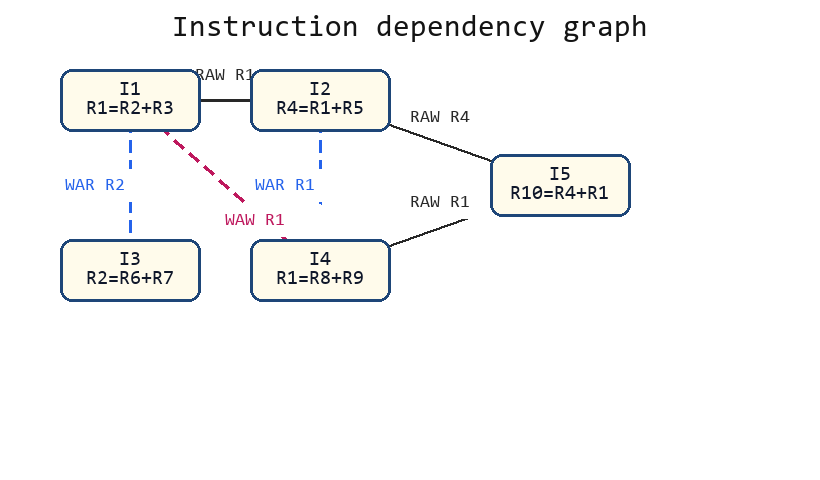
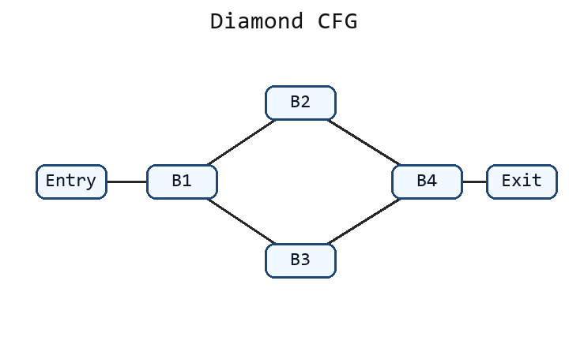
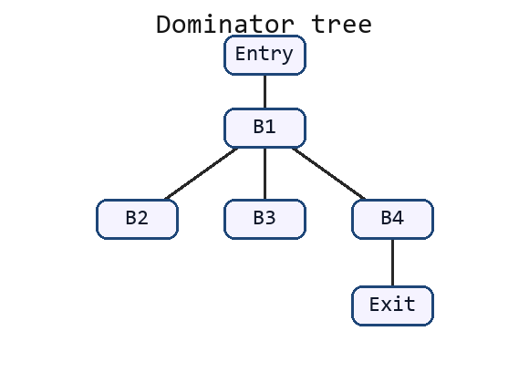

# Slides 后端完整模拟卷 08（题目与完整解析）

## 卷面说明

```text
考试时间：120 分钟
总分：100 分
说明：本卷独立覆盖指令调度、依赖图、资源约束、支配/后支配、Dominance Frontier 和 SSA。
```

## A 卷题目

### 一、三类依赖与寄存器重命名（20 分）

给定指令序列：

```text
I1: R1  = R2 + R3
I2: R4  = R1 + R5
I3: R2  = R6 + R7
I4: R1  = R8 + R9
I5: R10 = R4 + R1
```

1. 写出 RAW、WAR、WAW 的定义。
2. 列出全部 RAW 边。
3. 列出全部 WAR 边。
4. 列出全部 WAW 边。
5. 用寄存器重命名消除假依赖，并给出一个合法重排后的序列。

### 二、资源受限 List Scheduling（20 分）

给定依赖 DAG，边表示前驱完成后后继才能执行：

```text
A -> C
B -> C
C -> E
D -> E
E -> F
```

每条指令的执行延迟：

```text
A=2, B=1, C=3, D=1, E=2, F=1
```

目标机每周期最多发射两条指令，但每周期最多只能发射一条延迟大于 1 的指令。

1. 按“若指令在周期 t 发射，则在 t+latency 时结果可用”的规则，计算无限资源下每个结点的最早发射周期。
2. 计算从每个结点到出口的最长延迟，作为调度优先级。
3. 按优先级从大到小进行 List Scheduling，给出每周期发射结果。
4. 写出最终完成周期。
5. 区分依赖约束和资源约束。

### 三、局部调度、全局调度与软件流水（20 分）

循环体：

```text
for (i = 0; i < n; i++) {
    x[i] = a[i] + b[i];
}
```

假定一次迭代被翻译为：

```text
L1: load  Ra, a[i]
L2: load  Rb, b[i]
L3: add   Rx, Ra, Rb
L4: store x[i], Rx
L5: add   i, i, 1
L6: branch i<n
```

1. 写出单次迭代中的主要真实依赖。
2. 说明局部调度能在哪个范围内移动这些指令。
3. 说明全局调度跨基本块移动指令时必须额外考虑什么。
4. 给出把相邻两次迭代的 load 交叠执行的软件流水思路。
5. 说明寄存器压力为什么可能因调度而上升。

### 四、Dom、PostDom 与 Dominance Frontier（20 分）

给定 CFG：

```text
Entry -> B1
B1 -> B2
B1 -> B3
B2 -> B4
B3 -> B4
B4 -> Exit
```

1. 计算所有结点的 Dom 集和 idom。
2. 写出支配树。
3. 计算所有结点的 PostDom 集和直接后支配者 ipdom。
4. 计算每个结点的 Dominance Frontier。
5. 若变量 `x` 分别在 B2、B3 中定值，指出 phi 的插入位置。

### 五、循环 SSA 构造与退出 SSA（20 分）

给定 CFG 和代码：

```text
Entry -> H
H -> B
H -> Exit
B -> H

Entry: i = 0
H:     if i < n goto B else Exit
B:     i = i + 1
       goto H
```

1. 计算 Dom 集和 idom。
2. 计算 `DF(B)` 和 `DF(H)`。
3. 把代码转换成 SSA，写出变量版本和 phi。
4. 写出 phi 两个参数分别来自哪条控制流边。
5. 退出 SSA 时，在各前驱边上写出需要插入的复制。

## B 完整解析

### 一、三类依赖与寄存器重命名解析

定义：

```text
RAW，Read After Write：前一条写，后一条读，是真实数据流依赖。
WAR，Write After Read：前一条读，后一条写，是复用同一存储位置产生的反依赖。
WAW，Write After Write：两条都写，是复用同一存储位置产生的输出依赖。
```

RAW 边：




```text
I1 -> I2，R1
I2 -> I5，R4
I4 -> I5，R1
```

WAR 边：

```text
I1 -> I3，I1 读 R2，I3 写 R2
I2 -> I4，I2 读 R1，I4 写 R1
```

WAW 边：

```text
I1 -> I4，二者都写 R1
```

重命名：

```text
I3: R11 = R6 + R7
I4: R12 = R8 + R9
I5: R10 = R4 + R12
```

重命名后，R2 的新值不再覆盖 I1 要读取的旧 R2，R1 的第二个定义也不再覆盖 I2 要读取的旧 R1。

一个合法重排：

```text
I1: R1  = R2 + R3
I3: R11 = R6 + R7
I4: R12 = R8 + R9
I2: R4  = R1 + R5
I5: R10 = R4 + R12
```

保留的真实依赖为 `I1->I2->I5` 和 `I4->I5`。

### 二、资源受限 List Scheduling 解析

无限资源下最早发射周期：

```text
ES(A)=0
ES(B)=0
ES(D)=0
ES(C)=max(0+2,0+1)=2
ES(E)=max(2+3,0+1)=5
ES(F)=5+2=7
```

从结点开始到出口完成的最长延迟：

```text
priority(F)=1
priority(E)=2+1=3
priority(C)=3+3=6
priority(D)=1+3=4
priority(A)=2+6=8
priority(B)=1+6=7
```

List Scheduling：

```text
周期 0：发射 A、B
  A 延迟 2，B 延迟 1；满足每周期最多一条长延迟指令。

周期 1：发射 D
  C 仍在等待 A 的结果。

周期 2：发射 C
  A、B 均已完成。

周期 3、4：无就绪指令

周期 5：发射 E
  C 在周期 5 结果可用，D 早已完成。

周期 6：无就绪指令

周期 7：发射 F
```

调度表：

| 周期 | 发射指令 | 说明 |
| --- | --- | --- |
| 0 | A、B | A 延迟 2，B 延迟 1；满足每周期最多一条长延迟指令 |
| 1 | D | C 仍在等待 A 的结果 |
| 2 | C | A、B 均已完成 |
| 3、4 | 无 | 无就绪指令 |
| 5 | E | C 在周期 5 结果可用，D 早已完成 |
| 6 | 无 | 无就绪指令 |
| 7 | F | 发射 F |


`F` 延迟为 1，因此在周期 8 完成，最终完成周期为 8。

约束区别：

```text
依赖约束由程序语义产生，消费者不能早于生产者结果可用。
资源约束由机器产生，例如发射宽度、功能部件数量和端口数量。
```

### 三、局部调度、全局调度与软件流水解析

真实依赖：

```text
L1 -> L3，Ra
L2 -> L3，Rb
L3 -> L4，Rx
L5 -> L6，新的 i 用于循环条件
```

地址 `a[i]、b[i]、x[i]` 都依赖本次迭代的 `i`。如果把 `L5` 提前，还必须保证 load/store 地址仍使用旧迭代的 `i`，通常需要为迭代索引建立不同版本。

局部调度：

```text
只在一个基本块内部移动指令。
它遵守块内 RAW/WAR/WAW 和资源约束，不跨条件分支或循环边。
```

全局调度：

```text
可以跨基本块移动指令，但要考虑控制依赖、异常、副作用、内存别名、执行频率以及补偿代码。
例如可能抛异常的 load 不能无条件移到原本不执行该 load 的路径上。
```

软件流水示意：

```text
周期 k：执行第 j 次迭代的 add/store，同时发射第 j+1 次迭代的两个 load。
需要为不同迭代使用不同的 Ra、Rb、Rx 版本，并保持每次 store 对应正确的索引。
稳态时，多次迭代的不同阶段在流水线上重叠。
```

寄存器压力：

```text
把 load 提前会让加载结果更早产生、更晚使用，扩大活跃区间。
多个迭代重叠时同时存活的值更多，需要更多寄存器；不足时会产生 spill。
```

### 四、Dom、PostDom 与 Dominance Frontier 解析




Dom 集：

```text
Dom(Entry)={Entry}
Dom(B1)={Entry,B1}
Dom(B2)={Entry,B1,B2}
Dom(B3)={Entry,B1,B3}
Dom(B4)={Entry,B1,B4}
Dom(Exit)={Entry,B1,B4,Exit}
```

idom：

```text
idom(B1)=Entry
idom(B2)=B1
idom(B3)=B1
idom(B4)=B1
idom(Exit)=B4
```

支配树：




```text
Entry
  B1
    B2
    B3
    B4
      Exit
```

PostDom 集：

```text
PostDom(Exit)={Exit}
PostDom(B4)={B4,Exit}
PostDom(B2)={B2,B4,Exit}
PostDom(B3)={B3,B4,Exit}
PostDom(B1)={B1,B4,Exit}
PostDom(Entry)={Entry,B1,B4,Exit}
```

直接后支配者：

```text
ipdom(Entry)=B1
ipdom(B1)=B4
ipdom(B2)=B4
ipdom(B3)=B4
ipdom(B4)=Exit
```

Dominance Frontier：

```text
DF(Entry)={}
DF(B1)={}
DF(B2)={B4}
DF(B3)={B4}
DF(B4)={}
DF(Exit)={}
```

`x` 在 B2、B3 定值，两条定义在 B4 汇合，因此在 B4 插入：

```text
x4 = phi(x2,x3)
```

### 五、循环 SSA 构造与退出 SSA 解析

Dom 集：

```text
Dom(Entry)={Entry}
Dom(H)={Entry,H}
Dom(B)={Entry,H,B}
Dom(Exit)={Entry,H,Exit}
```

idom：

```text
idom(H)=Entry
idom(B)=H
idom(Exit)=H
```

Dominance Frontier：

```text
DF(B)={H}
DF(H)={H}
```

`H` 在自己的支配边界中，是因为 `H` 支配回边前驱 `B`，但不严格支配自身。

SSA：

```text
Entry:
  i0 = 0
  goto H

H:
  i1 = phi(i0,i2)
  if i1 < n goto B else Exit

B:
  i2 = i1 + 1
  goto H
```

phi 参数来源：

```text
i0 来自 Entry->H 边。
i2 来自 B->H 回边。
```

退出 SSA 的边复制：

```text
在 Entry->H 边插入：i1 = i0
在 B->H 边插入：i1 = i2
```

这些复制在对应前驱边上并行发生；之后寄存器合并可消除不必要的 move。
