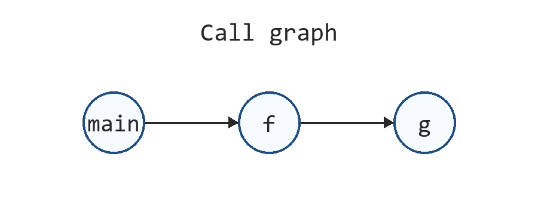
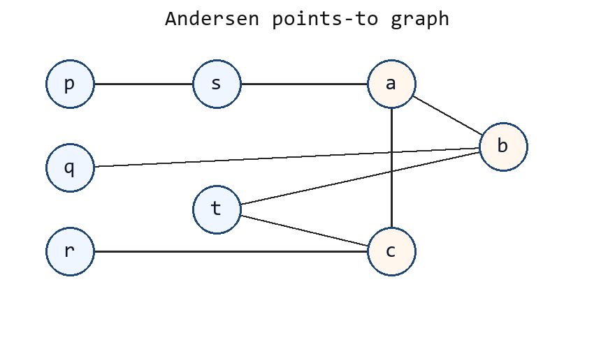

# Slides 过程间与指针完整模拟卷 10（题目与完整解析）

## 卷面说明

```text
考试时间：120 分钟
总分：100 分
说明：本卷独立覆盖调用图、上下文敏感、函数摘要、CFL Reachability、别名分析和 Andersen 闭包。
```

## A 卷题目

### 一、调用图、函数摘要与上下文敏感（20 分）

给定程序：

```text
int g(int v) {
    return v + 1;
}

int f(int x) {
    if (x > 0)
        return g(x);       // call site D
    return 0;
}

int main() {
    int a = f(1);          // call site C1
    int b = f(-1);         // call site C2
    return a + b;
}
```

1. 构造调用图。
2. 分别写出 C1、C2 的实际返回值以及 `main` 的返回值。
3. 若上下文不敏感分析把 `f` 的参数合并为 `{1,-1}`，写出它对 C1、C2 返回值的保守结果。
4. 写出区分 C1、C2 后的上下文敏感结果。
5. 为 `g` 和 `f` 分别写出一个函数摘要。

### 二、调用串与 CFL Reachability（20 分）

给定调用点 `C1、C2、D` 及如下匹配约定：

```text
call(C1) 与 return(C1) 必须匹配
call(C2) 与 return(C2) 必须匹配
call(D)  与 return(D)  必须匹配
```

判断下列路径是否为合法的上下文敏感过程间路径，并说明原因：

```text
P1 = call(C1), call(D), return(D), return(C1)
P2 = call(C1), call(D), return(D), return(C2)
P3 = call(C2), return(C2)
P4 = call(C1), return(C1), return(D)
```

再回答：

1. 调用串如何表示到达 `g` 的上下文。
2. 为什么递归程序必须限制调用串长度。
3. 如何把 call/return 标号解释成 Dyck 语言括号。

### 三、指针别名分析基本概念（20 分）

回答下列问题：

1. 什么是 alias。
2. 什么是 may-alias 和 must-alias。
3. 什么是 points-to set。
4. flow-sensitive pointer analysis 和 flow-insensitive pointer analysis 有什么区别。
5. field-sensitive 和 context-sensitive 对指针分析精度有什么影响。

### 四、Andersen 约束生成（20 分）

给定程序：

```text
p = &a;
q = &b;
*p = q;
r = &c;
s = p;
t = *p;
*s = r;
```

1. 对每条语句写出 Andersen 约束。
2. 写出初始 points-to 集。
3. 说明 `*p = q` 的约束含义。
4. 说明 `t = *p` 的约束含义。
5. 说明为什么该分析是保守的 may analysis。

### 五、Andersen 图闭包推导（20 分）

给定程序：

```text
p = &a;
q = &b;
*p = q;
r = &c;
s = p;
t = *p;
*s = r;
```

1. 构建约束图的初始边。
2. 按闭包传播写出 `pts(p)`、`pts(q)`、`pts(r)`、`pts(s)`。
3. 推导 `pts(a)`。
4. 推导 `pts(t)`。
5. 写出最终可能的别名关系。

## B 完整解析

### 一、调用图、函数摘要与上下文敏感解析

调用图：




```text
结点：main、f、g
边：main -> f
    f -> g

main->f 有两个调用点 C1、C2；f->g 的调用点为 D。
```

具体执行：

```text
C1：f(1) 进入真分支，调用 g(1)，返回 2，所以 a=2。
C2：f(-1) 进入假分支，直接返回 0，所以 b=0。
main 返回 a+b=2。
```

上下文不敏感：

```text
f 的参数集合被合并为 {1,-1}。
分析同时保留真分支返回 2 和假分支返回 0，因此 f 的返回集合为 {0,2}。
C1、C2 都只能得到保守结果 {0,2}。
```

上下文敏感：

```text
上下文 C1：参数 x=1，返回值精确为 2。
上下文 C2：参数 x=-1，返回值精确为 0。
因此 a=2、b=0。
```

函数摘要：

```text
g(v): return v+1，无全局副作用。

f(x):
  if x>0 return x+1
  else return 0
无全局副作用。
```

### 二、调用串与 CFL Reachability 解析

路径判断：

```text
P1 合法。
call(D) 与 return(D) 先匹配，外层 call(C1) 与 return(C1) 再匹配，满足嵌套结构。

P2 非法。
从 C1 调用 f，却返回到 C2，调用点不匹配。

P3 合法。
call(C2) 与 return(C2) 直接匹配；该路径对应 f(-1) 不调用 g 的分支。

P4 非法。
call(C1) 已经匹配并返回，随后出现没有对应 call(D) 的 return(D)。
```

到达 `g` 的调用串：

```text
从 C1 到 g：[C1,D]
从 C2 到 g：[C2,D]
实际程序中 C2 的参数为 -1，不会执行 D；静态分析仍可用调用串区分结构上的两个上下文。
```

调用串长度：

```text
递归会产生无限增长的调用点序列。
实际分析限制最近 k 个调用点，保证状态空间有限；代价是长度超过 k 后不同上下文被合并。
```

Dyck/CFL 表示：

```text
把 call(Ci) 看成类型 i 的左括号，把 return(Ci) 看成同类型右括号。
合法过程间路径的标号串必须是正确嵌套和同类型匹配的括号串。
CFL Reachability 用这种上下文无关语言约束图上的可达路径。
```

### 三、指针别名分析基本概念答案

alias：

```text
如果两个表达式可能表示同一个内存位置，它们就是别名。
例如 p 和 q 都可能指向同一对象时，*p 和 *q 可能访问同一内存。
```

may-alias 与 must-alias：

```text
may-alias：
两个表达式在某些执行中可能指向同一位置。

must-alias：
两个表达式在所有相关执行中都指向同一位置。
```

points-to set：

```text
pts(x) 是变量 x 可能指向的抽象对象集合。
例如 pts(p) = { a, b } 表示 p 可能指向 a 或 b。
```

flow-sensitive 与 flow-insensitive：

```text
flow-sensitive 指针分析区分程序点，考虑语句顺序。
flow-insensitive 指针分析忽略语句顺序，把整个程序看成一组无序约束求闭包。
Andersen 分析通常是 inclusion-based、flow-insensitive 的 may pointer analysis。
```

field-sensitive 与 context-sensitive：

```text
field-sensitive 会区分对象的不同字段，例如 o.f 和 o.g 分开建模。
context-sensitive 会区分不同调用上下文中的指针关系。
二者都能提高精度，但会增加分析成本。
```

### 四、Andersen 约束生成答案

逐句约束：

```text
p = &a:
a in pts(p)

q = &b:
b in pts(q)

*p = q:
for each o in pts(p), pts(q) subset pts(o)

r = &c:
c in pts(r)

s = p:
pts(p) subset pts(s)

t = *p:
for each o in pts(p), pts(o) subset pts(t)

*s = r:
for each o in pts(s), pts(r) subset pts(o)
```

初始 points-to 集：

```text
pts(p) = { a }
pts(q) = { b }
pts(r) = { c }
pts(s) = {}
pts(t) = {}
pts(a) = {}
pts(b) = {}
pts(c) = {}
```

`*p = q`：

```text
p 指向的每个对象 o 都会被写入 q 的值。
因此 q 可能指向的所有对象，都要加入 pts(o)。
```

`t = *p`：

```text
p 指向的每个对象 o 都可能被读取。
o 中保存的指针值都可能赋给 t。
因此 pts(o) 要加入 pts(t)。
```

保守 may analysis：

```text
Andersen 分析收集所有可能指向关系。
如果分析不能排除某个指向关系，就会把它保留在 points-to 集中。
结果可能比真实运行更大，但不会漏掉真实可能发生的指向关系。
```

### 五、Andersen 图闭包推导答案




初始边和集合：

```text
地址约束：
a -> pts(p)
b -> pts(q)
c -> pts(r)

拷贝约束：
pts(p) subset pts(s)

间接约束：
*p = q
t = *p
*s = r
```

基础传播：

```text
pts(p) = { a }
pts(q) = { b }
pts(r) = { c }

由 s = p：
pts(s) = { a }
```

推导 `pts(a)`：

```text
由 *p = q 且 pts(p) = { a }：
pts(q) subset pts(a)
所以 b in pts(a)。

由 *s = r 且 pts(s) = { a }：
pts(r) subset pts(a)
所以 c in pts(a)。

因此 pts(a) = { b, c }。
```

推导 `pts(t)`：

```text
由 t = *p 且 pts(p) = { a }：
pts(a) subset pts(t)

因为 pts(a) = { b, c }，
所以 pts(t) = { b, c }。
```

最终结果：

```text
pts(p) = { a }
pts(q) = { b }
pts(r) = { c }
pts(s) = { a }
pts(a) = { b, c }
pts(t) = { b, c }
pts(b) = {}
pts(c) = {}
```

最终 points-to 表：

| 变量/对象 | points-to 集合 |
| --- | --- |
| p | {a} |
| q | {b} |
| r | {c} |
| s | {a} |
| a | {b,c} |
| t | {b,c} |
| b | {} |
| c | {} |


可能别名：

```text
p 和 s may-alias，因为二者都可能指向 a。
t 和 q may-alias 在指向 b 的情况下成立，因为 b 同时在 pts(t) 和 pts(q) 中。
t 和 r may-alias 在指向 c 的情况下成立，因为 c 同时在 pts(t) 和 pts(r) 中。
q 和 r 不 may-alias，因为 pts(q) 与 pts(r) 不相交。
```
