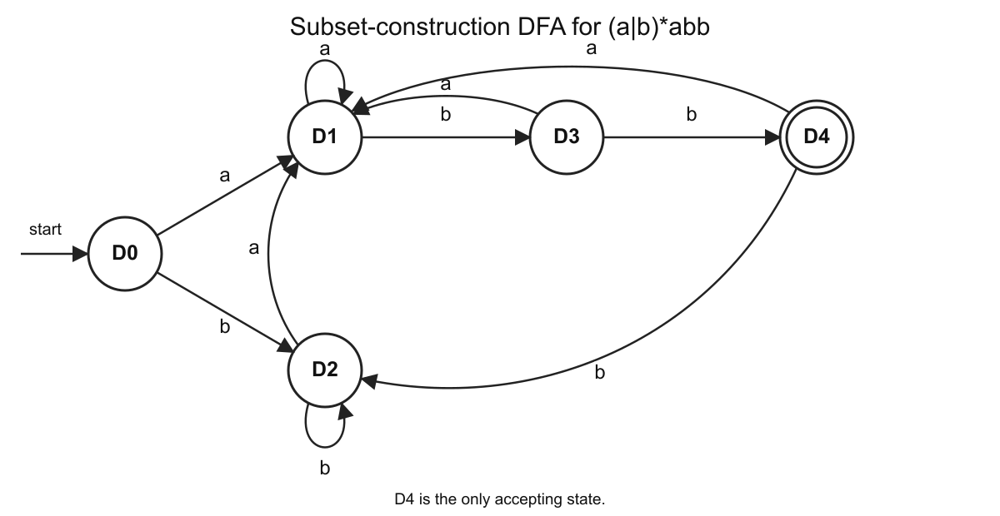
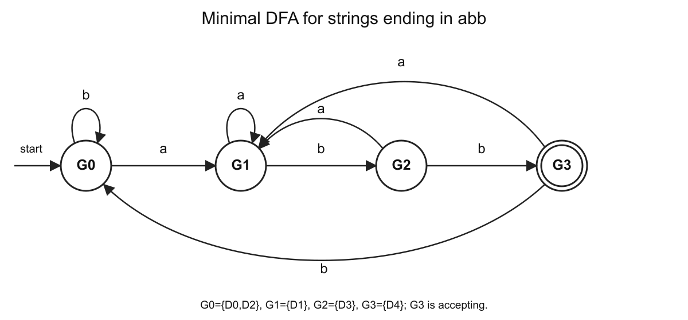

# 期末复习 PPT 专项模拟卷合集（题目与详解）

## 卷面说明

本合集只覆盖 `期末复习/` 下四份复习 PDF 已出现的内容：

- `期末复习一--词法解析-语法解析LL(1)文法(1).pdf`
- `期末复习二--语法解析LR(1)文法(1).pdf`
- `期末复习三--语义分析(1).pdf`
- `期末复习四--中间代码生成(1).pdf`

每套 100 分，题型集中在词法分析、LL(1)、LR(0)/SLR、语义分析、三地址码、SSA 和布尔表达式回填。

# 专项模拟卷 01

## A 卷题目

### 一、词法分析：Thompson、子集构造、最小化（20 分）

正则表达式：

```text
(a|b)*abb
```

1. 使用 Thompson 构造法构造等价 NFA。
2. 使用子集构造法构造 DFA，写明每个 DFA 状态对应的 NFA 状态集合。
3. 最小化 DFA。

### 二、LL(1) 分析（20 分）

文法：

```text
E -> E + T | T
T -> T * F | F
F -> ( E ) | id
```

1. 消除左递归。
2. 写 FIRST 和 FOLLOW。
3. 写预测分析表。
4. 判断消除左递归后的文法是否为 LL(1)。

### 三、LR(0)/SLR 分析（20 分）

仍使用第二题的表达式文法及其增广文法：

```text
E' -> E
E  -> E + T | T
T  -> T * F | F
F  -> ( E ) | id
```

1. 写出初始 LR(0) 项集 I0。
2. 计算 GOTO(I0, id)、GOTO(I0, E)、GOTO(I0, T)、GOTO(I0, F)。
3. 说明为什么含有 `E -> T .` 和 `T -> T . * F` 的状态在 LR(0) 中会出现移进-归约冲突。
4. 说明 SLR 如何用 FOLLOW 集消除该冲突。

### 四、语义分析：属性与 SDD（20 分）

考虑声明语句翻译：

```text
D  -> T L
T  -> int | float
L  -> id L'
L' -> , id L' | epsilon
```

1. 说明综合属性和继承属性的区别。
2. 为该文法设计一个 L 属性 SDD，把声明中的每个 `id` 加入符号表并记录类型。
3. 说明为什么这个 SDD 是 L 属性的。

### 五、中间代码：短路求值（20 分）

为下面语句生成三地址码，要求体现 `||` 和 `&&` 的短路求值，且 `&&` 优先级高于 `||`：

```text
if (x < 100 || x > 200 && x != y) x = 0;
```

## B 详解

### 一、词法分析详解






```text
正则表达式：(a|b)*abb

Thompson NFA：
起点 q0，终点 q13，q13 为接收状态。

q0 --epsilon--> q2
q0 --epsilon--> q1
q2 --epsilon--> q4
q2 --epsilon--> q6
q4 --a--> q5
q6 --b--> q7
q5 --epsilon--> q3
q7 --epsilon--> q3
q3 --epsilon--> q2
q3 --epsilon--> q1
q1 --epsilon--> q8
q8 --a--> q9
q9 --epsilon--> q10
q10 --b--> q11
q11 --epsilon--> q12
q12 --b--> q13
```

子集构造：

```text
D0 = {q0,q1,q2,q4,q6,q8}
  on a -> D1
  on b -> D2
  终态：否

D1 = {q1,q2,q3,q4,q5,q6,q8,q9,q10}
  on a -> D1
  on b -> D3
  终态：否

D2 = {q1,q2,q3,q4,q6,q7,q8}
  on a -> D1
  on b -> D2
  终态：否

D3 = {q1,q2,q3,q4,q6,q7,q8,q11,q12}
  on a -> D1
  on b -> D4
  终态：否

D4 = {q1,q2,q3,q4,q6,q7,q8,q13}
  on a -> D1
  on b -> D2
  终态：是
```

DFA 状态集合与转移表：

| DFA 状态 | NFA 状态集合 | 输入 a | 输入 b | 终态 |
| --- | --- | --- | --- | --- |
| D0 | {q0,q1,q2,q4,q6,q8} | D1 | D2 | 否 |
| D1 | {q1,q2,q3,q4,q5,q6,q8,q9,q10} | D1 | D3 | 否 |
| D2 | {q1,q2,q3,q4,q6,q7,q8} | D1 | D2 | 否 |
| D3 | {q1,q2,q3,q4,q6,q7,q8,q11,q12} | D1 | D4 | 否 |
| D4 | {q1,q2,q3,q4,q6,q7,q8,q13} | D1 | D2 | 是 |

最小化：

```text
初始划分：
非终态组 = {D0,D1,D2,D3}
终态组   = {D4}

D0 和 D2：
  on a 都到 D1
  on b 都到 D2
  在当前划分下不可区分

D1：
  on b 到 D3
D3：
  on b 到 D4
二者可区分。

最终分组：
G0 = {D0,D2}
G1 = {D1}
G2 = {D3}
G3 = {D4}

最小 DFA：
G0 --a--> G1, G0 --b--> G0
G1 --a--> G1, G1 --b--> G2
G2 --a--> G1, G2 --b--> G3
G3 --a--> G1, G3 --b--> G0

G0 是初态，G3 是终态。
```

补充说明：

```text
1. Thompson NFA 中，q13 是接收状态，所以 q13 画双圈。
2. 子集构造中，DFA 的一个状态就是 NFA 的一个状态集合。
3. DFA 状态集合中只要包含 q13，该 DFA 状态就是终态。
4. 最小化 DFA 时，先分终态组和非终态组，再检查同组状态在 a、b 上转入哪个分组。
5. D0 和 D2 在 a、b 上的行为相同，所以可以合并；D1、D3、D4 都能被区分。
```

### 二、LL(1) 详解

消除左递归：

```text
E  -> T E'
E' -> + T E' | epsilon
T  -> F T'
T' -> * F T' | epsilon
F  -> ( E ) | id
```

FIRST：

```text
FIRST(E)  = { (, id }
FIRST(E') = { +, epsilon }
FIRST(T)  = { (, id }
FIRST(T') = { *, epsilon }
FIRST(F)  = { (, id }
```

FOLLOW：

```text
FOLLOW(E)  = { ), $ }
FOLLOW(E') = { ), $ }
FOLLOW(T)  = { +, ), $ }
FOLLOW(T') = { +, ), $ }
FOLLOW(F)  = { *, +, ), $ }
```

预测分析表：

```text
M[E,  ( ] = E -> T E'
M[E, id ] = E -> T E'

M[E', + ] = E' -> + T E'
M[E', ) ] = E' -> epsilon
M[E', $ ] = E' -> epsilon

M[T,  ( ] = T -> F T'
M[T, id ] = T -> F T'

M[T', * ] = T' -> * F T'
M[T', + ] = T' -> epsilon
M[T', ) ] = T' -> epsilon
M[T', $ ] = T' -> epsilon

M[F,  ( ] = F -> ( E )
M[F, id ] = F -> id
```

结论：预测分析表没有多重入口，因此该文法是 LL(1)。

预测分析表（表格形式）：

| 非终结符 | 输入符号 | 产生式 |
| --- | --- | --- |
| E | ( | E -> T E' |
| E | id | E -> T E' |
| E' | + | E' -> + T E' |
| E' | ) | E' -> epsilon |
| E' | $ | E' -> epsilon |
| T | ( | T -> F T' |
| T | id | T -> F T' |
| T' | * | T' -> * F T' |
| T' | + | T' -> epsilon |
| T' | ) | T' -> epsilon |
| T' | $ | T' -> epsilon |
| F | ( | F -> ( E ) |
| F | id | F -> id |


补充说明：

```text
1. 原文法不是 LL(1)，因为 E -> E + T 和 T -> T * F 有直接左递归。
2. 消除左递归后再计算 FIRST、FOLLOW 和预测分析表。
3. FOLLOW(E) 一开始包含 $，因为 E 是开始符号；又因为 F -> ( E )，所以 ) 也在 FOLLOW(E) 中。
4. 预测分析表的填法：
   对 A -> alpha，若 a 属于 FIRST(alpha)，填 M[A,a] = A -> alpha。
   若 alpha 可以推出 epsilon，则对 FOLLOW(A) 中的符号 b，填 M[A,b] = A -> epsilon。
5. 表中没有多重入口，才可判断为 LL(1)。
```

### 三、LR(0)/SLR 详解

初始项集：

```text
I0:
E' -> . E
E  -> . E + T
E  -> . T
T  -> . T * F
T  -> . F
F  -> . ( E )
F  -> . id
```

GOTO：

```text
GOTO(I0, id):
F -> id .

GOTO(I0, E):
E' -> E .
E  -> E . + T

GOTO(I0, T):
E -> T .
T -> T . * F

GOTO(I0, F):
T -> F .
```

冲突说明：

```text
状态 GOTO(I0, T) 中有：
E -> T .
T -> T . * F

在 LR(0) 中，E -> T . 表示不看前瞻符号就规约 E -> T。
同一状态中 T -> T . * F 表示看到 * 时应该移进。
因此在输入 * 上同时存在 reduce E -> T 和 shift *，产生移进-归约冲突。
```

SLR 的处理：

```text
FOLLOW(E) = { +, ), $ }

SLR 只在 FOLLOW(E) 中的符号上放置 reduce E -> T。
因为 * 不属于 FOLLOW(E)，所以在 * 上不放 reduce E -> T。
因此 * 上只保留 shift，冲突被消除。
```

补充说明：

```text
1. LR(0) 处理的是自底向上语法分析中“什么时候移进、什么时候归约”的决策问题。
2. 第三题使用的是增广文法，即在原表达式文法前增加 E' -> E。
   这样当出现 E' -> E . 且输入为 $ 时，就可以接受。
3. LR(0) 项就是带点产生式，例如 E -> T . 表示已经识别完 T，可以归约成 E。
4. closure 的意思是：如果点后面是非终结符，就把它的所有产生式以点在最前的形式补进来。
5. GOTO(I, X) 的意思是：在项集 I 中读入文法符号 X，把点越过 X，然后再做 closure。
6. 冲突发生在 * 尚未被移进时。
   当前状态和输入符号 * 对应的 ACTION 表项同时出现 shift 和 reduce。
7. SLR 确实会看下一个输入符号；它只是在 FOLLOW(A) 中的符号上对 A -> alpha . 进行归约。
```

### 四、语义分析详解

```text
综合属性：从子结点或当前结点信息计算后传给父结点。
继承属性：从父结点或左侧兄弟结点传给当前结点。
```

L 属性 SDD：

```text
D -> T L
  L.in = T.type

T -> int
  T.type = int

T -> float
  T.type = float

L -> id L'
  addType(id.name, L.in)
  L'.in = L.in

L' -> , id L'1
  addType(id.name, L'.in)
  L'1.in = L'.in

L' -> epsilon
  不执行动作
```

这是 L 属性的原因：

```text
L.in 来自左侧的 T.type。
L'.in 来自父结点 L 或 L'。
每个继承属性只依赖父结点或左侧已经计算出的属性，不依赖右侧兄弟。
因此满足 L 属性限制。
```

补充说明：

```text
1. 这题默认基于语法分析树，也叫 parse tree 或 CST。
   语法分析树由产生式逐步展开形成，叶子从左到右对应输入 token。
2. SDD 是语法制导定义，即给文法符号设计属性，并写规则说明属性如何计算。
3. 题干没有给 T.type、L.in 这些名字；这些属性名由答题者设计，只要含义清楚即可。
4. T.type 表示 T 识别出的类型；L.in、L'.in 表示传给标识符列表的声明类型。
5. 符号表中写 x : float 的意思是记录“名字 x 的类型是 float”，供后续类型检查和代码生成使用。
6. L 属性要求继承属性只能依赖父结点或左侧兄弟结点的信息，不能依赖右侧兄弟。
```

### 五、中间代码详解

```text
if x < 100 goto L_then
goto L_check2

L_check2:
if x > 200 goto L_check3
goto L_next

L_check3:
if x != y goto L_then
goto L_next

L_then:
x = 0

L_next:
```

说明：

```text
x < 100 为真时，整个 || 为真，直接进入 then。
x < 100 为假时，才检查 x > 200 && x != y。
x > 200 为假时，整个 && 为假，直接到 L_next。
x > 200 为真时，才检查 x != y。
```

补充说明：

```text
1. 三地址码是编译器中间代码的一种形式，常见形式包括 t1 = a + b、if x < y goto L1、goto L2。
2. 本题条件应按优先级理解为 x < 100 || (x > 200 && x != y)。
3. 短路求值规则：
   A || B 中，A 为真时不再计算 B。
   A && B 中，A 为假时不再计算 B。
4. 因此 x < 100 为真时直接进入 L_then；为假时才检查 x > 200 && x != y。
5. x > 200 为假时直接跳到 L_next；为真时才检查 x != y。
```

# 专项模拟卷 02

## A 卷题目

### 一、词法分析：密码规则正则表达式（20 分）

密码字符串满足：

```text
1. 只由 a、b、0、1 组成。
2. 必须以字母 a 或 b 开头。
3. 必须以 abb 结尾。
4. 中间部分不能包含连续两个数字，即不能出现 00、01、10、11。
```

写出描述该类字符串的正则表达式，并说明各部分含义。

### 二、NFA 到 DFA（20 分）

给定 NFA：

```text
起点：0
终点：3

0 --epsilon--> 1
0 --epsilon--> 2
1 --a--> 1
1 --b--> 3
2 --b--> 2
2 --a--> 3
```

使用子集构造法构造 DFA，写出每个 DFA 状态的 NFA 状态集合、a/b 转移和是否为终态。

### 三、LR(0) 项集族与 SLR 表（20 分）

文法：

```text
S' -> S
S  -> C C
C  -> c C | d
```

1. 构造规范 LR(0) 项集族。
2. 写出 GOTO 转移。
3. 写 FOLLOW 集。
4. 写 SLR 分析表中的 ACTION/GOTO 条目。

### 四、语义分析：S 属性定义（20 分）

文法：

```text
E -> E + T | T
T -> num
```

属性 `code` 表示后缀表达式。设计 S 属性 SDD，并计算输入：

```text
3 + 4 + 5
```

的 `code`。

### 五、中间代码：while 翻译（20 分）

为下面程序生成三地址码：

```text
while (i < n) {
  a = a + i;
  i = i + 1;
}
```

## B 详解

### 一、词法分析详解

正则表达式：

```text
(a|b)((a|b)|0(a|b)|1(a|b))*abb
```

说明：

```text
(a|b)
  保证第一个字符是字母 a 或 b。

((a|b)|0(a|b)|1(a|b))*
  中间部分重复若干段。
  每一段可以是单个字母 a 或 b。
  如果出现数字 0 或 1，则它后面必须立刻跟一个字母 a 或 b。
  因此不会出现两个连续数字。

abb
  保证整个字符串以 abb 结尾。
```

### 二、NFA 到 DFA 详解

```text
D0 = epsilon-closure({0}) = {0,1,2}
```

子集构造结果：

```text
D0 = {0,1,2}
  on a -> D1
  on b -> D2
  终态：否

D1 = {1,3}
  on a -> D3
  on b -> D4
  终态：是

D2 = {2,3}
  on a -> D4
  on b -> D5
  终态：是

D3 = {1}
  on a -> D3
  on b -> D4
  终态：否

D4 = {3}
  on a -> D6
  on b -> D6
  终态：是

D5 = {2}
  on a -> D4
  on b -> D5
  终态：否

D6 = {}
  on a -> D6
  on b -> D6
  终态：否
```

终态判定规则：

```text
只要 DFA 状态集合中包含 NFA 终点 3，该 DFA 状态就是终态。
```

### 三、LR(0)/SLR 详解

规范 LR(0) 项集族：

```text
I0:
S' -> . S
S  -> . C C
C  -> . c C
C  -> . d

I1:
S' -> S .

I2:
S -> C . C
C -> . c C
C -> . d

I3:
C -> c . C
C -> . c C
C -> . d

I4:
C -> d .

I5:
S -> C C .

I6:
C -> c C .
```

GOTO：

```text
GOTO(I0, S) = I1
GOTO(I0, C) = I2
GOTO(I0, c) = I3
GOTO(I0, d) = I4

GOTO(I2, C) = I5
GOTO(I2, c) = I3
GOTO(I2, d) = I4

GOTO(I3, C) = I6
GOTO(I3, c) = I3
GOTO(I3, d) = I4
```

FOLLOW：

```text
FOLLOW(S) = { $ }
FOLLOW(C) = { c, d, $ }
```

SLR 表条目：

```text
ACTION[0,c] = s3
ACTION[0,d] = s4
GOTO[0,S] = 1
GOTO[0,C] = 2

ACTION[1,$] = acc

ACTION[2,c] = s3
ACTION[2,d] = s4
GOTO[2,C] = 5

ACTION[3,c] = s3
ACTION[3,d] = s4
GOTO[3,C] = 6

ACTION[4,c] = r(C -> d)
ACTION[4,d] = r(C -> d)
ACTION[4,$] = r(C -> d)

ACTION[5,$] = r(S -> C C)

ACTION[6,c] = r(C -> c C)
ACTION[6,d] = r(C -> c C)
ACTION[6,$] = r(C -> c C)
```

### 四、语义分析详解

S 属性 SDD：

```text
E -> E1 + T
  E.code = E1.code || T.code || "+"

E -> T
  E.code = T.code

T -> num
  T.code = num.lexeme
```

输入：

```text
3 + 4 + 5
```

按左结合分析：

```text
((3 + 4) + 5)
```

计算：

```text
3 + 4 的 code = 3 4 +
(3 + 4) + 5 的 code = 3 4 + 5 +
```

最终：

```text
E.code = 3 4 + 5 +
```

### 五、中间代码详解

```text
L_begin:
if i < n goto L_body
goto L_next

L_body:
t1 = a + i
a = t1
t2 = i + 1
i = t2
goto L_begin

L_next:
```

# 专项模拟卷 03

## A 卷题目

### 一、FIRST/FOLLOW 与 LL(1) 表（25 分）

文法：

```text
E -> id X
X -> epsilon | ( A ) | [ E ]
A -> E Y
Y -> epsilon | ; A
```

1. 写出 FIRST 集。
2. 写出 FOLLOW 集。
3. 构造预测分析表。
4. 判断该文法是否为 LL(1)。

### 二、LR(0) 与 SLR 的区别（15 分）

对于表达式文法中的某个 LR(0) 状态：

```text
E -> T .
T -> T . * F
```

1. 说明该状态在 LR(0) 中为什么有移进-归约冲突。
2. 若 `FOLLOW(E) = { +, ), $ }`，说明 SLR 在输入 `*` 时如何处理。

### 三、语义分析：属性分类与求值顺序（20 分）

考虑语义规则：

```text
D -> T L
  L.in = T.type

T -> int
  T.type = int

L -> id
  addType(id.name, L.in)
```

1. 指出 `T.type` 和 `L.in` 分别是综合属性还是继承属性。
2. 写出声明 `int x` 的属性求值顺序。
3. 说明 `addType(id.name, L.in)` 的作用。

### 四、布尔表达式回填（25 分）

为下面语句生成带标签的三地址码：

```text
if ((x < y) && (y < z) || (x == z))
  a = 2;
else
  a = 3;
```

要求体现短路求值和回填后的跳转目标。

### 五、SSA 中的 phi 函数（15 分）

把下面循环翻译成 SSA 风格的三地址码，要求在循环头写出必要的 phi 函数：

```text
i = 0;
s = 0;
while (i < n) {
  s = s + i;
  i = i + 1;
}
```

## B 详解

### 一、FIRST/FOLLOW 与 LL(1) 表详解

FIRST：

```text
FIRST(E) = { id }
FIRST(X) = { epsilon, (, [ }
FIRST(A) = { id }
FIRST(Y) = { epsilon, ; }
```

FOLLOW：

```text
FOLLOW(E) = { $, ], ;, ) }
FOLLOW(X) = { $, ], ;, ) }
FOLLOW(A) = { ) }
FOLLOW(Y) = { ) }
```

预测分析表：

```text
M[E, id] = E -> id X

M[X, (] = X -> ( A )
M[X, [] = X -> [ E ]
M[X, $] = X -> epsilon
M[X, ]] = X -> epsilon
M[X, ;] = X -> epsilon
M[X, )] = X -> epsilon

M[A, id] = A -> E Y

M[Y, ;] = Y -> ; A
M[Y, )] = Y -> epsilon
```

结论：

```text
预测分析表没有多重入口，因此该文法是 LL(1)。
```

### 二、LR(0) 与 SLR 详解

```text
E -> T .
```

表示已经识别出 `T`，可以规约为 `E`。

```text
T -> T . * F
```

表示如果下一个输入符号是 `*`，应该移进 `*`，继续识别乘法。

在 LR(0) 中，完成项 `E -> T .` 会在所有终结符上放置规约动作。因此在 `*` 上同时有：

```text
shift *
reduce E -> T
```

这就是移进-归约冲突。

SLR 使用 FOLLOW 集限制规约：

```text
FOLLOW(E) = { +, ), $ }
```

因为 `*` 不在 `FOLLOW(E)` 中，所以 SLR 不在 `*` 上放置 `reduce E -> T`。因此 `*` 上只保留移进动作。

### 三、语义分析详解

属性分类：

```text
T.type 是综合属性。
L.in 是继承属性。
```

`int x` 的求值顺序：

```text
1. T -> int，计算 T.type = int。
2. D -> T L，把 T.type 传给 L.in，即 L.in = int。
3. L -> id，执行 addType(x, int)。
```

`addType(id.name, L.in)` 的作用：

```text
把标识符 id.name 加入符号表，并记录它的类型为 L.in。
```

### 四、布尔表达式回填详解

表达式结构：

```text
((x < y) && (y < z)) || (x == z)
```

回填后的三地址码：

```text
1: if x < y goto 3
2: goto 5
3: if y < z goto 7
4: goto 5
5: if x == z goto 7
6: goto 9
7: a = 2
8: goto 10
9: a = 3
10:
```

说明：

```text
1 为真时继续检查 y < z；为假时跳到 x == z。
3 为真时整个左侧 && 为真，进入 then；为假时跳到 x == z。
5 为真时进入 then；为假时进入 else。
8 用于跳过 else。
```

### 五、SSA 详解

```text
entry:
i1 = 0
s1 = 0
goto L_header

L_header:
i2 = phi(i1, i3)
s2 = phi(s1, s3)
t1 = i2 < n
if t1 goto L_body else L_exit

L_body:
s3 = s2 + i2
i3 = i2 + 1
goto L_header

L_exit:
```

说明：

```text
i2 = phi(i1, i3) 合并循环前的初始 i1 和循环体回边产生的 i3。
s2 = phi(s1, s3) 合并循环前的初始 s1 和循环体回边产生的 s3。
```
