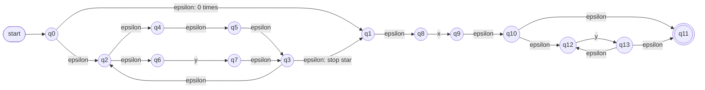

# 编译原理 2025 风格模拟卷01（题目与详解）

## 卷面说明

本卷按 Slides/Slides/handout 与三份 Recap PPT 更新，主线覆盖前端自动机与 LL、中端 IR/SSA、数据流、符号执行、后端目标代码、寄存器分配、指令调度以及过程间/指针分析。总分 100 分。

# A 卷题目

## 一、词法分析（15 分）

正则表达式：

```text
(epsilon|y)* x y*
```

1. 使用 Thompson 构造法构造等价 NFA。
2. 使用子集构造法构造 DFA，写明 DFA 状态含义。
3. 最小化 DFA。

## 二、LL 语法分析（15 分）

文法：

```text
A -> B C
B -> B P | r
C -> t | u
```

1. 消除左递归。
2. 写 FIRST 和 FOLLOW。
3. 写预测分析表。
4. 判断消除左递归后的文法是否为 LL(1)。

## 三、指令调度（15 分）

给定指令：

```text
I1: R1 = R2 + R3
I2: R4 = R1 + R5
I3: R2 = R6 + R7
I4: R1 = R8 + R9
I5: R10 = R4 + R1
```

1. 写出指令调度的目的。
2. 写出 RAW、WAR、WAW 的定义。
3. 构建依赖图，WAR/WAW 用虚线表示。
4. 在允许寄存器重命名的条件下给出一个合法重排序列。

## 四、支配问题（15 分）

CFG：菱形分支

```text
Entry->B1
B1->B2
B1->B3
B2->B4
B3->B4
B4->Exit
```

1. 写出 Dom、PostDom、Dom Frontier 的定义。
2. 计算每个节点的 Dom 集和 idom。
3. 写出支配边界。
4. 说明 SSA 中 phi 函数应放在什么位置。

## 五、符号执行与 SAT（20 分）

公式：

```text
F = ((a1 and b1) or c1)
```

1. 写出 Path-sensitive、Flow-sensitive、Context-sensitive 的定义。
2. 写出 CNF 的定义。
3. 使用 Tseitin 算法把 F 转成 CNF。
4. 证明 2025 卷中的两组公式同时可满足。

## 六、Andersen 指针分析（20 分）

程序：

```text
p = &a
q = &b
*p = q
r = &c
s = p
t = *p
*s = r
```

1. 对每条语句写 Andersen 约束。
2. 根据约束构建闭包。
3. 写出最终 points-to 集合。

## 七、PPT 新增重点：数据流分析（10 分）

CFG 与可达定值信息：

```text
Entry->B1
B1->B2
B2->B3
B2->B4
B3->B4

B1: gen={d1}, kill={}
B2: gen={d2}, kill={d1}
B3: gen={d3}, kill={}
B4: gen={d4}, kill={d2}
```

1. 写出 Reaching Definitions 的方向、meet 和 transfer 方程。
2. 计算各基本块的 IN/OUT。
3. 说明 worklist 算法什么时候停止。

# B 详解

## 一、词法分析详解

```text
正则表达式：(epsilon|y)* x y*

Thompson NFA：起点 q0，终点 q11。图中 q11 画双圈，下面转移表与图一致。
```



```text
Thompson NFA 转移表：
q4 --epsilon--> q5
q6 --y--> q7
q2 --epsilon--> q4
q2 --epsilon--> q6
q5 --epsilon--> q3
q7 --epsilon--> q3
q0 --epsilon--> q2
q0 --epsilon--> q1
q3 --epsilon--> q2
q3 --epsilon--> q1
q8 --x--> q9
q1 --epsilon--> q8
q12 --y--> q13
q10 --epsilon--> q12
q10 --epsilon--> q11
q13 --epsilon--> q12
q13 --epsilon--> q11
q9 --epsilon--> q10

子集构造 DFA：
D0:
  NFA集合 = {q0,q1,q2,q3,q4,q5,q6,q8}
  on x -> D1
  on y -> D2
  终态 = 否
D1:
  NFA集合 = {q9,q10,q11,q12}
  on x -> D3
  on y -> D4
  终态 = 是
D2:
  NFA集合 = {q1,q2,q3,q4,q5,q6,q7,q8}
  on x -> D1
  on y -> D2
  终态 = 否
D3:
  NFA集合 = EMPTY
  on x -> D3
  on y -> D3
  终态 = 否
D4:
  NFA集合 = {q11,q12,q13}
  on x -> D3
  on y -> D4
  终态 = 是

最小化：
初分组：
  终态组 = {D1,D4}
  非终态组 = {D0,D2,D3}
最终分组：
  G1 = {D1,D4}
  G2 = {D3}
  G3 = {D0,D2}
每个最终分组对应一个最小 DFA 状态。
```


## 二、LL 语法分析详解

```text
原文法：
A -> B C
B -> B P | r
C -> t | u

消除左递归：
A  -> B C
B  -> r B'
B' -> P B' | epsilon
C  -> t | u

FIRST：
FIRST(A)={ r }
FIRST(B)={ r }
FIRST(B')={ P, epsilon }
FIRST(C)={ t, u }

FOLLOW：
FOLLOW(A)={ $ }
FOLLOW(B)={ t, u }
FOLLOW(B')={ t, u }
FOLLOW(C)={ $ }

预测表：
M[A,r] = A -> B C
M[B,r] = B -> r B'
M[B',P] = B' -> P B'
M[B',t] = B' -> epsilon
M[B',u] = B' -> epsilon
M[C,t] = C -> t
M[C,u] = C -> u

结论：表中无多重入口，消除左递归后的文法是 LL(1)。
```


## 三、指令调度详解

定义：

```text
指令调度在不改变程序语义的前提下重排指令，减少流水线停顿，提高并行执行效率。
RAW：先写后读，必须保持顺序。
WAR：先读后写，写者不能提前。
WAW：先写后写，顺序影响最终值。
```

```text
指令：
I1: R1 = R2 + R3
I2: R4 = R1 + R5
I3: R2 = R6 + R7
I4: R1 = R8 + R9
I5: R10 = R4 + R1

依赖：
I1 -> I2 RAW on R1
I1 -> I3 WAR on R2
I1 -> I4 WAW on R1
I2 -> I4 WAR on R1
I2 -> I5 RAW on R4
I4 -> I5 RAW on R1

寄存器重命名：
I3: R2_new = R6 + R7
I4: R1_new = R8 + R9
I5 使用 R1_new

重命名后保留 RAW，WAR/WAW 被消除。一个合法调度序列：
I1, I3, I4, I2, I5
```


## 四、支配问题详解

定义：

```text
Dom(n)：入口到 n 的每条路径都经过的节点集合。
PostDom(n)：n 到出口的每条路径都经过的节点集合。
Dom Frontier(n)：n 支配某个前驱，但不严格支配该节点的位置。
```

```text
CFG 边：
Entry->B1
B1->B2
B1->B3
B2->B4
B3->B4
B4->Exit

Dom 集：
Dom(Entry)={Entry}
Dom(B1)={Entry,B1}
Dom(B2)={Entry,B1,B2}
Dom(B3)={Entry,B1,B3}
Dom(B4)={Entry,B1,B4}
Dom(Exit)={Entry,B1,B4,Exit}

直接支配者：
idom(B1)=Entry
idom(B2)=B1
idom(B3)=B1
idom(B4)=B1
idom(Exit)=B4

支配边界：
DF(B2)={B4}
DF(B3)={B4}
其余节点 DF 为空集

SSA phi 放置：若变量在多个基本块中被定义，则在这些定义块的迭代支配边界处插入该变量的 phi。直观上，phi 放在多条控制流汇合且不同定义可能到达的位置。
```


## 五、符号执行与 SAT 详解

```text
公式：F = ((a1 and b1) or c1)
引入：x11 <-> (a1 and b1)，x12 <-> (x11 or c1)，根变量 x12 为真。

CNF：
(not x11 or a1)
(not x11 or b1)
(x11 or not a1 or not b1)
(x12 or not x11)
(x12 or not c1)
(not x12 or x11 or c1)
(x12)

敏感性定义：
Path-sensitive 区分不同路径。
Flow-sensitive 区分程序点和语句顺序。
Context-sensitive 区分函数调用上下文。

同时可满足证明套用：
F1=(a0 or ... or an or c) and (b0 or ... or bm or not c)，F2=(a0 or ... or an or b0 or ... or bm)。
F1 为真时，c=false 推出某个 ai=true，c=true 推出某个 bj=true，所以 F2 为真。
F2 为真时，若某个 ai=true 令 c=false；若某个 bj=true 令 c=true，所以 F1 为真。
```


## 六、Andersen 指针分析详解

```text
程序：
p = &a
q = &b
*p = q
r = &c
s = p
t = *p
*s = r

约束：
a in pts(p)
b in pts(q)
for v in pts(p), pts(q) subset pts(v)
c in pts(r)
pts(p) subset pts(s)
for v in pts(p), pts(v) subset pts(t)
for v in pts(s), pts(r) subset pts(v)

闭包：
pts(p)={a}
pts(q)={b}
pts(r)={c}
pts(s)={a}
由 *p=q 得 pts(a) 包含 {b}
由 *s=r 得 pts(a) 包含 {c}
由 t=*p 得 pts(t) 包含 pts(a)，最终 pts(t)={b,c}
最终 pts(a)={b,c}
```


## 七、PPT 新增重点详解

```text
Reaching Definitions：
方向：前向。
meet：并集 union。
transfer：OUT[B] = gen[B] union (IN[B] - kill[B])
入口：IN[B1] = {}

IN[B1]  = {}
OUT[B1] = {d1}

IN[B2]  = OUT[B1] = {d1}
OUT[B2] = {d2}

IN[B3]  = OUT[B2] = {d2}
OUT[B3] = {d2,d3}

IN[B4]  = OUT[B2] union OUT[B3] = {d2,d3}
OUT[B4] = {d3,d4}

worklist 停止条件：所有基本块重新计算后 IN/OUT 都不再变化。
```

# C 复盘清单

```text
词法：Thompson、epsilon-closure、move、终态集合、最小化分组。
LL：左递归、FIRST、FOLLOW、预测表、多重入口。
IR/SSA：三地址码、基本块、支配边界、phi 插入与转出。
数据流：方向、meet、transfer、gen/kill、worklist、IN/OUT。
后端：目标代码、地址模式、冲突图、spill、指令调度。
符号执行：敏感性、CNF、Tseitin 子句、同时可满足证明。
过程间/指针：调用上下文、上下文敏感、Andersen 约束与闭包。
```
