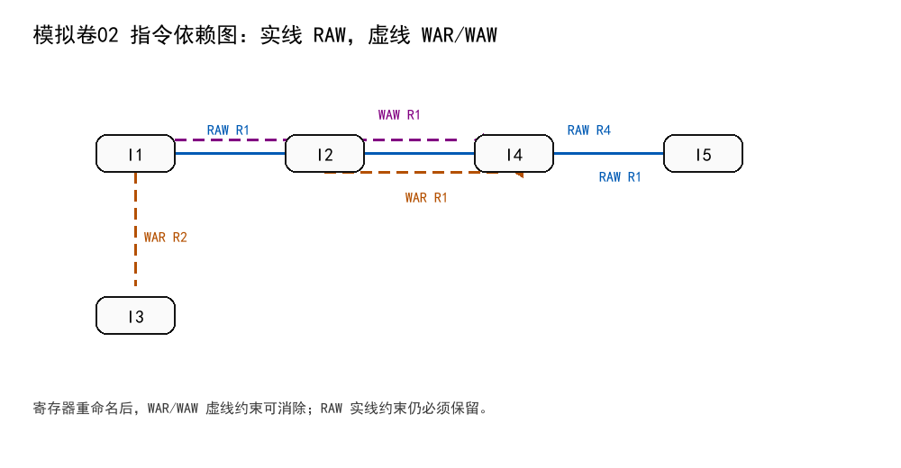
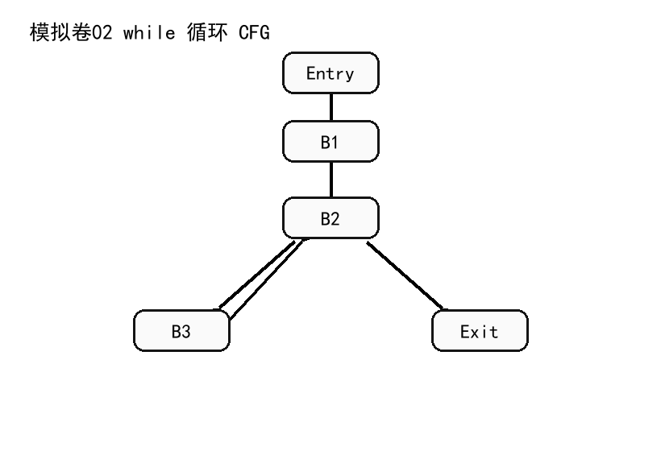
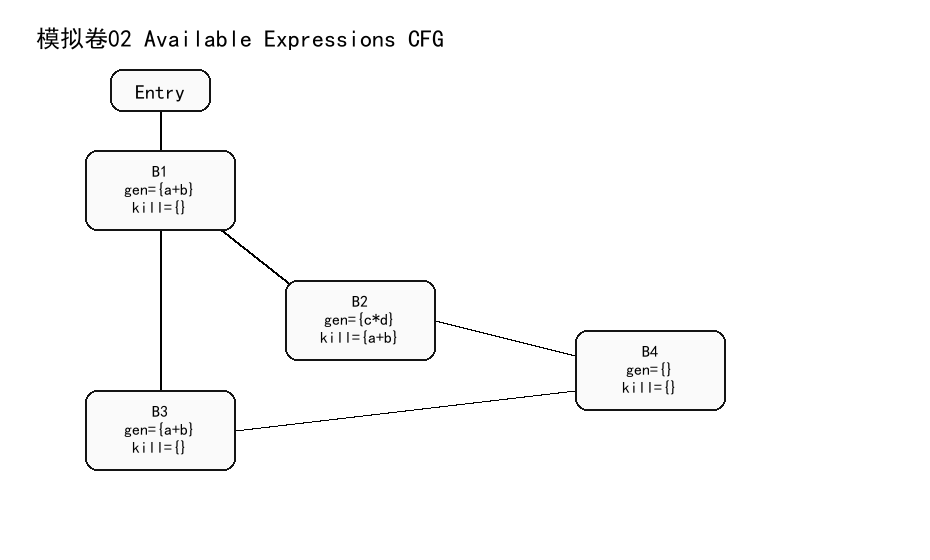

# 编译原理 2025 风格模拟卷02（题目与考试标准答案）

## 卷面说明

本卷按 Slides/Slides/handout 与三份 Recap PPT 更新，主线覆盖前端自动机与 LL、中端 IR/SSA、数据流、符号执行、后端目标代码、寄存器分配、指令调度以及过程间/指针分析。总分 100 分。

# A 卷题目

## 一、词法分析（15 分）

正则表达式：

```text
((epsilon|a)b*)*
```

1. 使用 Thompson 构造法构造等价 NFA。
2. 使用子集构造法构造 DFA，写明 DFA 状态含义。
3. 最小化 DFA。

## 二、LL 语法分析（15 分）

文法：

```text
S -> D E
D -> D q | s
E -> m | n
```

1. 消除左递归。
2. 写 FIRST 和 FOLLOW。
3. 写预测分析表。
4. 判断消除左递归后的文法是否为 LL(1)。

## 三、指令调度（15 分）

给定指令：

```text
I1: R1 = R2 + R3
I2: R4 = R1 + R5
I3: R2 = R6 + R7
I4: R1 = R8 + R9
I5: R10 = R4 + R1
```

1. 写出指令调度的目的。
2. 写出 RAW、WAR、WAW 的定义。
3. 构建依赖图，WAR/WAW 用虚线表示。
4. 在允许寄存器重命名的条件下给出一个合法重排序列。

## 四、支配问题（15 分）

CFG：while 循环

```text
Entry->B1
B1->B2
B2->B3
B3->B2
B2->Exit
```

1. 写出 Dom、PostDom、Dom Frontier 的定义。
2. 计算每个节点的 Dom 集和 idom。
3. 写出支配边界。
4. 说明 SSA 中 phi 函数应放在什么位置。

## 五、符号执行与 SAT（20 分）

公式：

```text
F = ((a2 and b2) or c2)
```

1. 写出 Path-sensitive、Flow-sensitive、Context-sensitive 的定义。
2. 写出 CNF 的定义。
3. 使用 Tseitin 算法把 F 转成 CNF。
4. 证明 2025 卷中的两组公式同时可满足。

## 六、Andersen 指针分析（20 分）

程序：

```text
x = &o1
y = &o2
z = x
*z = y
w = *x
```

1. 对每条语句写 Andersen 约束。
2. 根据约束构建闭包。
3. 写出最终 points-to 集合。

## 七、PPT 新增重点：数据流分析（10 分）

CFG 与可用表达式信息：

```text
Entry->B1
B1->B2
B1->B3
B2->B4
B3->B4

表达式全集 E={a+b, c*d}
B1: gen={a+b}, kill={}
B2: gen={c*d}, kill={a+b}
B3: gen={a+b}, kill={}
B4: gen={}, kill={}
```

1. 写出 Available Expressions 的方向、meet 和 transfer 方程。
2. 计算各基本块的 IN/OUT。
3. 说明它和 Reaching Definitions 的 meet 有什么不同。

# B 按考试标准重写答案

## 一、词法分析答案

本题图形化答案如下，三张图分别对应 Thompson NFA、子集构造 DFA 和最小 DFA。


```text
正则表达式：((epsilon|a)b*)*

Thompson NFA：起点 q0，终点 q1。按下列转移表画图，q1 画双圈。
q4 --epsilon--> q5
q6 --a--> q7
q2 --epsilon--> q4
q2 --epsilon--> q6
q5 --epsilon--> q3
q7 --epsilon--> q3
q10 --b--> q11
q8 --epsilon--> q10
q8 --epsilon--> q9
q11 --epsilon--> q10
q11 --epsilon--> q9
q3 --epsilon--> q8
q0 --epsilon--> q2
q0 --epsilon--> q1
q9 --epsilon--> q2
q9 --epsilon--> q1

子集构造 DFA：
D0:
  NFA集合 = {q0,q1,q2,q3,q4,q5,q6,q8,q9,q10}
  on a -> D1
  on b -> D2
  终态 = 是
D1:
  NFA集合 = {q1,q2,q3,q4,q5,q6,q7,q8,q9,q10}
  on a -> D1
  on b -> D2
  终态 = 是
D2:
  NFA集合 = {q1,q2,q3,q4,q5,q6,q8,q9,q10,q11}
  on a -> D1
  on b -> D2
  终态 = 是

最小化：
初分组：
  终态组 = {D0,D1,D2}
  非终态组 = {}
最终分组：
  G1 = {D0,D2,D1}
每个最终分组对应一个最小 DFA 状态。
```

最小化推理过程：

| 状态 | 是否终态 | a 转移 | b 转移 | 可区分性判断 |
| --- | --- | --- | --- | --- |
| D0 | 是 | D1 | D2 | 与 D1、D2 都是终态，且转移仍落在同一终态组 |
| D1 | 是 | D1 | D2 | 与 D0、D2 对输入 a/b 的目标组相同 |
| D2 | 是 | D1 | D2 | 与 D0、D1 对输入 a/b 的目标组相同 |

初始划分只有一个终态组 `{D0,D1,D2}`，没有非终态组。检查每个状态的 `a`、`b` 转移都仍然回到这个组，所以无法继续细分。

因此最小 DFA 只有一个状态：

| 最小 DFA 状态 | 原 DFA 状态集合 | a | b | 是否终态 |
| --- | --- | --- | --- | --- |
| G1 | `{D0,D1,D2}` | G1 | G1 | 是 |

G1 既是初态也是终态。也就是说，该正则表达式等价于所有由 `a`、`b` 构成的串，包括空串。


## 二、LL 语法分析答案

```text
原文法：
S -> D E
D -> D q | s
E -> m | n

消除左递归：
S  -> D E
D  -> s D'
D' -> q D' | epsilon
E  -> m | n

FIRST：
FIRST(S)={ s }
FIRST(D)={ s }
FIRST(D')={ q, epsilon }
FIRST(E)={ m, n }

FOLLOW：
FOLLOW(S)={ $ }
FOLLOW(D)={ m, n }
FOLLOW(D')={ m, n }
FOLLOW(E)={ $ }

预测表：
M[S,s] = S -> D E
M[D,s] = D -> s D'
M[D',q] = D' -> q D'
M[D',m] = D' -> epsilon
M[D',n] = D' -> epsilon
M[E,m] = E -> m
M[E,n] = E -> n

结论：表中无多重入口，消除左递归后的文法是 LL(1)。
```

左递归消除推导：

```text
D -> D q | s

套用直接左递归消除规则：
A -> A alpha | beta
改写为：
A  -> beta A'
A' -> alpha A' | epsilon

所以：
alpha = q
beta  = s

D  -> s D'
D' -> q D' | epsilon
```

FIRST 推导：

| 符号 | 推导依据 | FIRST |
| --- | --- | --- |
| D | `D -> s D'`，右部第一个符号是终结符 `s` | `{ s }` |
| D' | `D' -> q D' | epsilon` | `{ q, epsilon }` |
| E | `E -> m | n` | `{ m, n }` |
| S | `S -> D E`，且 D 不能推出 `epsilon` | `{ s }` |

FOLLOW 推导：

| FOLLOW 集 | 推导依据 | 结果 |
| --- | --- | --- |
| FOLLOW(S) | S 是开始符号 | `{ $ }` |
| FOLLOW(D) | `S -> D E`，D 后面是 E，所以加入 `FIRST(E)` | `{ m, n }` |
| FOLLOW(D') | `D -> s D'`，D' 在产生式末尾，所以加入 `FOLLOW(D)` | `{ m, n }` |
| FOLLOW(E) | `S -> D E`，E 在产生式末尾，所以加入 `FOLLOW(S)` | `{ $ }` |

预测分析表填表推导：

| 产生式 | FIRST 或 FOLLOW 依据 | 填入表项 |
| --- | --- | --- |
| `S -> D E` | `FIRST(D E)=FIRST(D)={s}` | `M[S,s] = S -> D E` |
| `D -> s D'` | `FIRST(s D')={s}` | `M[D,s] = D -> s D'` |
| `D' -> q D'` | `FIRST(q D')={q}` | `M[D',q] = D' -> q D'` |
| `D' -> epsilon` | `FOLLOW(D')={m,n}` | `M[D',m] = D' -> epsilon`，`M[D',n] = D' -> epsilon` |
| `E -> m` | `FIRST(m)={m}` | `M[E,m] = E -> m` |
| `E -> n` | `FIRST(n)={n}` | `M[E,n] = E -> n` |

预测分析表（表格形式）：

| 非终结符 | 输入符号 | 产生式 |
| --- | --- | --- |
| S | s | S -> D E |
| D | s | D -> s D' |
| D' | q | D' -> q D' |
| D' | m | D' -> epsilon |
| D' | n | D' -> epsilon |
| E | m | E -> m |
| E | n | E -> n |

完整预测分析表，空白项为 error：

| 非终结符 | s | q | m | n | $ |
| --- | --- | --- | --- | --- | --- |
| S | `S -> D E` | error | error | error | error |
| D | `D -> s D'` | error | error | error | error |
| D' | error | `D' -> q D'` | `D' -> epsilon` | `D' -> epsilon` | error |
| E | error | error | `E -> m` | `E -> n` | error |

每个表项最多只有一条产生式，因此消除左递归后的文法是 LL(1)。


## 三、指令调度答案

定义：

```text
指令调度在不改变程序语义的前提下重排指令，减少流水线停顿，提高并行执行效率。
RAW：先写后读，必须保持顺序。
WAR：先读后写，写者不能提前。
WAW：先写后写，顺序影响最终值。
```

```text
指令：
I1: R1 = R2 + R3
I2: R4 = R1 + R5
I3: R2 = R6 + R7
I4: R1 = R8 + R9
I5: R10 = R4 + R1

依赖：
I1 -> I2 RAW on R1
I1 -> I3 WAR on R2
I1 -> I4 WAW on R1
I2 -> I4 WAR on R1
I2 -> I5 RAW on R4
I4 -> I5 RAW on R1

寄存器重命名：
I3: R2_new = R6 + R7
I4: R1_new = R8 + R9
I5 使用 R1_new

重命名后保留 RAW，WAR/WAW 被消除。一个合法调度序列：
I1, I3, I4, I2, I5
```

先列每条指令的读写集合：

| 指令 | 读寄存器 | 写寄存器 |
| --- | --- | --- |
| I1 | R2, R3 | R1 |
| I2 | R1, R5 | R4 |
| I3 | R6, R7 | R2 |
| I4 | R8, R9 | R1 |
| I5 | R4, R1 | R10 |

逐对检查依赖：

| 依赖边 | 类型 | 寄存器 | 判断逻辑 |
| --- | --- | --- | --- |
| I1 -> I2 | RAW | R1 | I1 写 R1，I2 读 R1，I2 必须读到 I1 的结果 |
| I1 -> I3 | WAR | R2 | I1 读 R2，I3 后写 R2，I3 不能提前破坏 I1 的读值 |
| I1 -> I4 | WAW | R1 | I1 写 R1，I4 后写 R1，两个写入顺序影响最终版本 |
| I2 -> I4 | WAR | R1 | I2 读 R1，I4 后写 R1，I4 不能提前破坏 I2 的读值 |
| I2 -> I5 | RAW | R4 | I2 写 R4，I5 读 R4 |
| I4 -> I5 | RAW | R1 | I4 写 R1，I5 读 R1，I5 需要 I4 的结果 |

依赖图如下。实线是 RAW，虚线是 WAR/WAW：



寄存器重命名后：

| 原指令 | 重命名后 |
| --- | --- |
| I3: `R2 = R6 + R7` | I3: `R2_new = R6 + R7` |
| I4: `R1 = R8 + R9` | I4: `R1_new = R8 + R9` |
| I5: `R10 = R4 + R1` | I5: `R10 = R4 + R1_new` |

重命名消除了 WAR/WAW，仍必须满足：

```text
I1 -> I2
I2 -> I5
I4 -> I5
```

序列 `I1, I3, I4, I2, I5` 的合法性检查：

| 约束 | 在该序列中的相对顺序 | 是否满足 |
| --- | --- | --- |
| I1 -> I2 | I1 在 I2 前 | 是 |
| I2 -> I5 | I2 在 I5 前 | 是 |
| I4 -> I5 | I4 在 I5 前 | 是 |

所以 `I1, I3, I4, I2, I5` 是寄存器重命名后的一个合法调度序列。


## 四、支配问题答案

定义：

```text
Dom(n)：入口到 n 的每条路径都经过的节点集合。
PostDom(n)：n 到出口的每条路径都经过的节点集合。
Dom Frontier(n)：n 支配某个前驱，但不严格支配该节点的位置。
```

```text
CFG 边：
Entry->B1
B1->B2
B2->B3
B3->B2
B2->Exit

Dom 集：
Dom(Entry)={Entry}
Dom(B1)={Entry,B1}
Dom(B2)={Entry,B1,B2}
Dom(B3)={Entry,B1,B2,B3}
Dom(Exit)={Entry,B1,B2,Exit}

直接支配者：
idom(B1)=Entry
idom(B2)=B1
idom(B3)=B2
idom(Exit)=B2

支配边界：
DF(B2)={B2}
DF(B3)={B2}
其余节点 DF 为空集

SSA phi 放置：若变量在多个基本块中被定义，则在这些定义块的迭代支配边界处插入该变量的 phi。直观上，phi 放在多条控制流汇合且不同定义可能到达的位置。
```

CFG 图如下：



Dom 集按方程计算：

```text
Dom(Entry) = {Entry}
Dom(n) = {n} union intersection(Dom(p))，p 是 n 的所有前驱
```

逐点代入：

| 节点 | 前驱 | 计算过程 | Dom 集 |
| --- | --- | --- | --- |
| Entry | 无 | 入口节点固定 | `{Entry}` |
| B1 | Entry | `{B1} union Dom(Entry)` | `{Entry,B1}` |
| B2 | B1, B3 | `{B2} union (Dom(B1) intersection Dom(B3))`，不动点结果 | `{Entry,B1,B2}` |
| B3 | B2 | `{B3} union Dom(B2)` | `{Entry,B1,B2,B3}` |
| Exit | B2 | `{Exit} union Dom(B2)` | `{Entry,B1,B2,Exit}` |

直接支配者 idom 的判断标准：`idom(n)` 是严格支配 n 的节点中离 n 最近的那个节点。

| 节点 | 严格支配者 | idom |
| --- | --- | --- |
| B1 | `{Entry}` | Entry |
| B2 | `{Entry,B1}` | B1 |
| B3 | `{Entry,B1,B2}` | B2 |
| Exit | `{Entry,B1,B2}` | B2 |

支配边界按定义判断：若节点 X 支配 Y 的某个前驱，但 X 不严格支配 Y，则 Y 属于 DF(X)。

| X | 检查点 | 判断 | DF(X) |
| --- | --- | --- | --- |
| B2 | B2 | B2 支配 B2 的前驱 B3，且 B2 不严格支配自身 | `{B2}` |
| B3 | B2 | B3 支配 B2 的前驱 B3，且 B3 不严格支配 B2 | `{B2}` |
| Entry | B2 | Entry 严格支配 B2 | `{}` |
| B1 | B2 | B1 严格支配 B2 | `{}` |
| Exit | 无后继汇合 | 不产生支配边界 | `{}` |

因此若循环体 B3 中定义的变量能沿回边回到循环头 B2，并且该变量在循环外进入 B2 前也有定义，则 phi 放在循环头 B2。


## 五、符号执行与 SAT 答案

```text
公式：F = ((a2 and b2) or c2)
引入：x21 <-> (a2 and b2)，x22 <-> (x21 or c2)，根变量 x22 为真。

CNF：
(not x21 or a2)
(not x21 or b2)
(x21 or not a2 or not b2)
(x22 or not x21)
(x22 or not c2)
(not x22 or x21 or c2)
(x22)

敏感性定义：
Path-sensitive 区分不同路径。
Flow-sensitive 区分程序点和语句顺序。
Context-sensitive 区分函数调用上下文。

同时可满足证明套用：
F1=(a0 or ... or an or c) and (b0 or ... or bm or not c)，F2=(a0 or ... or an or b0 or ... or bm)。
F1 为真时，c=false 推出某个 ai=true，c=true 推出某个 bj=true，所以 F2 为真。
F2 为真时，若某个 ai=true 令 c=false；若某个 bj=true 令 c=true，所以 F1 为真。
```

Tseitin 转换的推导表：

| 子公式 | 新变量 | 等价关系 | CNF 子句 |
| --- | --- | --- | --- |
| `a2 and b2` | x21 | `x21 <-> (a2 and b2)` | `(not x21 or a2)`；`(not x21 or b2)`；`(x21 or not a2 or not b2)` |
| `x21 or c2` | x22 | `x22 <-> (x21 or c2)` | `(x22 or not x21)`；`(x22 or not c2)`；`(not x22 or x21 or c2)` |
| 整个公式为真 | x22 | 根变量取真 | `(x22)` |

所以最终 CNF 是：

```text
(not x21 or a2)
(not x21 or b2)
(x21 or not a2 or not b2)
(x22 or not x21)
(x22 or not c2)
(not x22 or x21 or c2)
(x22)
```

两组公式同时可满足的证明按两个方向写：

| 已知 | 分情况 | 构造或推出 | 结论 |
| --- | --- | --- | --- |
| `F1=(a0 or ... or an or c) and (b0 or ... or bm or not c)` 为真 | `c=false` | 第一项要为真，必须有某个 `ai=true` | `F2` 为真 |
| `F1` 为真 | `c=true` | 第二项要为真，必须有某个 `bj=true` | `F2` 为真 |
| `F2=(a0 or ... or an or b0 or ... or bm)` 为真 | 存在某个 `ai=true` | 取 `c=false` | `F1` 为真 |
| `F2` 为真 | 存在某个 `bj=true` | 取 `c=true` | `F1` 为真 |

因此两组公式存在满足赋值的条件一致，可同时满足。


## 六、Andersen 指针分析答案

```text
程序：
x = &o1
y = &o2
z = x
*z = y
w = *x

约束：
o1 in pts(x)
o2 in pts(y)
pts(x) subset pts(z)
for v in pts(z), pts(y) subset pts(v)
for v in pts(x), pts(v) subset pts(w)

闭包：
pts(x)={o1}
pts(y)={o2}
pts(z)={o1}
由 *z=y 得 pts(o1)={o2}
由 w=*x 得 pts(w)={o2}
```

逐条语句生成约束：

| 语句 | Andersen 约束 | 含义 |
| --- | --- | --- |
| `x = &o1` | `o1 in pts(x)` | x 指向 o1 |
| `y = &o2` | `o2 in pts(y)` | y 指向 o2 |
| `z = x` | `pts(x) subset pts(z)` | x 的指向集合流入 z |
| `*z = y` | 对每个 `v in pts(z)`，`pts(y) subset pts(v)` | y 指向的对象流入 z 所指对象 |
| `w = *x` | 对每个 `v in pts(x)`，`pts(v) subset pts(w)` | x 所指对象的内容流入 w |

闭包计算过程：

| 轮次 | 新增事实 | 原因 |
| --- | --- | --- |
| 0 | `pts(x)={o1}`，`pts(y)={o2}` | 两条取地址语句 |
| 1 | `pts(z)={o1}` | `z = x`，所以 `pts(x) subset pts(z)` |
| 2 | `pts(o1)` 加入 `o2` | `*z = y`，且 `pts(z)={o1}`、`pts(y)={o2}` |
| 3 | `pts(w)` 加入 `o2` | `w = *x`，且 `pts(x)={o1}`、`pts(o1)={o2}` |

最终 points-to 集合：

| 符号 | points-to 集合 |
| --- | --- |
| x | `{o1}` |
| y | `{o2}` |
| z | `{o1}` |
| w | `{o2}` |
| o1 | `{o2}` |
| o2 | `{}` |


## 七、PPT 新增重点答案

```text
Available Expressions：
方向：前向。
meet：交集 intersection，因为表达式必须在所有路径上都可用。
transfer：OUT[B] = gen[B] union (IN[B] - kill[B])
入口：IN[B1] = {}

IN[B1]  = {}
OUT[B1] = {a+b}

IN[B2]  = OUT[B1] = {a+b}
OUT[B2] = {c*d}

IN[B3]  = OUT[B1] = {a+b}
OUT[B3] = {a+b}

IN[B4]  = OUT[B2] intersection OUT[B3] = {}
OUT[B4] = {}

与 Reaching Definitions 不同：
Reaching Definitions 是 may analysis，用 union。
Available Expressions 是 must analysis，用 intersection。
```

数据流图如下：



Available Expressions 使用前向 must-analysis 方程：

```text
IN[B]  = intersection OUT[P]，P 是 B 的所有前驱
OUT[B] = gen[B] union (IN[B] - kill[B])
```

边界条件：入口处没有已经计算且仍可用的表达式，所以 `IN[B1]={}`。表达式全集是 `{a+b, c*d}`。

按 CFG 顺序代入：

| 基本块 | 前驱 | IN 计算 | OUT 计算 |
| --- | --- | --- | --- |
| B1 | Entry | `IN[B1] = {}` | `OUT[B1] = {a+b} union ({} - {}) = {a+b}` |
| B2 | B1 | `IN[B2] = OUT[B1] = {a+b}` | `OUT[B2] = {c*d} union ({a+b} - {a+b}) = {c*d}` |
| B3 | B1 | `IN[B3] = OUT[B1] = {a+b}` | `OUT[B3] = {a+b} union ({a+b} - {}) = {a+b}` |
| B4 | B2, B3 | `IN[B4] = OUT[B2] intersection OUT[B3] = {}` | `OUT[B4] = {} union ({} - {}) = {}` |

最终表：

| 基本块 | IN | OUT |
| --- | --- | --- |
| B1 | `{}` | `{a+b}` |
| B2 | `{a+b}` | `{c*d}` |
| B3 | `{a+b}` | `{a+b}` |
| B4 | `{}` | `{}` |

与 Reaching Definitions 的区别：

| 分析 | 性质 | meet | 原因 |
| --- | --- | --- | --- |
| Reaching Definitions | may analysis | union | 只要某条路径能到达，就算可能到达 |
| Available Expressions | must analysis | intersection | 必须所有路径上都已经计算且未被杀死，才算可用 |

