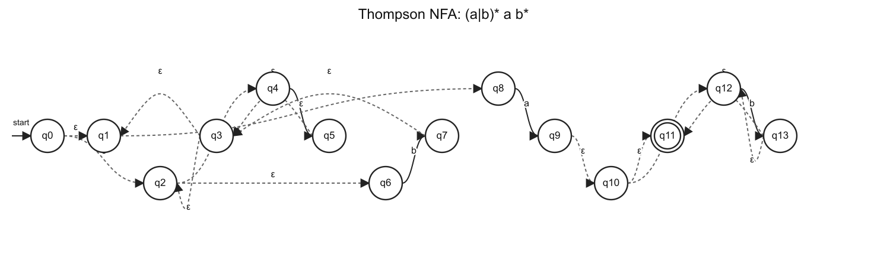
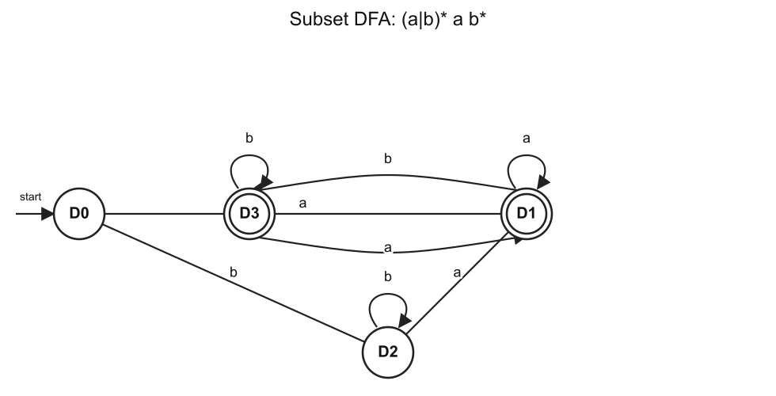
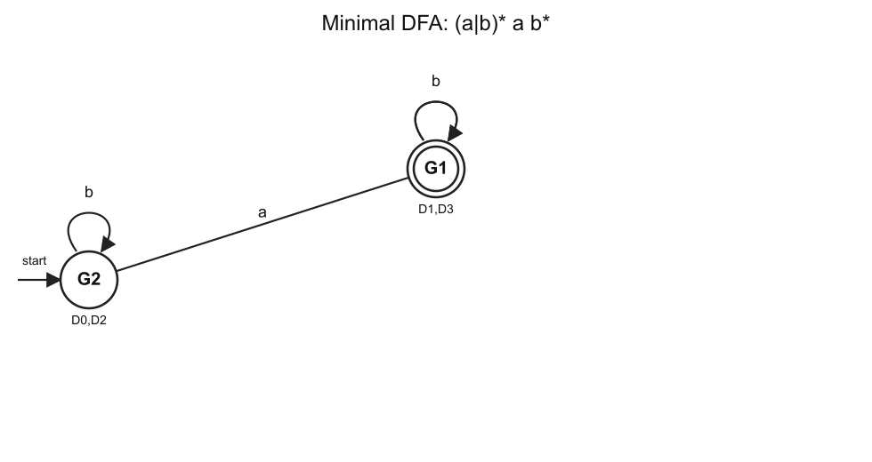

# 编译原理 2025 风格模拟卷05（题目与考试标准答案）

## 卷面说明

本卷按 Slides/Slides/handout 与三份 Recap PPT 更新，主线覆盖前端自动机与 LL、中端 IR/SSA、数据流、符号执行、后端目标代码、寄存器分配、指令调度以及过程间/指针分析。总分 100 分。

# A 卷题目

## 一、词法分析（15 分）

正则表达式：

```text
(a|b)* a b*
```

1. 使用 Thompson 构造法构造等价 NFA。
2. 使用子集构造法构造 DFA，写明 DFA 状态含义。
3. 最小化 DFA。

## 二、LL 语法分析（15 分）

文法：

```text
P -> Q R
Q -> Q dot | num
R -> plus | minus
```

1. 消除左递归。
2. 写 FIRST 和 FOLLOW。
3. 写预测分析表。
4. 判断消除左递归后的文法是否为 LL(1)。

## 三、指令调度（15 分）

给定指令：

```text
I1: R1 = R2 + R3
I2: R4 = R1 + R5
I3: R2 = R6 + R7
I4: R1 = R8 + R9
I5: R10 = R4 + R1
```

1. 写出指令调度的目的。
2. 写出 RAW、WAR、WAW 的定义。
3. 构建依赖图，WAR/WAW 用虚线表示。
4. 在允许寄存器重命名的条件下给出一个合法重排序列。

## 四、支配问题（15 分）

CFG：菱形分支

```text
Entry->B1
B1->B2
B1->B3
B2->B4
B3->B4
B4->Exit
```

1. 写出 Dom、PostDom、Dom Frontier 的定义。
2. 计算每个节点的 Dom 集和 idom。
3. 写出支配边界。
4. 说明 SSA 中 phi 函数应放在什么位置。

## 五、符号执行与 SAT（20 分）

公式：

```text
F = ((a5 and b5) or c5)
```

1. 写出 Path-sensitive、Flow-sensitive、Context-sensitive 的定义。
2. 写出 CNF 的定义。
3. 使用 Tseitin 算法把 F 转成 CNF。
4. 证明 2025 卷中的两组公式同时可满足。

## 六、Andersen 指针分析（20 分）

程序：

```text
p = &a
q = &b
*p = q
r = &c
s = p
t = *p
*s = r
```

1. 对每条语句写 Andersen 约束。
2. 根据约束构建闭包。
3. 写出最终 points-to 集合。

## 七、PPT 新增重点：目标代码生成（10 分）

目标机支持：

```text
LD R, addr
ST addr, R
SUB Rd, R1, R2
```

变量都在栈帧中，地址分别为：

```text
x: -4(FP)
y: -8(FP)
z: -12(FP)
```

1. 写出把三地址码 `x = y - z` 翻译成目标代码的序列。
2. 指出其中用到的指令类别。
3. 说明 `-8(FP)` 这种形式属于什么。

# B 按考试标准重写答案

## 一、词法分析答案

本题图形化答案如下，三张图分别对应 Thompson NFA、子集构造 DFA 和最小 DFA。







```text
正则表达式：(a|b)* a b*

Thompson NFA：起点 q0，终点 q11。按下列转移表画图，q11 画双圈。
q4 --a--> q5
q6 --b--> q7
q2 --epsilon--> q4
q2 --epsilon--> q6
q5 --epsilon--> q3
q7 --epsilon--> q3
q0 --epsilon--> q2
q0 --epsilon--> q1
q3 --epsilon--> q2
q3 --epsilon--> q1
q8 --a--> q9
q1 --epsilon--> q8
q12 --b--> q13
q10 --epsilon--> q12
q10 --epsilon--> q11
q13 --epsilon--> q12
q13 --epsilon--> q11
q9 --epsilon--> q10

子集构造 DFA：
D0:
  NFA集合 = {q0,q1,q2,q4,q6,q8}
  on a -> D1
  on b -> D2
  终态 = 否
D1:
  NFA集合 = {q1,q2,q3,q4,q5,q6,q8,q9,q10,q11,q12}
  on a -> D1
  on b -> D3
  终态 = 是
D2:
  NFA集合 = {q1,q2,q3,q4,q6,q7,q8}
  on a -> D1
  on b -> D2
  终态 = 否
D3:
  NFA集合 = {q1,q2,q3,q4,q6,q7,q8,q11,q12,q13}
  on a -> D1
  on b -> D3
  终态 = 是

最小化：
初分组：
  终态组 = {D1,D3}
  非终态组 = {D0,D2}
最终分组：
  G1 = {D1,D3}
  G2 = {D0,D2}
每个最终分组对应一个最小 DFA 状态。
```


## 二、LL 语法分析答案

```text
原文法：
P -> Q R
Q -> Q dot | num
R -> plus | minus

消除左递归：
P  -> Q R
Q  -> num Q'
Q' -> dot Q' | epsilon
R  -> plus | minus

FIRST：
FIRST(P)={ num }
FIRST(Q)={ num }
FIRST(Q')={ dot, epsilon }
FIRST(R)={ plus, minus }

FOLLOW：
FOLLOW(P)={ $ }
FOLLOW(Q)={ plus, minus }
FOLLOW(Q')={ plus, minus }
FOLLOW(R)={ $ }

预测表：
M[P,num] = P -> Q R
M[Q,num] = Q -> num Q'
M[Q',dot] = Q' -> dot Q'
M[Q',plus] = Q' -> epsilon
M[Q',minus] = Q' -> epsilon
M[R,plus] = R -> plus
M[R,minus] = R -> minus

结论：表中无多重入口，消除左递归后的文法是 LL(1)。
```

预测分析表（表格形式）：

| 非终结符 | 输入符号 | 产生式 |
| --- | --- | --- |
| P | num | P -> Q R |
| Q | num | Q -> num Q' |
| Q' | dot | Q' -> dot Q' |
| Q' | plus | Q' -> epsilon |
| Q' | minus | Q' -> epsilon |
| R | plus | R -> plus |
| R | minus | R -> minus |


## 三、指令调度答案

定义：

```text
指令调度在不改变程序语义的前提下重排指令，减少流水线停顿，提高并行执行效率。
RAW：先写后读，必须保持顺序。
WAR：先读后写，写者不能提前。
WAW：先写后写，顺序影响最终值。
```

```text
指令：
I1: R1 = R2 + R3
I2: R4 = R1 + R5
I3: R2 = R6 + R7
I4: R1 = R8 + R9
I5: R10 = R4 + R1

依赖：
I1 -> I2 RAW on R1
I1 -> I3 WAR on R2
I1 -> I4 WAW on R1
I2 -> I4 WAR on R1
I2 -> I5 RAW on R4
I4 -> I5 RAW on R1

寄存器重命名：
I3: R2_new = R6 + R7
I4: R1_new = R8 + R9
I5 使用 R1_new

重命名后保留 RAW，WAR/WAW 被消除。一个合法调度序列：
I1, I3, I4, I2, I5
```


## 四、支配问题答案

定义：

```text
Dom(n)：入口到 n 的每条路径都经过的节点集合。
PostDom(n)：n 到出口的每条路径都经过的节点集合。
Dom Frontier(n)：n 支配某个前驱，但不严格支配该节点的位置。
```

```text
CFG 边：
Entry->B1
B1->B2
B1->B3
B2->B4
B3->B4
B4->Exit

Dom 集：
Dom(Entry)={Entry}
Dom(B1)={Entry,B1}
Dom(B2)={Entry,B1,B2}
Dom(B3)={Entry,B1,B3}
Dom(B4)={Entry,B1,B4}
Dom(Exit)={Entry,B1,B4,Exit}

直接支配者：
idom(B1)=Entry
idom(B2)=B1
idom(B3)=B1
idom(B4)=B1
idom(Exit)=B4

支配边界：
DF(B2)={B4}
DF(B3)={B4}
其余节点 DF 为空集

SSA phi 放置：若变量在多个基本块中被定义，则在这些定义块的迭代支配边界处插入该变量的 phi。直观上，phi 放在多条控制流汇合且不同定义可能到达的位置。
```


## 五、符号执行与 SAT 答案

```text
公式：F = ((a5 and b5) or c5)
引入：x51 <-> (a5 and b5)，x52 <-> (x51 or c5)，根变量 x52 为真。

CNF：
(not x51 or a5)
(not x51 or b5)
(x51 or not a5 or not b5)
(x52 or not x51)
(x52 or not c5)
(not x52 or x51 or c5)
(x52)

敏感性定义：
Path-sensitive 区分不同路径。
Flow-sensitive 区分程序点和语句顺序。
Context-sensitive 区分函数调用上下文。

同时可满足证明套用：
F1=(a0 or ... or an or c) and (b0 or ... or bm or not c)，F2=(a0 or ... or an or b0 or ... or bm)。
F1 为真时，c=false 推出某个 ai=true，c=true 推出某个 bj=true，所以 F2 为真。
F2 为真时，若某个 ai=true 令 c=false；若某个 bj=true 令 c=true，所以 F1 为真。
```


## 六、Andersen 指针分析答案

```text
程序：
p = &a
q = &b
*p = q
r = &c
s = p
t = *p
*s = r

约束：
a in pts(p)
b in pts(q)
for v in pts(p), pts(q) subset pts(v)
c in pts(r)
pts(p) subset pts(s)
for v in pts(p), pts(v) subset pts(t)
for v in pts(s), pts(r) subset pts(v)

闭包：
pts(p)={a}
pts(q)={b}
pts(r)={c}
pts(s)={a}
由 *p=q 得 pts(a) 包含 {b}
由 *s=r 得 pts(a) 包含 {c}
由 t=*p 得 pts(t) 包含 pts(a)，最终 pts(t)={b,c}
最终 pts(a)={b,c}
```


## 七、PPT 新增重点答案

```text
目标代码：
LD R1, -8(FP)
LD R2, -12(FP)
SUB R3, R1, R2
ST -4(FP), R3

指令类别：
LD/ST 是 Load/Store。
SUB 是 Calculation。

-8(FP) 是基址加偏移地址模式。
含义是以 FP 为基址，再加 -8 得到变量 y 的地址。
```

