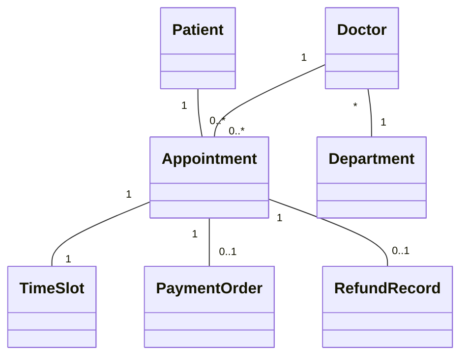
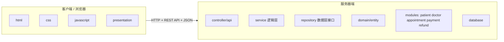
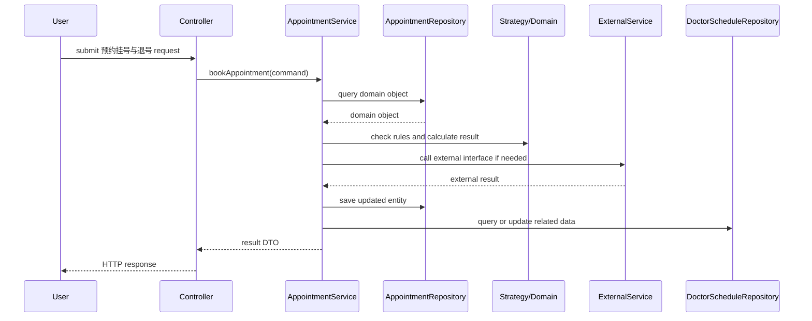
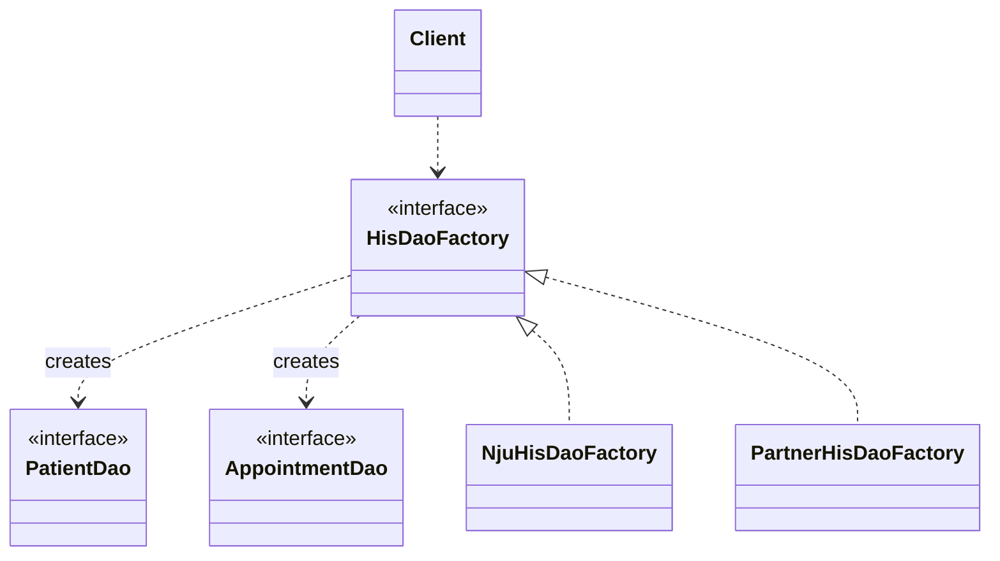

# 软件工程与计算 II 期末模拟卷 07：医院预约挂号系统（题目与详解）

## 卷面说明

本卷按 2020、2022 的完整十题结构设计，并纳入 2025 的 Spring Boot 三层代码、策略模式、代码改造、测试与 HCI 题型。总分 100 分，每题 10 分。

场景：医院预约挂号系统 提供 预约挂号与退号。主要参与者包括 患者、医生、分诊护士、支付平台、医院 HIS。系统采用 Web 架构，客户端为浏览器，服务器端采用 Spring Boot，数据持久化由 Repository 完成。

# A 卷题目

## 一、简答题（10 分）

1. 软件工程。
2. 持续集成。
3. 软件生命周期模型。

## 二、需求题（10 分）

围绕 `预约挂号与退号`：

1. 写出 2 个用例，说明参与者和主成功场景。
2. 写出一个业务需求、一个用户需求和一个系统级需求。
3. 判断“系统需要向外部系统提供 API 供调用”属于哪类需求，并说明原因。

## 三、需求分析题（10 分）

根据场景，完成 `预约挂号与退号` 的概念类图：

1. 识别问题域概念类。
2. 写出概念类之间的关联、聚合、组合或继承。
3. 写出关键属性并画出类图。

## 四、体系结构设计题（10 分）

系统采用 Web 分层架构：

1. 画出物理包图，要求体现客户端 `html/css/javascript/presentation`，服务器端 Controller、Service、Repository、Domain、Database，并标注 HTTP、REST API、JSON。
2. 针对 `预约挂号与退号` 写出 Service 接口、Repository 方法声明、Controller 调用 Service 的依赖注入代码片段，写出包名。

## 五、详细设计题（10 分）

针对 `预约挂号与退号`：

1. 画出 Controller、Service、Repository、外部接口之间的顺序图。
2. 简述集中式、分散式、委托式控制策略。
3. 判断本场景适合的控制策略并说明理由。

## 六、模块化与信息隐藏题（10 分）

系统中 `patient、doctor、appointment、payment、refund` 包之间存在直接互相访问数据对象和调用内部方法的现象。

1. 从耦合和内聚角度分析问题。
2. 指出违反的设计原则。
3. 给出包结构和接口层面的改进方案。

## 七、设计模式题（10 分）

业务中存在变化点：替换医院 HIS 数据源。请说明使用 `Abstract Factory` 如何设计。

要求：

1. 写出模式适用原因。
2. 画出类图。
3. 说明使用到的设计原则。
4. 说明优缺点。

## 八、软件构造题（10 分）

某同学把 `appointment booking mixes payment, slot locking and database access` 写在一个方法中，方法包含大量条件分支、魔法数字和对数据访问对象的直接调用。

1. 从软件构造角度列出问题。
2. 给出重构方向。
3. 写出一段改进后的代码骨架。

## 九、测试题（10 分）

针对 `预约挂号与退号` 的核心方法：

1. 说明如何计算圈复杂度。
2. 设计满足 `状态转换测试` 的测试用例集。
3. 补充一个异常路径测试用例。

## 十、人机交互题（10 分）

针对 `科室选择、医生排班、号源状态、支付倒计时、退号入口`，从 HCI 原则角度分析优点、不足和改进建议。至少写 5 点。

# B 详解

## 一、简答题详解

- 软件工程：把系统化、规范化、可量化的方法应用于软件开发、运行和维护，并研究这些方法的学科。展开时补充需求、设计、构造、测试、维护、配置管理、质量保障和项目管理。
- 生命周期：软件从提出、开发、运行、维护到退役的全过程。模型可写瀑布、增量迭代、演化、螺旋。
- SCM：配置项识别、版本管理、变更控制、配置审计、状态报告、发布管理。变更控制为提交请求、评估影响、批准或拒绝、实施、验证、更新状态。
- CI：频繁集成主干，自动构建、测试和质量检查，降低集成风险，缩短反馈周期。
- 再工程：理解旧系统后进行重构、迁移或改造，使系统更易维护或适配新环境。
- 增量迭代与演化：前者按功能批次交付，后者根据反馈持续改变系统形态。


## 二、需求题详解

用例示例：

- 患者选择科室、医生和号源，系统锁定号源并创建预约订单。
- 患者退号，系统校验退号规则，生成退款记录并释放号源。

需求层次：

- 业务需求：建设 医院预约挂号系统，提升 预约挂号与退号 的处理效率，降低人工处理成本。
- 用户需求：患者 希望通过系统自助完成 预约挂号与退号 并查看处理结果。
- 系统级需求：系统接收请求后应校验用户权限、业务对象状态和输入数据，处理成功后保存记录并返回结果。
- 对外 API 属于对外接口需求，因为它规定本系统与外部系统之间的调用方式、输入输出、数据格式和异常处理。


## 三、需求分析题详解

概念类图答案：



关键属性：

```text
Patient(patientId, name, phone)
Doctor(doctorId, name, title)
Department(deptId, name)
Appointment(appointmentNo, status, visitTime)
PaymentOrder(orderNo, amount, status)
```


评分点：概念类来自问题域，不写 Controller、Service、Repository；关系写多重性；属性只写业务状态和关键标识。

## 四、体系结构设计题详解

物理包图：




接口代码：

```java
package edu.nju.hospital.service;

public interface AppointmentService {
    AppointmentResult bookAppointment(BookAppointmentCommand command);
}

package edu.nju.hospital.repository;

public interface AppointmentRepository {
    Optional<Appointment> findByAppointmentNo(String appointmentNo);
    void save(Appointment appointment);
}

package edu.nju.hospital.repository;

public interface DoctorScheduleRepository {
    List<TimeSlot> findAvailableSlots(Long doctorId);
    void lockSlot(TimeSlot slot);
}

package edu.nju.hospital.controller;

@RestController
@RequestMapping("/api/bookAppointment")
public class AppointmentController {
    private final AppointmentService service;

    public AppointmentController(AppointmentService service) {
        this.service = service;
    }

    @PostMapping
    public AppointmentResult submit(@RequestBody BookAppointmentCommand command) {
        return service.bookAppointment(command);
    }
}
```


评分点：Controller 通过构造器注入 Service；Service 和 Repository 都是接口；Controller 不直接访问 Repository。

## 五、详细设计题详解

顺序图：




控制风格：

- 集中式控制：少数控制对象掌握流程，流程集中但容易形成大控制器。
- 分散式控制：多个对象共同推进流程，单对象职责轻，但控制流难追踪。
- 委托式控制：入口对象保留主流程，把专业子任务委托给 Service、领域对象、策略对象和 Repository。
- 预约挂号与退号 适合委托式控制，因为它包含校验、规则计算、外部接口、持久化和结果返回。


## 六、模块化与信息隐藏题详解

- 直接互相访问内部对象会形成高访问耦合，修改一个包的数据结构会影响另一个包。
- 业务包之间循环依赖违反低耦合、信息隐藏和 DIP。
- 把跨包交互改成接口调用：上层依赖 Service 接口，Service 依赖 Repository 接口，包内隐藏实现类。
- 把共享数据对象转成 DTO 或领域对象，不暴露内部集合和可变字段。
- 把变化规则封装到策略对象或领域服务中，提高内聚。


## 七、设计模式题详解

Abstract Factory 类图：



```text
原则：DIP、OCP、面向接口编程。
作用：业务逻辑依赖 DAO 抽象，替换 HIS 数据源时替换工厂和产品族。
```


## 八、软件构造题详解

```java
问题：
1. 命名不能表达业务含义。
2. 多个业务规则写在一个长条件或 switch 中。
3. 魔法数字散落在代码中。
4. 缺少非法输入处理。
5. 方法同时承担校验、计算、持久化或输出职责。

改进：
1. 使用有意义命名。
2. 提取小方法。
3. 用 Strategy 或表驱动隔离变化规则。
4. 用 guard clause 处理非法输入。
5. 为核心规则补充单元测试。

public boolean check(Request request) {
    validate(request);
    return rules.stream().allMatch(rule -> rule.pass(request));
}
```


## 九、测试题详解

```text
T1 正常输入：覆盖成功路径，预期成功。
T2 关键字段为空：覆盖输入校验失败，预期拒绝并提示。
T3 对象状态非法：覆盖业务状态失败，预期拒绝。
T4 外部接口失败：覆盖异常路径，预期回滚或返回失败。
T5 边界输入：覆盖金额、数量、时间段或容量边界，预期与规则一致。

圈复杂度：V(G) = 判定节点数 + 1。
若题目给出 4 个 if 或 while 判定，则 V(G)=5。
状态转换测试 作答时写明每个判定的真值和假值如何被覆盖。
```


## 十、人机交互题详解

- 系统状态可见：科室选择、医生排班、号源状态、支付倒计时、退号入口 中的提交、处理中、成功、失败状态都要明确显示。
- 一致性和标准：按钮位置、颜色、图标、术语在同类页面中保持一致。
- 错误预防：危险操作要二次确认，非法输入在提交前提示。
- 识别优于回忆：常用选项、历史记录、默认值和示例能降低记忆负担。
- 用户控制和自由：提供返回、取消、撤销或重新提交路径。
- 美学和极简：高频任务放在主路径，次要信息折叠，避免过密表单。


# C 复盘清单

做完本卷后回看：需求三层次、Web 物理包图、接口代码、委托式控制、设计原则、Abstract Factory、构造重构、状态转换测试、HCI 十项启发式。

