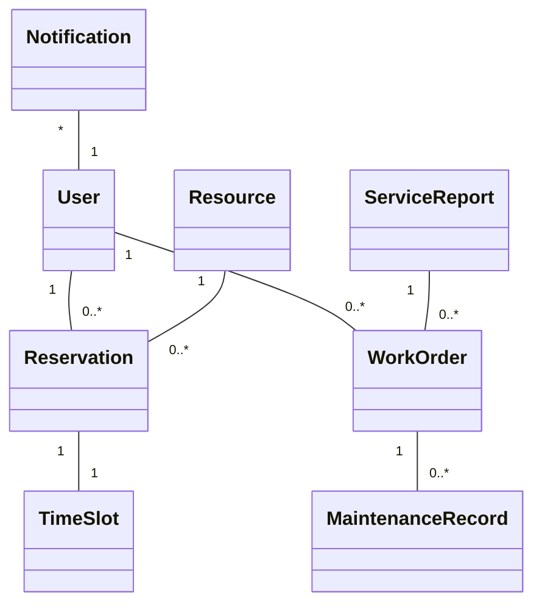
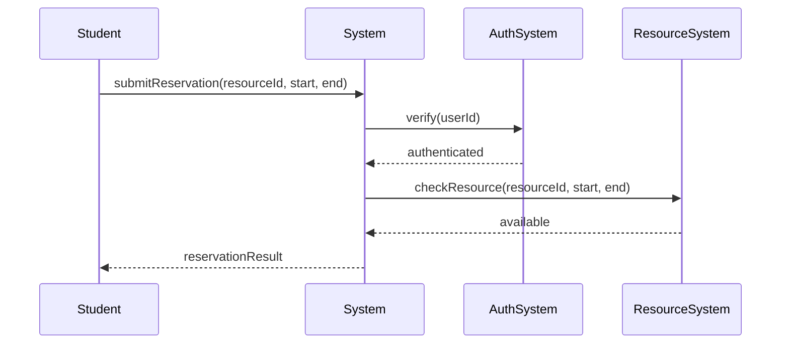
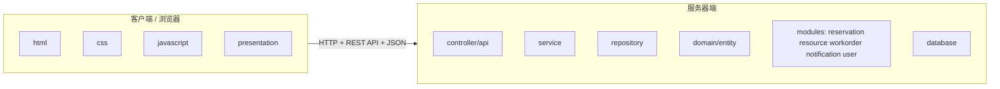
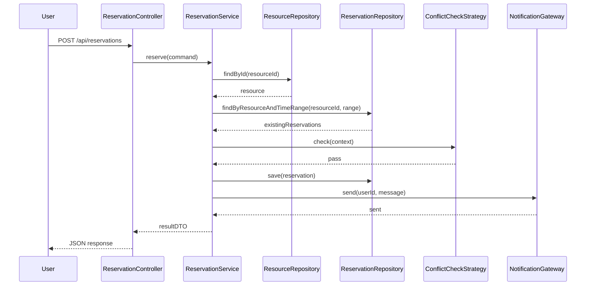
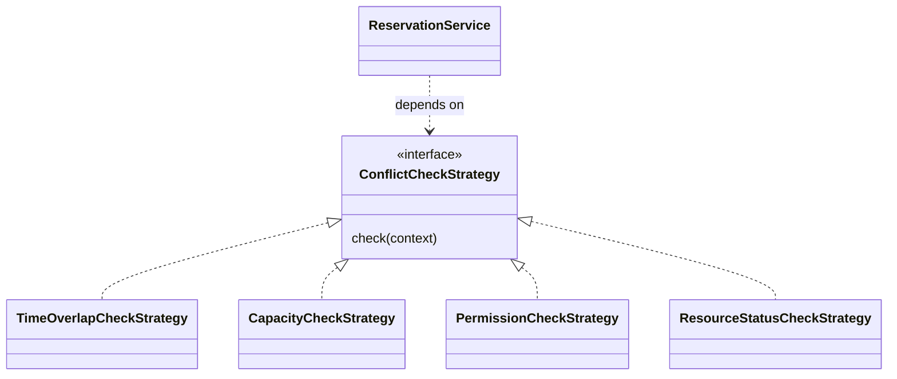
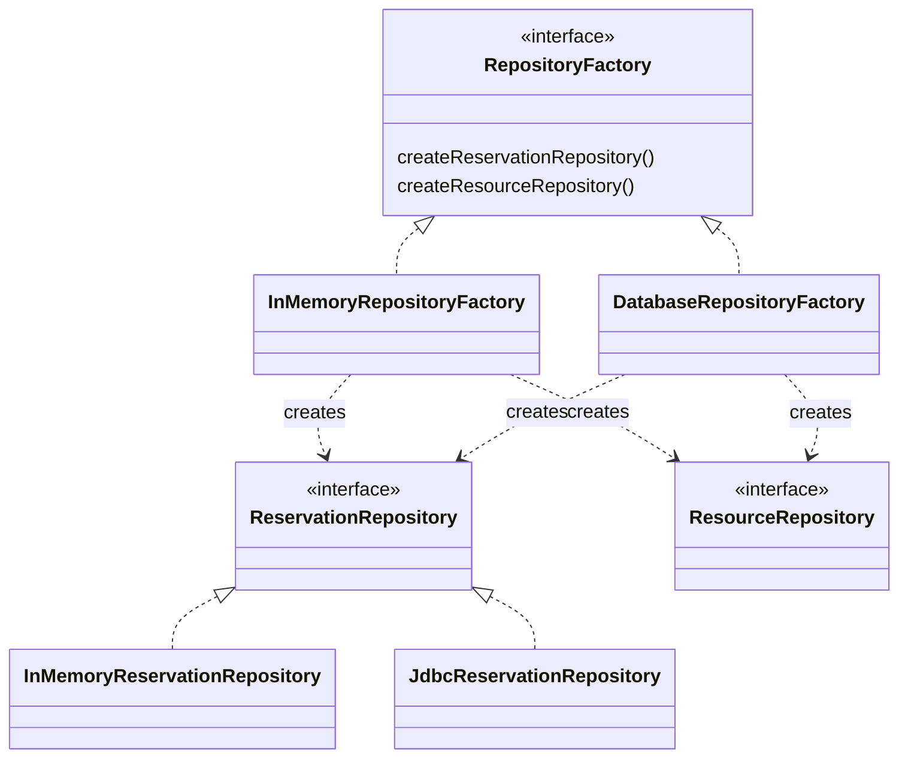
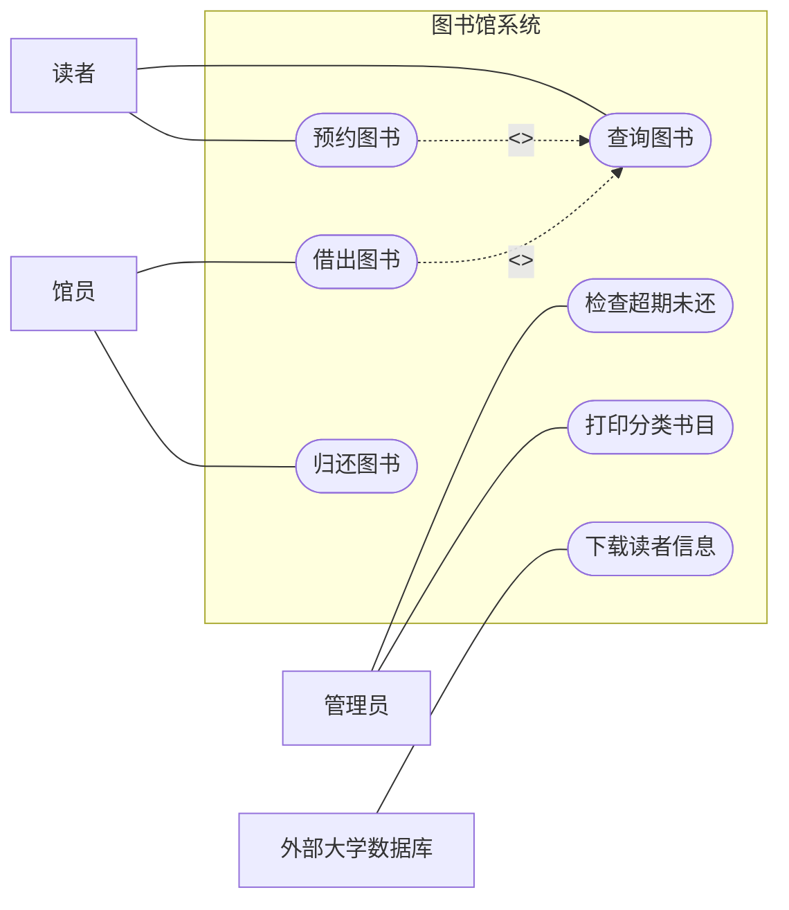
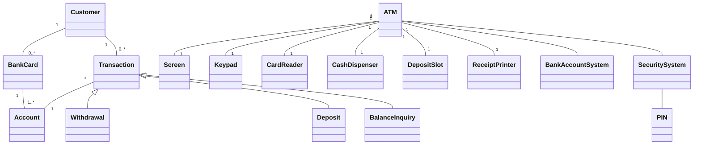
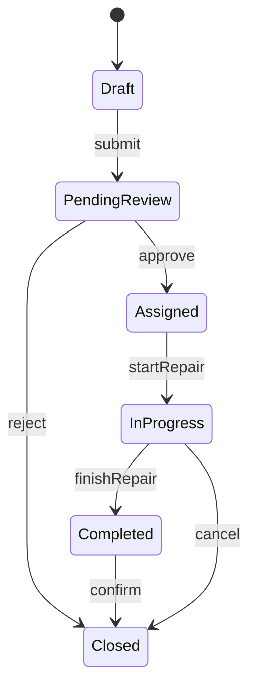
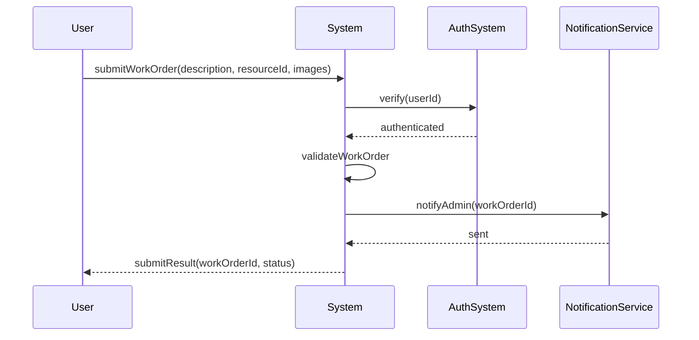

# 软件工程与计算 II 最简综合卷与补充模拟卷

## 使用说明

本文件基于以下已读取材料整理：

- `Exam/答案整理/期末试题答案汇总.md`
- `软工二期末突击/00-零基础期末总复习资料.md`
- `软工二课程整理/课程框架与重点名词.md`
- `Review/名词解释.pdf`
- `Review/补充简答题.pdf`
- `Review/复习提纲.pdf`
- `Review/复习知识点.pdf`
- `Review/summary-重点.pdf`
- `软工二期末突击/模拟卷/模拟卷01-校园卡自助系统题目与详解.md`
- `软工二期末突击/模拟卷/模拟卷02-进销存采购补货系统题目与详解.md`
- `软工二期末突击/模拟卷/模拟卷03-教师排课系统题目与详解.md`
- `软工二期末突击/模拟卷/模拟卷04-图书馆借阅预约系统题目与详解.md`
- `软工二期末突击/模拟卷/模拟卷05-移动支付积分系统题目与详解.md`
- `软工二期末突击/模拟卷/模拟卷06-在线选课系统题目与详解.md`
- `软工二期末突击/模拟卷/模拟卷07-医院预约挂号系统题目与详解.md`
- `软工二期末突击/模拟卷/模拟卷08-实验室设备预约报修系统题目与详解.md`

整理原则：

```text
1. 最简综合卷保留历年卷稳定十题结构，每类核心题型只出一次。
2. 补充模拟卷覆盖已有 8 套系统场景卷中训练较少的旧题和边角知识。
3. 答案按卷面可直接书写的格式给出，需要画图的题目直接给出图形，另配接口代码和测试表述。
```

# 最简综合模拟卷

## A 卷题目

### 一、简答题（10 分）

回答下列问题：

1. 软件工程的定义。
2. 软件配置管理中的变更控制过程。
3. 增量迭代模型和演化模型的区别。

### 二、需求题（10 分）

场景：学校建设 `校园服务预约与工单系统`，学生可以预约教室、自习室和实验设备，也可以提交维修工单。管理员负责审核资源、处理工单并查看统计报表。系统需要和统一认证、消息服务、资源管理系统交互。

完成：

1. 写出 2 个用例，说明参与者和主成功场景。
2. 写出一个业务需求、一个用户需求和一个系统级需求。
3. 判断“系统需要向资源管理系统提供 REST API 供调用”属于哪类需求，并说明原因。

### 三、需求分析题（10 分）

针对 `校园服务预约与工单系统`：

1. 识别问题域概念类。
2. 写出类之间的关联和多重性。
3. 画出一个系统顺序图，要求只把系统当成黑盒。

### 四、体系结构设计题（10 分）

系统采用 Web 分层架构：

1. 画出物理包图，要求体现客户端 `html/css/javascript/presentation`，服务器端 `controller`、`service`、`repository`、`domain`、`database`，并标注 `HTTP + REST API + JSON`。
2. 写出预约服务的 `Service` 接口、`Repository` 接口和 `Controller` 构造器注入代码片段。

### 五、详细设计题（10 分）

针对“提交预约申请”：

1. 画出 `Controller`、`Service`、`Repository`、外部消息服务之间的详细顺序图。
2. 简述集中式、委托式、分散式控制风格。
3. 判断该场景应采用的控制风格，并说明理由。

### 六、模块化与信息隐藏题（10 分）

系统中 `reservation`、`resource`、`workorder`、`notification`、`user` 包互相直接访问内部对象，且多个包直接读取同一个可变全局配置对象。

完成：

1. 从耦合、内聚角度分析问题。
2. 指出违反的设计原则。
3. 给出包结构和接口层面的改进方案。

### 七、设计模式题（10 分）

系统存在两个变化点：

```text
1. 预约冲突检测规则：按时间段冲突、容量冲突、权限冲突、设备状态冲突。
2. 数据访问实现：测试环境使用内存 Repository，生产环境使用数据库 Repository。
```

完成：

1. 说明第一个变化点如何使用 Strategy。
2. 说明第二个变化点如何使用 Abstract Factory 或 DAO Factory。
3. 画出类图，并写出使用到的设计原则。

### 八、软件构造题（10 分）

下面方法把输入校验、业务规则、持久化和通知混在一起：

```java
public boolean reserve(Request r) {
    if (r != null && r.userId != null && r.resourceId != null
            && r.start != null && r.end != null && r.end.after(r.start)
            && dao.find(r.resourceId).status == 1
            && dao.count(r.resourceId, r.start, r.end) < 3) {
        dao.save(r);
        msg.send(r.userId, "ok");
        return true;
    }
    return false;
}
```

完成：

1. 从软件构造角度列出问题。
2. 给出重构方向。
3. 写出改进后的代码骨架。

### 九、测试题（10 分）

针对预约校验方法：

```text
条件 C1：用户已登录。
条件 C2：资源处于可预约状态。
条件 C3：预约时间段合法。
条件 C4：预约人数没有超过容量。
动作 A1：保存预约。
动作 A2：返回失败原因。
```

完成：

1. 说明圈复杂度计算方法。
2. 设计满足条件覆盖的测试用例。
3. 说明如何用 Mock 测试外部消息服务。

### 十、人机交互题（10 分）

针对预约页面：资源日历、时间段选择、冲突提示、提交按钮、处理结果通知。

从 HCI 原则角度分析优点、不足和改进建议，至少写 5 点。

## B 简明答案

### 一、简答题答案

软件工程：

```text
软件工程是把系统化、规范化、可度量的方法应用于软件开发、运行和维护，并研究这些方法的学科。
答题时补充：软件制品包括程序、数据、文档和知识；目标是在受控成本、进度和质量下交付可维护系统。
```

变更控制过程：

```text
1. 提交变更请求。
2. 分析影响，覆盖需求、设计、代码、测试、进度、成本和风险。
3. CCB 或项目负责人批准或拒绝。
4. 制定实施方案和回滚方案。
5. 执行变更。
6. 验证变更结果。
7. 更新基线、配置状态和相关文档。
```

增量迭代模型和演化模型：

```text
增量迭代模型强调按功能优先级分批交付，每个增量都经历分析、设计、构造和测试。
演化模型强调先交付初始版本，再根据用户反馈、环境变化和新需求持续修改。
区别：前者强调有计划的分批交付，后者强调系统形态随反馈持续调整。
```

### 二、需求题答案

用例：

```text
用例 1：提交资源预约。
参与者：学生。
主成功场景：学生选择资源和时间段，系统校验权限、资源状态和冲突，保存预约并发送通知。

用例 2：处理维修工单。
参与者：管理员、维修人员。
主成功场景：管理员查看工单，分派维修人员，维修人员填写处理结果，系统更新工单状态。
```

需求层次：

```text
业务需求：学校建设统一服务预约与工单平台，提高资源使用效率，减少线下登记和人工协调成本。
用户需求：学生希望在线预约资源、提交维修工单并查看处理进度。
系统级需求：系统在收到预约请求后，应校验用户身份、资源状态、
预约时间和容量限制，校验通过后保存预约并返回结果。
```

需求类型：

```text
“系统需要向资源管理系统提供 REST API 供调用”属于对外接口需求。
理由：它规定本系统与外部系统之间的调用方式、接口形式、输入输出和通信协议。
```

### 三、需求分析题答案

概念类图：



系统顺序图：



评分点：

```text
概念类图只写问题域概念，不写 Controller、Service、Repository。
系统顺序图把系统看成黑盒，只写参与者、系统和外部系统。
```

### 四、体系结构设计题答案

物理包图：



接口代码：

```java
package edu.nju.service;

public interface ReservationService {
    ReservationResult reserve(ReservationCommand command);
}

package edu.nju.repository;

public interface ResourceRepository {
    Optional<Resource> findById(Long resourceId);
    void save(Resource resource);
}

package edu.nju.repository;

public interface ReservationRepository {
    void save(Reservation reservation);
    List<Reservation> findByResourceAndTimeRange(Long resourceId, TimeRange range);
}

package edu.nju.controller;

@RestController
@RequestMapping("/api/reservations")
public class ReservationController {
    private final ReservationService reservationService;

    public ReservationController(ReservationService reservationService) {
        this.reservationService = reservationService;
    }

    @PostMapping
    public ReservationResult reserve(@RequestBody ReservationCommand command) {
        return reservationService.reserve(command);
    }
}
```

### 五、详细设计题答案

详细顺序图：



控制风格：

```text
集中式控制：少数控制对象掌握大部分流程，决策位置清楚，但控制器容易膨胀。
委托式控制：入口对象保留主流程，把专业子任务委托给 Service、领域对象、策略对象和 Repository。
分散式控制：多个对象共同推进流程，单对象轻，但控制流难追踪。
```

本场景采用委托式控制：

```text
Controller 只处理请求和响应。
Service 组织业务流程和事务。
Repository 隐藏持久化。
Strategy 处理冲突检测变化点。
NotificationGateway 隐藏外部消息服务。
```

### 六、模块化与信息隐藏题答案

问题：

```text
1. 包之间互相直接访问内部对象，形成高访问耦合和循环依赖。
2. 多个包共享可变全局配置，形成公共耦合。
3. 业务规则、通知、资源状态和用户权限混在不同包中，职责边界不清。
4. 内部数据结构暴露后，字段修改会传播到多个包。
```

违反原则：

```text
信息隐藏：内部数据结构和变化点没有被封装。
DIP：高层业务直接依赖低层实现对象。
SRP：包和类存在多个变化理由。
Law of Demeter：跨对象链式访问过多。
ADP：包依赖关系中存在环。
```

改进：

```text
reservation 包只暴露 ReservationService。
resource 包只暴露 ResourceQueryService 或 ResourceRepository 接口。
notification 包只暴露 NotificationGateway。
user 包只暴露 UserService 或 AuthGateway。
公共配置改为不可变配置对象，通过构造器注入。
跨包传递 DTO 或领域接口，不返回内部可变集合。
```

### 七、设计模式题答案

Strategy：



ReservationService 依赖 ConflictCheckStrategy 接口。新增冲突规则时新增策略类，不修改主流程。

Abstract Factory / DAO Factory：



原则：

```text
OCP：新增规则或数据访问实现时扩展新类。
DIP：Service 依赖接口，不依赖具体实现。
SRP：每个策略只负责一种冲突检测。
信息隐藏：Repository 隐藏存储细节。
```

### 八、软件构造题答案

问题：

```text
1. 条件表达式过长，可读性差。
2. status == 1 是魔法数字。
3. 方法同时负责校验、查询、保存和通知，违反 SRP。
4. 直接访问 dao 和 msg，依赖具体实现。
5. 失败时只返回 false，缺少明确失败原因。
6. 没有异常处理、事务边界和测试切入点。
```

重构方向：

```text
提取输入校验方法。
用枚举表达资源状态。
用 Strategy 或规则列表表达预约规则。
Service 依赖 Repository 和 Gateway 接口。
返回 ReservationResult，包含成功状态和失败原因。
用 Mock 替代外部依赖进行单元测试。
```

代码骨架：

```java
public class ReservationService {
    private final ResourceRepository resourceRepository;
    private final ReservationRepository reservationRepository;
    private final List<ReservationRule> rules;
    private final NotificationGateway notificationGateway;

    public ReservationResult reserve(ReservationCommand command) {
        validate(command);
        Resource resource = resourceRepository.findById(command.resourceId())
                .orElseThrow(() -> new BusinessException("resource not found"));
        ReservationContext context = ReservationContext.of(command, resource);

        for (ReservationRule rule : rules) {
            RuleResult result = rule.check(context);
            if (!result.pass()) {
                return ReservationResult.fail(result.reason());
            }
        }

        Reservation reservation = Reservation.create(command);
        reservationRepository.save(reservation);
        notificationGateway.send(command.userId(), "reservation accepted");
        return ReservationResult.success(reservation.id());
    }
}
```

### 九、测试题答案

圈复杂度：

```text
V(G) = 判定节点数 + 1。
若 C1、C2、C3、C4 分别作为 4 个独立判定，则 V(G)=5。
若实现为一个复合 if，按题目要求拆分基本条件进行条件覆盖。
```

条件覆盖测试：

```text
T1: C1=T, C2=T, C3=T, C4=T -> A1 保存预约。
T2: C1=F, C2=T, C3=T, C4=T -> A2 返回未登录。
T3: C1=T, C2=F, C3=T, C4=T -> A2 返回资源不可预约。
T4: C1=T, C2=T, C3=F, C4=T -> A2 返回时间段非法。
T5: C1=T, C2=T, C3=T, C4=F -> A2 返回容量已满。
```

Mock：

```text
用 Mock NotificationGateway 替代真实消息服务。
成功路径断言 send(userId, message) 被调用一次。
失败路径断言 send 不被调用。
当 Mock 抛出异常时，断言 Service 返回失败或触发回滚逻辑。
```

### 十、人机交互题答案

```text
系统状态可见：提交中、审核中、预约成功、冲突失败必须明确显示。
错误预防：非法时间段、已满资源和权限不足应在提交前提示。
识别优于回忆：日历直接显示可预约时段，减少用户记忆资源编号。
一致性和标准：按钮位置、颜色、术语在预约、工单和报表页面保持一致。
用户控制和自由：提供取消预约、修改时间段、返回列表和重新提交入口。
Fitts 定律：高频按钮靠近主要操作区域，按钮尺寸足够大。
美学和极简：默认显示关键任务信息，历史记录和高级筛选折叠。
帮助用户恢复错误：冲突提示应给出可选时间段，而不是只显示失败。
```

# 补充模拟卷 01：旧题简答与过程模型补缺

## A 卷题目

### 一、软件工程发展、团队与质量保障（20 分）

1. 概括 1950s 到 2000s 软件工程发展的阶段特点。
2. 写出三种团队结构。
3. 结合项目说明质量保障活动覆盖哪些阶段。

### 二、配置管理与持续集成（20 分）

1. 写出软件配置管理的活动。
2. 说明配置项和基线。
3. 解释 CI/CD 和配置管理的关系。

### 三、需求规格说明（20 分）

1. 说明为什么需要建立需求规格说明。
2. 写出需求规格说明常见书写要求。
3. 修改下面需求中的问题：

```text
系统应该尽快处理预约，并且界面要非常友好。
程序调用 ReservationService 的 check 方法验证所有参数。
```

### 四、过程模型比较（20 分）

比较：

```text
Build-and-Fix
Waterfall
Incremental Iteration
Evolutionary Model
Prototype Model
Spiral Model
```

要求写出核心思想、适用场景和主要风险。

### 五、维护、文档、逆向工程与再工程（20 分）

1. 说明软件维护的重要性。
2. 区分用户文档和系统文档。
3. 区分逆向工程和再工程。

## B 简明答案

### 一、软件工程发展、团队与质量保障答案

阶段特点：

```text
1950s：科学计算，以机器为中心编程。
1960s：业务应用和事务处理增长，软件不同于硬件的特征凸显。
1970s：结构化方法和瀑布模型发展，强调规则和纪律。
1980s：追求生产力，结构化方法和面向对象方法广泛应用，重视过程。
1990s：企业级大规模系统和 Web 应用出现，强调快速开发、可变更性和用户价值。
2000s：大众 Web 产品和大规模 Web 应用增长，强调快速迭代、创新和用户反馈。
```

团队结构：

```text
主程序员团队。
民主团队。
开放团队。
```

质量保障：

```text
需求阶段：需求评审、需求度量。
体系结构阶段：架构评审、集成测试策略。
详细设计阶段：设计评审、设计度量、集成测试准备。
构造阶段：代码评审、代码度量、单元测试、持续集成。
测试阶段：测试执行、缺陷度量、覆盖率分析、回归测试。
```

### 二、配置管理与持续集成答案

SCM 活动：

```text
配置项识别。
版本管理。
变更控制。
配置审计。
状态报告。
软件发布管理。
```

配置项和基线：

```text
配置项是纳入配置管理的制品，包括需求文档、设计文档、
源代码、测试脚本、配置文件、数据库脚本和部署脚本。
基线是经过评审和批准的规格或产品版本，后续变更必须经过正式变更控制。
```

CI/CD：

```text
CI 通过自动构建、自动测试和静态检查保证主干持续可集成。
CD 通过自动或半自动发布保证发布过程可重复、可审计、可回滚。
它们把配置管理中的构建、版本、发布和验证活动自动化。
```

### 三、需求规格说明答案

必要性：

```text
1. 方便交流：把问题域理解和系统解决方案文档化。
2. 建立基线：方便任务分配、进度计划、跟踪和度量。
3. 支持验证：需求可以被评审、测试和追踪。
4. 支持变更管理：变更可以分析影响范围。
```

书写要求：

```text
使用用户术语。
简洁、精确、易读、易修改。
可验证。
可实现。
避免模糊形容词和程度词。
避免把内部类名、方法名、参数名写成用户需求。
```

修改：

```text
原句问题：
“尽快”“非常友好”不可验证。
“程序调用 ReservationService 的 check 方法”使用实现术语。

改写：
系统应在用户提交预约请求后 2 秒内返回处理结果。
系统应在预约时间冲突时显示冲突原因和至少一个可选时间段。
系统应校验预约请求中的用户身份、资源状态、时间段和容量限制。
```

### 四、过程模型比较答案

```text
Build-and-Fix：
无明确过程，直接构建再修补。适合极小实验程序。风险是结构退化、缺少文档、难测试、难维护。

Waterfall：
需求、设计、实现、测试、交付顺序推进。
适合需求稳定、合同边界清楚的项目。
风险是反馈晚，早期需求错误会传递到后期。

Incremental Iteration：
按功能增量分批交付，每轮迭代完善。
适合核心需求清楚、功能可拆分的系统。
风险是需要稳定架构和增量规划。

Evolutionary Model：
交付初始版本后根据反馈持续演化。适合需求变化频繁的系统。风险是范围和进度难控制。

Prototype Model：
用原型澄清界面、流程和规则。适合需求表达不清的项目。风险是把抛弃式原型直接当最终产品。

Spiral Model：
风险驱动，每轮包括目标设定、风险分析、开发验证和计划下一轮。
适合大型高风险项目。
风险是对风险识别能力要求高。
```

### 五、维护、文档、逆向工程与再工程答案

维护：

```text
软件维护是在交付后修改软件系统或部件，以修正缺陷、改进性能或适应环境变化。
软件不会物理磨损，但会因需求、环境、依赖和业务变化而持续需要修改。
```

文档：

```text
用户文档面向最终用户，说明安装、登录、导航、操作步骤、输入格式、错误恢复和常见问题。
系统文档面向维护和运维人员，说明软硬件配置、网络、安全、备份、部署、故障处理和部件替换。
```

逆向工程与再工程：

```text
逆向工程从已有系统恢复部件、交互、需求和设计，核心是理解和抽象。
再工程在理解旧系统基础上重构、迁移或重新实现，目标是改善结构、质量、可维护性和可演化性。
```

# 补充模拟卷 02：需求建模与图形题补缺

## A 卷题目

### 一、图书馆系统用例建模（20 分）

场景：图书馆系统支持读者查询图书、借书、还书、预约图书；馆员办理借还；管理员检查超期未还并打印分类书目。

完成：

1. 写出建模步骤。
2. 写出参与者和用例。
3. 标注一组 `include` 和一组 `extend`。

### 二、ATM 领域模型（20 分）

场景：ATM 通过屏幕、键盘、读卡器、存款口、打印机与客户交互。客户可存款、取款、查询余额。账户更新由银行账户系统完成，安全系统负责 PIN 验证。

完成概念类图。

### 三、状态图与系统顺序图（20 分）

针对维修工单：

```text
提交 -> 待审核 -> 已分派 -> 处理中 -> 已完成 -> 已关闭
```

完成：

1. 写出状态、事件和转换。
2. 写出“提交维修工单”的系统顺序图。

### 四、需求错误识别与功能测试（20 分）

需求片段：

```text
系统应该拥有现代化界面。
用户点击按钮以后系统调用 WorkOrderDao.insert。
管理员能很方便地处理所有异常工单。
```

完成：

1. 指出问题。
2. 改写为可验证需求。
3. 为“提交维修工单”设计功能测试用例。

### 五、概念类图、系统顺序图和详细顺序图区别（20 分）

说明三者的目的、图中对象、考试作答边界。

## B 简明答案

### 一、图书馆系统用例建模答案

建模步骤：

```text
1. 确定系统边界。
2. 找参与者。
3. 找有业务价值的用例。
4. 合并过细操作。
5. 标注 include、extend 和泛化。
```

用例图：



### 二、ATM 领域模型答案

领域类图：



评分点：

```text
领域模型写业务概念和设备概念，不写 Controller、Service、DAO。
交易类型用继承表达。
外部账户系统和安全系统作为外部系统概念。
```

### 三、状态图与系统顺序图答案

状态转换：



系统顺序图：



### 四、需求错误识别与功能测试答案

问题：

```text
“现代化”“很方便”不可验证。
“调用 WorkOrderDao.insert”使用实现术语。
“所有异常工单”范围过大，缺少异常类型和处理规则。
```

改写：

```text
系统应在用户提交维修工单后 2 秒内返回工单编号和初始状态。
系统应要求用户填写资源编号、故障描述和联系方式，缺失任一必填项时拒绝提交并显示字段级错误信息。
管理员应能按工单状态、资源编号和提交时间筛选工单。
系统应支持管理员将待审核工单分派给维修人员，并记录分派时间和处理人。
```

功能测试用例：

```text
T1: 必填项完整，资源存在 -> 提交成功，返回工单编号和待审核状态。
T2: 故障描述为空 -> 提交失败，提示故障描述必填。
T3: 资源编号不存在 -> 提交失败，提示资源不存在。
T4: 图片格式不支持 -> 提交失败，提示允许的文件格式。
T5: 消息服务失败 -> 工单保存成功，通知状态记录为待重试或返回明确失败策略。
```

### 五、三类图区别答案

```text
概念类图：
目的：描述问题域中的重要概念、属性、关系和多重性。
对象：User、Resource、Reservation、WorkOrder 这类领域概念。
边界：不写 Controller、Service、Repository。

系统顺序图：
目的：描述参与者和系统黑盒之间的一次交互。
对象：参与者、System、外部系统。
边界：不展开系统内部对象。

详细顺序图：
目的：描述系统内部对象如何协作完成用例。
对象：Controller、Service、Repository、领域对象、外部接口。
边界：要体现职责分配、控制风格和依赖方向。
```

# 补充模拟卷 03：架构、模块化、模式与测试补缺

## A 卷题目

### 一、体系结构风格（20 分）

比较主程序/子程序、面向对象、分层、MVC 的优点、缺点和适用场景。并说明企业信息系统为什么常用分层架构。

### 二、包设计原则（20 分）

解释：

```text
REP
CCP
CRP
ADP
SDP
SAP
```

并说明 `reservation` 和 `coupon` 两个包互相依赖时如何改造。

### 三、Stub、Driver、Mock 与集成测试（20 分）

1. 区分 Stub、Driver、Mock。
2. 为 `ReservationService` 和 `NotificationGateway` 设计一个集成测试方案。

### 四、设计模式选择（20 分）

为以下场景选择设计模式并说明：

```text
1. 新增多种预约冲突检测算法。
2. MySQL DAO 与 PostgreSQL DAO 需要整体替换。
3. 系统配置对象全局只允许一个实例。
4. 页面按不同排序方式遍历资源集合。
5. 工单状态变化后通知多个显示组件。
```

### 五、黑盒与白盒测试（20 分）

1. 区分等价类、边界值、决策表、状态转换。
2. 区分语句覆盖、分支覆盖、条件覆盖、路径覆盖。
3. 为预约容量规则设计边界值测试。

## B 简明答案

### 一、体系结构风格答案

```text
主程序/子程序：
优点是流程清晰、控制强。
缺点是调用关系强耦合，接口变化影响大，容易形成公共耦合。
适合顺序步骤清楚的小型程序。

面向对象：
优点是隐藏内部实现，结构接近领域概念，易理解、易复用。
缺点是接口耦合、对象标识耦合和副作用仍然存在。
适合基于数据和职责组织的系统。

分层：
优点是抽象层次清楚，支持并行开发，复用性和可修改性好。
缺点是跨层协议难改，层间调用带来性能损失，层数和粒度需要设计。
适合企业信息系统。

MVC：
优点是分离 Model、View、Controller，支持多视图和界面变化。
缺点是复杂度增加，模型变化会影响视图和控制。
适合交互界面和 Web 系统。
```

企业信息系统使用分层架构：

```text
企业信息系统生命周期长、业务规则多、人员分工明显。
分层把展示、业务逻辑和数据访问分开。
界面变化不直接影响业务规则。
数据库变化不直接影响 Controller。
```

### 二、包设计原则答案

```text
REP：重用发布等价原则，重用粒度等于发布粒度。
CCP：共同封闭原则，同一包内类应对同类变化共同封闭。
CRP：共同重用原则，同一包内类应被一起重用，避免强迫用户依赖不需要的类。
ADP：无环依赖原则，包依赖图不能有环。
SDP：稳定依赖原则，依赖应指向更稳定的包。
SAP：稳定抽象原则，稳定包应更抽象，不稳定包应更具体。
```

互相依赖改造：

```text
把双向依赖改为依赖抽象接口。
抽出 reservation.api 中的 ReservationService 接口。
抽出 coupon.api 中的 CouponPolicy 接口。
由应用服务或协调者负责组合两个包。
具体实现依赖接口，包依赖图保持有向无环。
```

### 三、Stub、Driver、Mock 与集成测试答案

```text
Stub：被测模块依赖的下层临时代码，用固定返回值替代真实依赖。
Driver：调用被测模块的上层临时代码，用来驱动测试执行。
Mock：可验证交互的替身对象，既提供返回值，也记录是否按预期被调用。
```

集成测试：

```text
1. 准备 ReservationService、真实规则对象、测试 Repository、Mock NotificationGateway。
2. 输入合法预约请求。
3. 断言 Repository 保存了一条预约。
4. 断言 Mock NotificationGateway 被调用一次。
5. 输入冲突预约请求。
6. 断言 Repository 没有新增预约，NotificationGateway 没有被调用。
```

### 四、设计模式选择答案

```text
1. 多种冲突检测算法：Strategy。把算法封装成 ConflictCheckStrategy，新增算法时新增实现类。
2. MySQL DAO 与 PostgreSQL DAO 整体替换：Abstract Factory 或 DAO Factory。
   业务层依赖 DAO 接口，工厂创建一组相关 DAO。
3. 全局唯一配置对象：Singleton。
   考试写法可用私有构造器、静态实例和全局访问方法；
   工程实践中优先由依赖注入容器管理生命周期。
4. 遍历资源集合：Iterator。客户端通过统一迭代接口遍历，不暴露集合内部结构。
5. 状态变化通知多个显示组件：Observer。工单作为 Subject，多个显示组件作为 Observer。
```

### 五、黑盒与白盒测试答案

黑盒测试：

```text
等价类：把输入划分为有效类和无效类，从每类选代表值。
边界值：围绕边界、边界内、边界外取值，发现闭开区间错误。
决策表：适合多个条件组合决定多个动作。
状态转换：适合对象行为依赖当前状态的场景，覆盖有效转换和重要无效转换。
```

白盒测试：

```text
语句覆盖：每条语句至少执行一次。
分支覆盖：每个判定的真分支和假分支至少执行一次。
条件覆盖：每个基本条件的真值和假值至少出现一次。
路径覆盖：每条独立执行路径至少执行一次。
```

容量边界值：

```text
规则：容量上限 capacity = 30。

T1: current = 0, request = 1 -> 成功。
T2: current = 29, request = 1 -> 成功，刚好达到上限。
T3: current = 30, request = 1 -> 失败，超过上限。
T4: current = 28, request = 2 -> 成功，刚好达到上限。
T5: current = 28, request = 3 -> 失败，超过上限。
T6: request = 0 -> 失败，请求人数非法。
T7: request = -1 -> 失败，请求人数非法。
```
