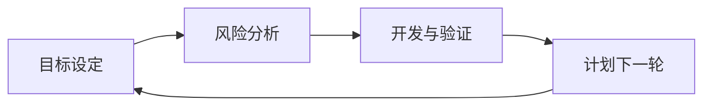

# 01 软件工程基础与项目管理复习讲义

整理范围：

- `PPT/01-01-软件工程基础.pdf`
- `PPT/01-02-项目管理基础.pdf`

交叉参考：

- `Exam/2012.pdf`：名词解释、增量交付模型与演化模型、团队管理。
- `Exam/2013A.pdf`：软件工程、软件演化生命周期模型、螺旋模型。
- `Exam/2013B.pdf`：软件工程、验证与确认、增量开发模型和迭代开发模型。
- `Exam/2014.pdf`：软件工程、软件设计、螺旋模型、质量保障活动。
- `Exam/2016.pdf`：软件工程、演化模型、正向工程与逆向工程。
- `Exam/2020.pdf`：软件工程、持续集成、软件生命周期模型。
- `Exam/2022.pdf`：软件工程、配置管理中的变更控制、迭代增量模型与演化模型。
- `Exam/2025.pdf`：软件工程、再工程、增量迭代模型和演化模型。
- `Review/summary-重点.pdf`、`Review/Final_Reference.pdf`：软件工程定义、质量保证、配置管理、过程模型。

说明：

- 本部分是全课程的工程基础。答题时不要只写定义，要能把定义落到项目失败、质量保证、配置管理和生命周期模型。
- 软件工程、SQA、SCM、CI/CD、风险管理经常以简答题或案例分析题出现。

## 二、2 个课件的主线

| 课件 | 主线 | 必会关键词 |
| --- | --- | --- |
| `01-01` 软件工程基础 | 为什么需要软件工程，软件与传统工程的差异 | 软件定义、软件特征、软件危机、SWEBOK、Ariane 5 |
| `01-02` 项目管理基础 | 如何控制范围、时间、成本、质量和变更 | 项目、五过程组、风险管理、SQA、SCM、基线、CI/CD、部署策略 |

---

# 1. 软件工程基础与项目管理

## 1.1 软件是什么

软件不是单纯的程序。课程中的核心表达是：

**软件 = 程序 + 数据 + 文档 + 知识**

IEEE 610.12-1990 对软件的定义强调三类内容：

- 程序
- 规程或过程
- 相关文档与数据

答题时要写出“软件不只等于代码”。代码只是可执行部分，文档、数据、过程和领域知识共同决定软件能否被理解、运行、维护和演化。

## 1.2 软件的典型特征

常见概括：

- 无形：软件没有物理形态，进度和质量不易直接观察。
- 复杂：状态、分支、交互和依赖数量高。
- 可复制：复制成本低，但开发和维护成本高。
- 易修改：修改入口多，但影响传播复杂。
- 退化：软件不会物理磨损，但会因环境变化、需求变化和补丁叠加而退化。
- 依赖：依赖硬件、操作系统、网络、数据库、第三方库和组织流程。
- 智力密集：核心产出来自设计、抽象、分析和协作。

考试答“软件危机”时，要把这些特征与项目失败联系起来：规模变大后，靠个人经验写代码无法稳定控制质量、进度、成本和维护。

## 1.3 软件工程的定义

IEEE 定义的关键词：

- 系统化
- 规范化
- 可度量
- 开发、运行和维护

可写为：

> 软件工程是把系统化、规范化、可度量的方法应用于软件的开发、运行和维护，并研究这些方法的学科。

软件工程解决的不是“怎么写出一段代码”，而是“如何在多人协作、长期演化、质量受控的条件下交付软件系统”。

## 1.4 软件危机与 Ariane 5 案例

软件危机的标志性节点是 1968 年 NATO 软件工程会议。

常见问题：

- 项目延期
- 成本超支
- 软件质量低
- 难以维护
- 文档缺失
- 需求不断变化
- 开发过程不可控

Ariane 5 案例的答题重点：

- 代码本身来自已有系统，不等于在新环境中正确。
- 隐含的数值范围假设没有被充分记录和验证。
- 复用没有配套完成需求、环境、接口和异常条件验证。
- 失败属于需求假设、集成验证、配置和变更管理问题，不只是编码问题。

## 1.5 SWEBOK 知识域

传统知识域覆盖需求、设计、构造、测试、维护、配置管理、工程管理、过程、模型方法、质量、职业实践、经济学、计算基础、数学基础、工程基础等。

SWEBOK V4 增强关注：

- 软件体系结构
- 软件工程运维
- 软件安全
- AI for SE：用 AI 辅助软件工程
- SE for AI：用软件工程方法建设 AI 系统

答题时可以用一句话收束：

> AI 增强了需求整理、设计草图、代码生成和审查效率，但工程纪律仍由需求验证、接口约束、测试、配置管理和人工评审保证。

---

## 1.6 项目与项目管理

PMBOK 中项目的核心特征：

- 临时性：有明确开始和结束。
- 独特性：交付独特产品、服务或成果。

软件项目管理要控制三个基本约束：

- 范围
- 时间
- 成本

三者共同影响质量。范围扩大、时间压缩或成本不足，都会传导到质量风险。

## 1.7 项目管理五大过程组

按课程表达：

1. 项目启动
2. 项目计划
3. 项目执行
4. 跟踪与控制
5. 项目收尾

常见管理活动：

- 项目计划
- 团队管理
- 成本管理
- 软件质量保证
- 度量
- 过程管理
- 进度管理
- 风险管理
- 配置管理

## 1.8 风险管理

风险管理循环：

1. 风险识别
2. 风险分析
3. 优先级排序
4. 风险应对
5. 风险监控

常见风险类型：

- 技术风险：新框架、新平台、性能瓶颈、兼容性问题。
- 人员风险：关键成员离开、经验不足、沟通失败。
- 需求风险：需求不清、范围膨胀、利益相关者冲突。
- 进度风险：估算失真、依赖延期、任务拆分不合理。
- 外部风险：政策、供应商、硬件、网络、第三方接口变化。

答题模板：

> 先列风险，再写影响，再写应对措施。  
> 例如：第三方支付接口变更属于外部和技术风险，会影响充值功能上线；应对措施是提前建立接口契约、Mock 服务、回归测试和变更通知机制。

## 1.9 软件质量保证 SQA

SQA 关注“过程和产品是否满足质量要求”。

常见活动：

- 代码审查
- 静态分析
- 测试
- 过程审计
- 质量度量
- 阶段评审

里程碑质量活动：

- 需求阶段：需求评审、需求度量。
- 体系结构阶段：架构评审、集成测试策略。
- 详细设计阶段：设计评审、设计度量、集成测试准备。
- 构造阶段：代码审查、代码度量、单元测试。
- 测试阶段：缺陷度量、覆盖率分析、回归测试。

## 1.10 软件配置管理 SCM

SCM 的目标：

- 识别配置项
- 控制变更
- 记录和报告配置状态
- 审计配置
- 保证产品与规格一致

核心术语：

- 配置项 CI：纳入配置管理的项目制品，如需求文档、设计文档、源代码、测试脚本、部署脚本、数据库脚本。
- 基线 Baseline：经过正式评审和批准的规格或产品，后续变更必须走正式变更控制。

SCM 常见活动：

1. 配置项识别
2. 版本管理
3. 变更控制
4. 配置审计
5. 状态报告
6. 发布管理

## 1.11 变更控制流程

标准作答流程：

1. 提交变更请求 CR。
2. 进行影响分析：影响需求、设计、代码、测试、进度、成本和风险。
3. 进行风险评估。
4. CCB 审查并批准或拒绝。
5. 制定回滚计划。
6. 执行变更。
7. 更新基线。
8. 上线验证。
9. 更新状态报告。

Knight Capital 案例的答题重点：

- 部署遗漏一台服务器。
- 新旧代码路径并存导致异常交易。
- 这是发布管理、配置管理和上线验证失败。
- 技术错误背后是过程控制缺失。

---

# 对应考试模板

## 7.12 配置管理题模板

题目出现上线后版本不一致、漏部署、旧代码被触发：

```text
问题属于配置管理和发布管理失败。
原因：配置项识别不完整，版本状态未核对，发布前未做配置审计和上线验证。
改进：
1. 将源码、脚本、配置、依赖和部署清单纳入配置项。
2. 建立发布基线。
3. 变更走 CR、影响分析、CCB 审批、执行、审计、状态报告。
4. 发布前核对所有服务器版本。
5. 发布后执行冒烟测试和回滚预案。
```

---

# 高频考点展开

## 软件工程定义的三层答法

考试里问“什么是软件工程”，答题要包含三层：

1. 方法层：把系统化、规范化、可度量的方法应用于软件开发、运行和维护。
2. 对象层：软件制品包括程序、数据、文档和知识，不只包括代码。
3. 目标层：在多人协作和长期演化中控制质量、成本、进度和风险。

标准答案：

```text
软件工程是把系统化、规范化、可度量的方法应用于
软件开发、运行和维护的工程活动，并研究这些方法。
它关注完整软件制品，包括程序、数据、文档和知识，
目标是在受控的成本、进度和质量约束下交付可维护的软件系统。
```

## 增量迭代模型与演化模型

| 项目 | 增量迭代模型 | 演化模型 |
| --- | --- | --- |
| 基本思想 | 分批交付系统功能，每个增量经历分析、设计、实现和测试 | 先交付初始版本，再在使用和反馈中持续演化 |
| 需求状态 | 核心需求较清楚，功能可按优先级拆分 | 需求变化频繁，系统边界和细节逐步明确 |
| 优点 | 早交付、早反馈、风险分散、便于按优先级安排功能 | 适合需求变化，用户参与强，能持续吸收真实反馈 |
| 缺点 | 需要良好的总体架构和增量规划 | 范围控制难，过程管理弱时会退化成改错式开发 |
| 考试关键词 | 增量、迭代、阶段性交付、可计划 | 演化、反馈、持续修改、需求不稳定 |

## 过程模型场景判定

| 模型 | 驱动因素 | 适用场景 | 主要风险 |
| --- | --- | --- | --- |
| 瀑布模型 | 文档和阶段顺序 | 需求稳定、合同边界清楚、变更受控 | 早期需求错误会传递到后期，反馈晚。 |
| 增量迭代模型 | 需求优先级和阶段性交付 | 核心需求清楚，功能可按优先级分批交付 | 需要开放式架构和清晰增量规划。 |
| 演化模型 | 需求变化和用户反馈 | 需求变化频繁，问题域需要边用边改 | 范围和进度控制难。 |
| 原型模型 | 澄清需求不确定性 | 用户说不清界面、流程或业务规则 | 抛弃式原型不能直接当最终产品。 |
| 螺旋模型 | 风险解决 | 大型、高风险、技术和需求不确定性高的系统 | 风险识别和风险分析能力要求高。 |

螺旋模型作图答案：

<!-- LATEX_DIAGRAM: spiral-model -->



答题句：

```text
螺旋模型是风险驱动的迭代模型。每一轮先确定目标和约束，再分析并解决主要风险，然后开发和验证本轮制品，最后计划下一轮。它结合了迭代、原型和瀑布式阶段活动。
```

## 软件质量保证与测试的区别

SQA 是过程与产品质量保证，测试只是其中一种手段。

- SQA 关注过程是否被执行、文档是否完整、评审是否完成、配置项是否受控。
- 测试关注运行软件后发现缺陷。
- 代码审查和静态分析不需要运行程序，也属于质量保证活动。
- 配置审计和变更控制不直接找代码缺陷，但能防止错误版本进入生产环境。

## SCM 案例答题思路

看到“版本不一致、漏部署、旧代码被触发、生产配置被误删、无法回滚”，按下面结构写：

```text
这是软件配置管理问题。
配置项包括源码、配置文件、构建脚本、数据库脚本、部署脚本和发布包。
改进措施包括：
建立基线、执行变更控制、记录状态报告、
发布前配置审计、发布后冒烟测试、保留回滚版本。
```

## CI/CD 与配置管理

CI/CD 是配置管理在现代工程中的自动化延伸：

- CI 自动完成编译、单元测试、静态分析和集成测试。
- CD 自动或半自动发布到测试环境和生产环境。
- 管线保证构建过程可重复、可审计、可回滚。
- Knight Capital 这类漏部署问题要通过自动化部署清单、版本校验和发布后验证控制。

# 自测题与答案

## 题 1：软件工程解决的核心问题是什么？

答案：

软件工程解决大规模软件开发中的复杂性、变化性和协作控制问题。它用系统化、规范化、可度量的方法管理需求、设计、构造、测试、维护、质量、配置和项目过程，使软件在受控成本和进度下达到质量要求。

## 题 2：Ariane 5 失败为什么不是单纯编码问题？

答案：

Ariane 5 复用了 Ariane 4 的代码，但新环境下数值范围假设已经变化。失败点在需求假设、复用验证、集成测试、异常处理和变更管理。答题时要写“正确运行过的代码换到新环境仍要重新验证”。

## 题 3：配置管理中的变更控制流程是什么？

答案：

提交变更请求；进行影响分析；进行风险评估；由 CCB 审查；批准后制定实施和回滚计划；执行变更；更新基线；进行配置审计和上线验证；更新状态报告。

## 题 4：持续集成的好处和工具链是什么？

答案：

好处包括早发现集成问题、减少手工构建错误、保证主干可用、缩短反馈时间、提高发布可重复性。工具链包括 Git、GitHub 或 GitLab、CI 服务、构建工具、测试框架、静态分析工具、制品库和部署脚本。

## 题 5：风险管理包含哪些步骤？

答案：

风险识别、风险分析、优先级排序、风险应对、风险监控。典型风险包括技术风险、人员风险、需求风险、进度风险和外部风险。

---

# 快速背诵清单

## 软件工程

- 软件 = 程序 + 数据 + 文档 + 知识。
- 软件工程 = 系统化、规范化、可度量的方法。
- 软件危机来自规模、复杂度、变化和协作失控。
- AI 加速工程活动，但不能替代验证、评审和配置管理。

## 项目管理

- 项目：临时性、独特性。
- 三约束：范围、时间、成本，影响质量。
- 五过程组：启动、计划、执行、跟踪控制、收尾。
- 风险管理：识别、分析、排序、应对、监控。
- SCM：配置项、基线、版本、变更、审计、状态报告、发布。
