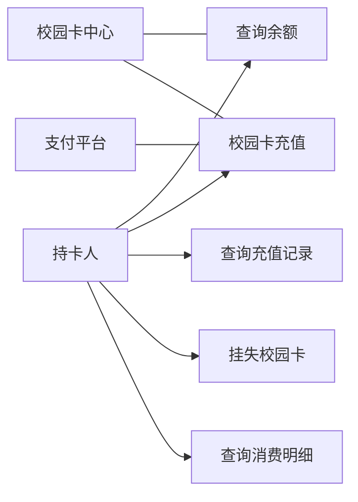
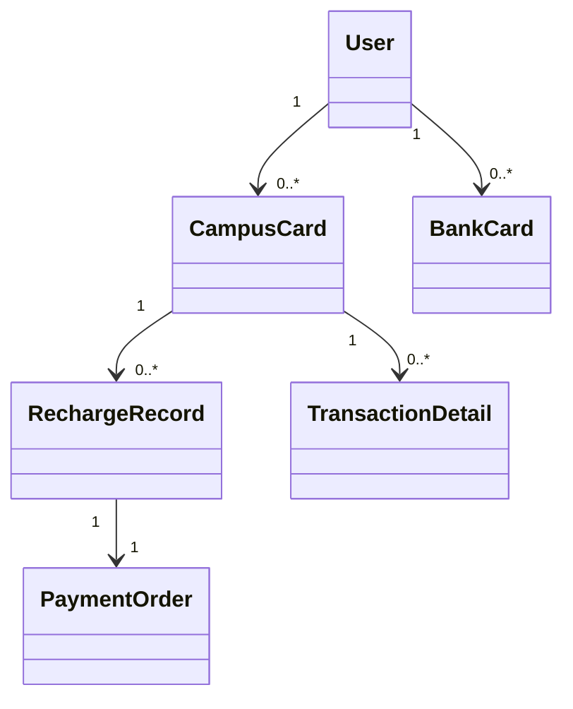
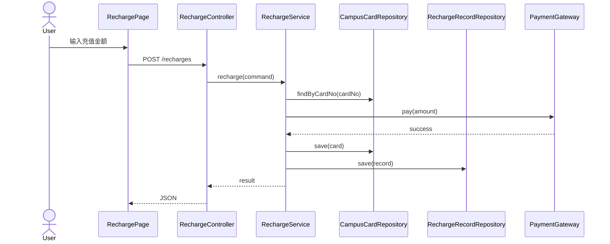

# 02 需求工程复习讲义

整理范围：

- `PPT/02-01-需求工程基础.pdf`
- `PPT/02-02-AI辅助需求获取.pdf`
- `PPT/02-03-用例建模与用户故事.pdf`
- `PPT/02-04-需求分析与AI辅助建模.pdf`
- `PPT/02-05-需求文档化验证与冲突检测.pdf`

交叉参考：

- `Exam/2012.pdf`：销售用例分析类图。
- `Exam/2013A.pdf`：ATM 业务需求、用户需求、系统级需求、功能需求与非功能需求。
- `Exam/2013B.pdf`：ATM 用例图和系统顺序图。
- `Exam/2014.pdf`：图书馆系统用例建模、用例顺序图到分析类图。
- `Exam/2016.pdf`：支付宝支付用例图、概念类图。
- `Exam/2020.pdf`：采购补货用例、需求分类、概念类图。
- `Exam/2022.pdf`：校园卡自助系统用例、充值需求、概念类图。
- `Exam/2025.pdf`：判断需求级别和需求类型、从用户级需求到系统级需求。
- `Review/summary-重点.pdf`、`Review/Final_Reference.pdf`：需求分类、用例粒度、概念类图、顺序图、状态图、SRS。

说明：

- 本部分是考试综合题最多的部分之一。答题重点不是画图好看，而是概念、关系、边界、粒度和可验证性正确。
- AI 相关内容按“生成初稿 + 人工审查”的工程流程理解，不把 AI 输出直接当作需求结论。

## 二、5 个课件的主线

| 课件 | 主线 | 必会关键词 |
| --- | --- | --- |
| `02-01` 需求工程基础 | 需求层次、需求类型、问题域 | 业务需求、用户需求、系统级需求、功能需求、非功能需求 |
| `02-02` AI 辅助需求获取 | AI 如何辅助访谈、整理和检查需求 | Prompt、利益相关者、隐含约束、人工审查 |
| `02-03` 用例建模与用户故事 | 从用户目标到用例图和用例描述 | Actor、Use Case、include、extend、前置条件、后置条件 |
| `02-04` 需求分析与 AI 辅助建模 | 从需求文本到分析模型 | 概念类图、顺序图、状态图、OCL |
| `02-05` 需求文档化验证与冲突检测 | SRS、追踪、验证与冲突处理 | SRS、可验证性、追踪矩阵、歧义、冲突、Spec |

---

# 2. 需求工程

## 2.1 需求工程的含义

需求工程覆盖所有围绕需求展开的活动。

核心活动：

- 需求获取
- 需求分析
- 需求规格说明
- 需求验证
- 需求管理

需求工程不是简单“问用户要功能”。它需要理解问题域、利益相关者、业务流程、约束条件、数据规则和外部系统。

## 2.2 问题域

问题域包含：

- 业务目标
- 业务流程
- 领域术语
- 组织规则
- 相关人员
- 现有系统
- 数据对象
- 外部约束

需求工程的关键是先理解问题域，再定义系统边界和解决方案。

## 2.3 需求层次

### 业务需求

回答“为什么建设系统”。

关注：

- 战略目标
- 业务价值
- 愿景
- 范围

示例：

> 建设校园卡自助系统，提高充值、挂失、查询等业务的自助化比例，降低人工窗口压力。

### 用户需求

回答“用户想用系统完成什么任务”。

特点：

- 面向用户任务
- 语言不够精确
- 常混合功能、界面和约束

示例：

> 学生希望在网页或移动端自助完成校园卡充值，并查看充值记录。

### 系统级需求

回答“系统必须提供什么能力和约束”。

特点：

- 精确
- 可验证
- 可追踪
- 面向系统交互和响应

示例：

> 系统接收充值请求后，应校验校园卡状态和支付结果；支付成功后创建充值记录并更新账户余额。

## 2.4 需求类型

Review 中常用两级分类：

| 分类层次 | 类型 | 说明 |
| --- | --- | --- |
| 总体需求 | 项目需求 | 人员、成本、时间、交付物、计划约束。 |
| 总体需求 | 过程需求 | 开发方法、协作方式、文档提交、持续集成、评审要求。 |
| 总体需求 | 系统需求 | 软件、硬件和外部系统共同承担的系统能力。 |
| 总体需求 | 其他需求 | 培训、人力、硬件采购、部署环境等配套要求。 |
| 软件需求 | 功能、性能、质量属性、对外接口、约束、数据需求 | 直接描述软件产品要做什么、做到什么质量、遵守什么限制。 |

### 功能需求

说明系统做什么。

示例：

- 查询校园卡余额。
- 提交充值订单。
- 查询充值记录。
- 挂失校园卡。

说明：登录和权限校验通常服务于安全性质量属性，不作为普通业务用例；认证系统本身作为考试题目时，登录才作为该系统的核心功能。

### 非功能需求

说明系统达到什么质量或约束。

常见维度：

- 性能
- 安全
- 可用性
- 可靠性
- 可维护性
- 可移植性
- 易用性

性能维度：

- 速度
- 容量
- 吞吐量
- 负载
- 时效性或实时性

### 外部接口需求

说明系统与外部系统、硬件、用户界面之间的交互约束。

示例：

- 与支付平台通过 HTTPS 通信。
- 与校园卡中心系统同步余额。
- 前端通过 REST API 调用后端服务。

### 约束

说明系统建设必须遵守的限制。

示例：

- 使用学校统一身份认证。
- 数据库存储在校内数据中心。
- 后端采用 Java Spring Boot。

### 数据需求

说明系统需要管理的数据对象、数据字段、完整性规则和保留策略。

示例：

- 充值记录包含记录编号、校园卡号、金额、支付渠道、支付状态、创建时间。
- 充值金额必须大于 0。

## 2.5 AI 辅助需求获取

AI 适合：

- 从访谈记录中提取功能点。
- 整理用户故事。
- 生成需求文档初稿。
- 把自然语言改写成结构化条目。
- 检查编号、格式和冲突线索。

AI 的薄弱点：

- 容易遗漏隐含业务规则。
- 容易忽略系统边界。
- 容易生成不符合真实组织流程的功能。
- 对领域例外、权限规则、历史系统接口理解不足。

推荐流程：

1. Prompt：给出背景、角色、范围、输出格式。
2. Generate：生成需求条目或模型草图。
3. Review：人工核对业务规则、边界、异常和术语。
4. Refine：补充约束、优先级、验收标准和追踪关系。

---

## 2.6 用例建模

用例描述系统与外部对象之间的一组交互行为。它从用户目标出发，描述系统如何向参与者提供有价值的服务。

Cockburn 的区分：

- 用例：包含一个用户目标下的所有场景。
- 场景：用例中的一条具体路径。

### 基本元素

- 参与者 Actor：系统外部与系统交互的角色。
- 用例 Use Case：系统提供的服务。
- 系统边界：区分系统内部和外部。
- 关系：关联、包含、扩展、泛化。

参与者可以是人、外部系统、硬件设备或定时器。参与者位于系统边界外，用例位于系统边界内。

### include 与 extend

include：

- 基本用例每次执行时都要执行被包含用例。
- 方向：基本用例指向被包含用例。
- 用于抽取多个用例共享的公共行为。

extend：

- 扩展用例在特定条件下插入基本用例。
- 方向：扩展用例指向基本用例。
- 用于异常、可选、附加行为。

示例：

- “充值” include “身份验证”：每次充值都要验证用户身份。
- “充值失败处理” extend “充值”：只有支付失败或写入余额失败时触发。

### 用例粒度

合格用例通常满足：

- 对应一个业务事件。
- 由参与者发起。
- 在连续时间内完成。
- 对参与者有业务价值。

常见错误：

- 把增删改查拆成太细的技术操作。
- 把同一业务目标拆散。
- 把登录、数据校验、数据库连接当作独立业务用例。
- 在用例图里写实现细节。

### Cockburn 层次

- 概要层：范围太大，适合说明系统目标。
- 用户目标层：最适合作为主用例。
- 子功能层：粒度较小，常用于 include 或内部步骤。

## 2.7 用例描述模板

十项模板：

1. 用例编号
2. 用例名称
3. 参与者
4. 触发条件
5. 前置条件
6. 后置条件
7. 基本流程
8. 扩展流程
9. 特殊需求
10. 备注

前置条件是用例开始前已经成立的系统状态，不是“用户输入账号密码”这类步骤。

示例：充值用例简表

| 项目 | 内容 |
| --- | --- |
| 用例编号 | UC-Recharge |
| 用例名称 | 校园卡充值 |
| 参与者 | 持卡人 |
| 触发条件 | 持卡人选择充值功能 |
| 前置条件 | 持卡人已通过身份认证，校园卡状态正常 |
| 后置条件 | 充值成功时账户余额增加，并生成充值记录 |
| 基本流程 | 选择充值金额；系统创建充值订单；调用支付接口；支付成功后更新余额；显示结果 |
| 扩展流程 | 支付失败时记录失败原因并提示用户；校园卡状态异常时拒绝充值 |
| 特殊需求 | 充值结果写入和记录生成保持一致 |

## 2.8 用户故事与 BDD

用户故事常用格式：

> 作为 `<角色>`，我想要 `<能力>`，以便 `<业务价值>`。

示例：

> 作为持卡人，我想要在线充值校园卡，以便在食堂和门禁场景继续使用校园卡。

BDD 使用 Given-When-Then：

```text
Given 持卡人已登录且校园卡状态正常
When 持卡人提交 100 元充值并完成支付
Then 系统增加校园卡余额并生成一条成功充值记录
```

ATDD 强调先定义验收测试，再驱动设计和实现。

---

## 2.9 需求分析模型

常用模型：

- 用例图
- 概念类图
- 顺序图
- 状态图
- ER 图
- OCL 约束

面向对象需求分析输出：

- 用例图和用例描述
- 概念类图或领域模型
- 顺序图
- 状态图
- OCL 约束

## 2.10 概念类图

概念类图描述问题域中的概念及其关系，属于分析模型。

它与设计类图的区别：

| 项目 | 概念类图 | 设计类图 |
| --- | --- | --- |
| 阶段 | 需求分析 | 详细设计 |
| 关注 | 领域概念 | 软件类、接口、方法 |
| 内容 | 类名、属性、关联、多重性 | 属性、方法、可见性、接口、继承、依赖 |
| 来源 | 用例、业务文本、领域知识 | 架构、设计原则、实现技术 |

### 从文本提取概念类

步骤：

1. 收集用例描述、访谈记录和业务规则。
2. 标记名词和名词短语。
3. 合并同义词。
4. 删除纯属性、实现概念、外部系统、重复词和临时消息。
5. 与业务人员确认剩余概念。
6. 为概念添加属性、关联和多重性。

判断一个词能否成为概念类：

- 系统需要长期记录它。
- 它拥有多个属性。
- 它参与业务规则。
- 它与其他概念存在稳定关系。

示例：

- “充值记录”是概念类，因为系统要保存记录编号、金额、支付状态、时间等属性。
- “金额”通常是属性，不是概念类。
- “支付平台”是外部系统，在系统边界外。

### 关联与多重性

动词短语常提示关联：

- 用户拥有校园卡。
- 校园卡产生充值记录。
- 充值记录对应支付订单。

数量词提示多重性：

- 一个用户可以拥有多张校园卡。
- 一张校园卡可以有多条充值记录。
- 一条充值记录对应一个支付订单。

## 2.11 顺序图

顺序图描述对象之间按时间顺序发生的消息交互。

画法要点：

- 先选一个用例。
- 从基本流程开始。
- 每个交互步骤对应消息。
- 使用 `alt` 表示分支，使用 `opt` 表示可选步骤。
- 消息顺序必须与业务流程一致。

充值用例的典型对象：

- 持卡人
- 充值界面
- 充值控制器
- 充值服务
- 校园卡仓储
- 充值记录仓储
- 支付网关

典型流程：

1. 持卡人提交充值请求。
2. 控制器调用充值服务。
3. 服务查询校园卡状态。
4. 服务创建充值记录或充值订单。
5. 服务调用支付网关确认支付结果。
6. 服务更新余额。
7. 服务保存充值记录。
8. 控制器返回充值结果。

## 2.12 状态图

状态图描述一个对象在生命周期内的状态变化。

适合建模：

- 订单
- 校园卡
- 支付记录
- 设备
- 会话

充值记录状态示例：

- Created
- Paying
- Success
- Failed
- Cancelled

状态图可以直接指导测试：

- 每条合法迁移对应一个测试。
- 每条非法迁移对应一个异常测试。

## 2.13 OCL

OCL 是附着在 UML 模型上的声明式约束语言。

特点：

- 无副作用。
- 说明不变式、前置条件和后置条件。
- 可表达集合约束。

常见元素：

- `inv`：不变式。
- `pre`：前置条件。
- `post`：后置条件。
- `@pre`：操作执行前的值。
- `forAll`、`exists`、`select`、`collect`：集合操作。

示例：

```text
context Recharge
inv PositiveAmount:
  self.amount > 0
```

```text
context CampusCard::recharge(amount)
pre ValidAmount:
  amount > 0
post BalanceIncreased:
  self.balance = self.balance@pre + amount
```

---

## 2.14 SRS 与需求验证

SRS 是系统级需求规格说明，从产品和系统视角列出需求。

用例文档和 SRS 的区别：

| 项目 | 用例文档 | SRS |
| --- | --- | --- |
| 视角 | 用户交互 | 系统能力 |
| 组织方式 | 按用户目标 | 按功能、接口、数据、质量属性 |
| 重点 | 场景和流程 | 可验证、可追踪的需求条目 |

SRS 条目要使用刺激-响应结构：

> 当 `<刺激>` 发生时，系统应 `<响应>`。

示例：

> 当持卡人完成支付且支付平台返回成功结果时，系统应更新校园卡余额并生成成功充值记录。

## 2.15 好需求的标准

常见标准：

- 正确性
- 完整性
- 一致性
- 可读性
- 可修改性
- 可验证性
- 可追踪性

验证方法：

- 同行评审
- 原型验证
- 仿真
- 测试用例推导
- 追踪矩阵检查

## 2.16 需求追踪

前向追踪：

> 需求 → 设计 → 代码 → 测试

后向追踪：

> 代码或设计 → 需求来源

追踪矩阵常见列：

- 需求编号
- 需求来源
- 设计模块
- 代码模块
- 测试用例
- 状态

需求属性：

- 编号
- 描述
- 理由
- 来源
- 优先级
- 稳定性
- 状态
- 负责人
- 版本
- 变更历史

## 2.17 歧义与冲突

歧义类型：

- 词法歧义：同一词有多种含义。
- 句法歧义：句子结构导致多种解释。
- 语用歧义：上下文或业务背景不足导致理解不一致。

冲突类型：

- 直接矛盾：两个需求对同一条件给出相反响应。
- 资源冲突：时间、预算、算力、设备或人员无法同时满足。
- 优先级冲突：不同利益相关者对需求重要性排序不同。

处理流程：

1. 标记冲突需求编号。
2. 说明冲突类型。
3. 找到对应利益相关者。
4. 召开评审。
5. 记录决策和理由。
6. 更新 SRS、追踪矩阵和变更历史。

## 2.18 Spec 驱动开发

SDD 链路：

> Spec → Design → Tasks → Code

好的 Spec 包含：

- 问题背景
- 用户故事
- 功能范围
- 验收标准
- 非功能约束
- 不在范围内的内容
- 待确认问题

在 AI 协作中，Spec 是人与 AI 之间的工程协议。Spec 越清晰，AI 输出越容易被审查、测试和接入项目。

---

# 对应考试模板

## 7.4 需求题答题模板

### 写业务需求

```text
BR-01 建设校园卡自助系统，提高校园卡充值、查询、挂失等业务的
自助办理比例，减少人工窗口处理压力。
```

### 写用户需求

```text
UR-01 作为持卡人，我想在线充值校园卡，以便在余额不足时继续使用校园卡。
```

### 写系统级功能需求

```text
FR-01 当持卡人提交充值请求时，系统应校验持卡人身份、校园卡状态和充值金额。
FR-02 当支付平台返回支付成功结果时，系统应更新校园卡余额并生成成功充值记录。
FR-03 当持卡人查询充值记录时，系统应返回该校园卡的充值记录列表。
```

### 写非功能需求

```text
NFR-01 系统应通过 HTTPS 提供充值接口。
NFR-02 充值成功响应时间应不超过 3 秒，不包含第三方支付平台处理时间。
NFR-03 系统应记录每次充值请求、支付结果和余额更新结果。
```

## 7.5 概念类图题模板

校园卡系统概念类：

- User
- CampusCard
- RechargeRecord
- PaymentOrder
- LossReport
- Transaction

主要关系：

- 一个 `User` 拥有零张或多张 `CampusCard`。
- 一张 `CampusCard` 对应零条或多条 `RechargeRecord`。
- 一条 `RechargeRecord` 对应一个 `PaymentOrder`。
- 一张 `CampusCard` 对应零条或多条 `LossReport`。
- 一张 `CampusCard` 对应零条或多条 `Transaction`。

概念类示例：

```text
User
  userId
  name
  studentNo

CampusCard
  cardNo
  balance
  status

RechargeRecord
  recordId
  amount
  status
  createdAt

PaymentOrder
  orderId
  channel
  status
  paidAt
```

## 7.6 顺序图题模板

充值基本流程：

```text
Actor -> RechargePage: 输入金额并提交
RechargePage -> RechargeController: POST /api/recharges
RechargeController -> RechargeService: recharge(command)
RechargeService -> CampusCardRepository: findByCardNo(cardNo)
CampusCardRepository --> RechargeService: CampusCard
RechargeService -> PaymentGateway: pay(order)
PaymentGateway --> RechargeService: PaymentResult
RechargeService -> CampusCard: recharge(amount)
RechargeService -> CampusCardRepository: save(card)
RechargeService -> RechargeRecordRepository: save(record)
RechargeService --> RechargeController: RechargeResult
RechargeController --> RechargePage: JSON result
```

异常分支：

- 校园卡不存在：抛出 `CardNotFoundException`。
- 校园卡已挂失：返回充值拒绝。
- 支付失败：保存失败记录并返回失败原因。
- 保存余额失败：执行事务回滚并记录错误。

## 7.7 状态图题模板

校园卡状态：

```text
Normal -> Lost: reportLost
Lost -> Normal: cancelLossReport
Normal -> Frozen: freeze
Frozen -> Normal: unfreeze
Normal -> Cancelled: cancel
Lost -> Cancelled: cancel
Frozen -> Cancelled: cancel
```

充值记录状态：

```text
Created -> Paying: startPayment
Paying -> Success: paymentSucceeded
Paying -> Failed: paymentFailed
Created -> Cancelled: cancel
Failed -> Created: retry
```

测试点：

- 正常迁移要测。
- 非法迁移要测。
- 每个状态的允许操作要测。

---

# 高频考点展开

## 需求级别判断

判断需求级别时，先看它回答的问题：

- 业务需求回答“为什么建系统”，对应组织目标和业务价值。
- 用户需求回答“用户要完成什么任务”，对应用户目标和业务流程。
- 系统级需求回答“系统接收什么输入、做什么处理、给出什么输出”，对应可实现、可测试、可追踪的系统行为。

示例：

```text
业务需求：提高校园卡充值和查询业务的自助办理比例。
用户需求：持卡人要在线完成校园卡充值并查看结果。
系统级需求：当支付平台返回支付成功结果时，系统应更新校园卡余额并生成充值记录。
```

## 需求类型判断

| 需求表述 | 类型 | 判断依据 |
| --- | --- | --- |
| 系统应支持用户查询余额 | 功能需求 | 说明系统做什么 |
| 充值结果应在 3 秒内返回 | 性能需求 | 说明响应时间 |
| 系统通过 HTTPS 提供接口 | 对外接口需求或约束 | 说明外部通信方式 |
| 金额字段只能包含数字且大于 0 | 数据需求 | 说明数据格式和取值范围 |
| 系统应记录充值操作日志 | 功能需求，也服务于可审计性 | 说明系统行为 |

需求表述要避免“很快”“方便”“尽量”等不可验证词。改写时使用具体条件、阈值、输入和输出。

## 用例粒度判断

合格用例的判断标准：

1. 由外部参与者触发。
2. 对参与者产生业务价值。
3. 在连续时间内完成。
4. 对应一个用户目标或业务事件。

不适合作为业务用例的内容：

- 登录：通常是前置条件或 include，除非题目专门考认证系统。
- 数据校验：属于步骤或规则。
- 连接数据库：属于实现细节。
- 点击按钮：属于界面动作，不是完整用户目标。

## 概念类图答题步骤

1. 从用例文本中提取名词和名词短语。
2. 删除属性词、动作词、界面词、临时消息和外部系统。
3. 保留系统需要长期记录并参与业务规则的概念。
4. 给每个概念补关键属性。
5. 根据动词短语补关联。
6. 根据数量词补多重性。

示例：

```text
“一张校园卡可以有多条充值记录”：
CampusCard 1 ---- 0..* RechargeRecord
```

## 顺序图答题步骤

顺序图从一个用例的基本流程开始：

1. 左侧放参与者。
2. 按层次放界面、控制器、服务、仓储、外部接口。
3. 每个用例步骤转成一条消息。
4. 查询用返回虚线表示。
5. 异常流程用 `alt` 描述。

评分点是消息顺序和职责边界，不是图形装饰。

## 校园卡图形题示例

用例图：

<!-- LATEX_DIAGRAM: campus-card-usecase -->



概念类图：

<!-- LATEX_DIAGRAM: campus-card-concept-class -->



充值顺序图：

<!-- LATEX_DIAGRAM: recharge-sequence -->



## SRS 与验收标准

SRS 条目要能导出测试：

```text
FR-01 当持卡人提交充值请求时，系统应校验校园卡状态和充值金额。
AC-01 Given 校园卡状态正常且金额为 100 元，
When 持卡人提交充值请求，
Then 系统创建充值订单。
```

一个好的需求条目要满足：

- 有编号。
- 描述单一行为。
- 条件清楚。
- 响应清楚。
- 可以被测试。
- 能追踪到设计、代码和测试。

# 自测题与答案

## 题 1：需求的分类有哪些？

答案：

按层次分为业务需求、用户需求、系统级需求。按类型分为功能需求、非功能需求、对外接口需求、约束和数据需求。非功能需求还可细分为性能、安全、可靠性、可维护性、易用性等质量属性。

## 题 2：需求的层次性是什么？

答案：

业务需求说明组织为什么建设系统；用户需求说明用户要用系统完成什么任务；系统级需求说明系统在具体输入和条件下必须提供什么行为和响应。三者从目标到任务再到系统规格逐层细化。

## 题 3：如何改写“所有用户查询都必须在很快的时间内完成”？

答案：

原表述不可测试，“很快”没有阈值。可改为：

```text
当用户提交余额查询请求时，
系统应在 2 秒内返回查询结果；
该时间不包含外部支付平台响应时间。
```

## 题 4：什么情况下使用 include，什么情况下使用 extend？

答案：

多个用例都必须执行同一段公共行为时使用 include；某行为只在特定条件下发生时使用 extend。include 的方向是基本用例指向被包含用例；extend 的方向是扩展用例指向基本用例。

## 题 5：概念类图和设计类图的区别是什么？

答案：

概念类图属于需求分析，描述问题域概念、属性、关联和多重性，不写方法和实现细节。设计类图属于详细设计，描述软件类、接口、方法、可见性、继承、依赖和实现结构。

## 题 6：AI 生成需求模型后要审查什么？

答案：

审查系统边界、术语一致性、遗漏的异常流程、隐含业务规则、关联方向、多重性、状态迁移条件、需求编号和追踪关系。AI 输出只能作为初稿，最终模型要由工程师根据问题域验证。

---

# 快速背诵清单

## 需求工程

- 活动：获取、分析、规格说明、验证、管理。
- 层次：业务需求、用户需求、系统级需求。
- 类型：功能、非功能、接口、约束、数据。
- 用例：用户目标、参与者、系统边界、include、extend。
- SRS：系统视角、刺激-响应、可验证、可追踪。
