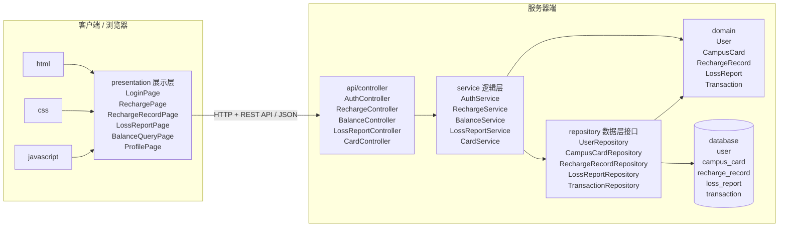

# 03 体系结构与人机交互复习讲义

整理范围：

- `PPT/03-01-软件设计基础与体系结构概念.pdf`
- `PPT/03-02-体系结构风格与设计过程.pdf`
- `PPT/03-03-体系结构设计实践与验证.pdf`
- `PPT/03-04-人机交互设计.pdf`

交叉参考：

- `Exam/2012.pdf`：分层原型、信息隐藏、数据层替换。
- `Exam/2014.pdf`：用例顺序图到设计顺序图、HCI 原则分析。
- `Exam/2016.pdf`：支付模块物理包图、展示层与逻辑层接口、逻辑层与数据层接口。
- `Exam/2020.pdf`：进销存 Web 分层物理包图、采购补货接口设计、HCI 页面点评。
- `Exam/2022.pdf`：校园卡自助系统物理包图、充值服务接口、HCI 分析。
- `Exam/2025.pdf`：Spring Boot 三层职责、Service/Repository/Controller 代码、界面截图评价。
- `Review/summary-重点.pdf`、`Review/Final_Reference.pdf`：分层风格、MVC、体系结构设计过程、HCI 原则。

说明：

- 本部分要把“图”和“代码接口”连起来。物理包图回答部署和分层，接口代码回答层间依赖，HCI 题回答用户任务和交互原则。
- Spring Boot 常见三层不是 MVC 的全部含义；MVC 从交互职责划分，Controller/Service/Repository 从后端实现职责划分。

## 二、4 个课件的主线

| 课件 | 主线 | 必会关键词 |
| --- | --- | --- |
| `03-01` 软件设计基础与体系结构概念 | 设计如何管理复杂度，体系结构由什么构成 | 关注点分离、分解、抽象、组件、连接件、配置、4+1 |
| `03-02` 体系结构风格与设计过程 | 如何选择分层、MVC 等风格并设计接口 | 分层风格、MVC、DIP、ADR、设计过程 |
| `03-03` 体系结构设计实践与验证 | 如何把用例映射到包、接口、部署和验证 | 逻辑视图、开发视图、物理视图、集成、架构坏味道 |
| `03-04` 人机交互设计 | 如何评价和改进界面 | 可用性、Fitts 定律、识别优于回忆、反馈、Nielsen |

---

# 3. 软件体系结构与人机交互

## 3.1 设计的任务

设计回答“如何实现需求”。

与需求和编程的区别：

| 阶段 | 回答问题 | 关注模型 |
| --- | --- | --- |
| 需求 | 做什么 | 用例图、概念类图 |
| 设计 | 如何组织解决方案 | 包图、组件图、接口、协作 |
| 编程 | 如何用代码实现 | 类、方法、语句、数据结构 |

设计管理复杂度的基本手段：

- 关注点分离
- 分解
- 抽象
- 模块化
- 信息隐藏

## 3.2 设计层次

### 高层设计：体系结构设计

关注整个系统结构：

- 子系统
- 分层
- 组件
- 部署节点
- 连接方式
- 技术栈约束

常用图：

- 组件图
- 部署图
- 高层包图

### 中层设计

关注包、模块、类之间如何协作。

常用图：

- 包图
- 交互图
- 设计类图

### 低层设计

关注单个类、方法、数据结构和算法。

内容：

- 属性
- 方法
- 参数
- 返回值
- 控制结构
- 异常处理

## 3.3 体系结构的组成

体系结构由三类内容构成：

- 部件或组件
- 连接件
- 配置

解释：

- 组件承担计算、存储或业务职责。
- 连接件定义组件交互方式，如方法调用、REST API、消息队列、数据库连接。
- 配置说明组件和连接件如何组合成整体系统。

体系结构决策一旦落地，修改成本高。错误的层次、错误的依赖方向和错误的部署结构会形成长期技术债。

## 3.4 4+1 视图

4+1 视图用于从多个角度描述体系结构：

- 逻辑视图：类、包、领域对象、业务职责。
- 开发视图：代码模块、工程结构、组件划分。
- 进程视图：运行时进程、线程、并发、通信。
- 物理视图：服务器、客户端、数据库、网络部署。
- 场景视图：用关键用例串联并验证前四个视图。

答题时常用写法：

> 使用场景视图验证架构是否支持核心用例；使用逻辑视图说明业务分层；使用开发视图说明代码组织；使用进程视图说明运行时并发和通信；使用物理视图说明客户端、服务器和数据库部署。

## 3.5 体系结构风格

体系结构风格定义：

- 组件词汇表
- 连接件类型
- 拓扑约束

### 分层风格

典型三层：

- 表示层
- 业务逻辑层
- 数据访问层

优点：

- 职责清晰。
- 上层不用关心下层实现细节。
- 便于替换界面、业务逻辑或数据存储。
- 便于测试和维护。

缺点：

- 层间调用带来额外开销。
- 简单功能也要穿过多层。
- 层次划分错误会导致绕层访问和依赖混乱。

### MVC

MVC 分离：

- Model：数据和业务状态。
- View：界面显示。
- Controller：接收输入并协调模型和视图。

Web 项目中常见对应关系：

- Controller：处理 HTTP 请求。
- Service：执行业务逻辑。
- Repository 或 DAO：访问数据。
- Entity 或 PO：持久化对象。
- DTO 或 VO：接口传输对象或界面展示对象。

## 3.6 体系结构设计过程

课程中的过程可概括为：

1. 分析需求。
2. 选择体系结构风格。
3. 设计逻辑结构。
4. 设计接口。
5. 设计物理部署。
6. 验证体系结构。
7. 评审并迭代。

答题时不要只画图，要说明为什么选择这个结构。

示例：

> 企业信息系统强调可维护性、安全性和分工协作，适合采用分层架构。表示层处理用户交互，业务逻辑层封装业务规则，数据访问层封装持久化细节。上层依赖接口而非实现，以降低层间耦合。

## 3.7 接口与依赖倒置

分层系统中要避免上层直接依赖下层实现类。

推荐结构：

- `service` 包声明业务接口。
- `service.impl` 包提供业务实现。
- `repository` 包声明数据访问接口。
- `repository.impl` 包提供数据访问实现。
- Controller 依赖 Service 接口。
- Service 实现依赖 Repository 接口。

依赖倒置原则：

- 高层模块不依赖低层模块，二者都依赖抽象。
- 抽象不依赖细节，细节依赖抽象。

考试代码题重点：

- 写出接口所在包名。
- Controller 中通过构造器注入 Service。
- ServiceImpl 中通过构造器注入 Repository。
- Controller 不直接访问 Repository。

## 3.8 体系结构验证

验证关注：

- 核心用例是否能穿过架构完成。
- 层间依赖方向是否正确。
- 接口是否稳定。
- 质量属性是否得到支撑。
- 部署结构是否满足性能、安全和可靠性要求。
- 是否存在架构坏味道。

常见架构坏味道：

- 上层绕过业务层直接访问数据库。
- 所有业务逻辑堆在 Controller。
- Service 只有转发，没有业务职责。
- Repository 混入业务规则。
- 包之间循环依赖。
- 共享全局状态过多。

---

## 3.9 人机交互设计

人机交互关注用户、任务、界面和系统反馈之间的关系。

可用性属性：

- 易学性
- 效率
- 易记性
- 错误率与恢复能力
- 满意度

易学性和效率存在取舍。新手需要清晰入口和提示，熟练用户需要快捷键、批量操作和命令式能力。

## 3.10 人的认知特点

设计原则：

- 识别优于回忆。
- 图形信息在很多场景下比纯文本更易识别。
- GUI 通过菜单、按钮和图标降低记忆负担。
- CLI 对专家高效，但学习成本高。

## 3.11 Fitts 定律

Fitts 定律说明：

- 目标越近，操作越快。
- 目标越大，操作越快。
- 屏幕边缘和角落更容易命中。

设计推论：

- 高频按钮要放在易触达位置。
- 危险按钮与常用按钮要保持距离。
- 小图标按钮需要足够点击区域。

## 3.12 用户类型

- 新手：需要清晰导航、提示和容错。
- 中级用户：需要稳定流程和效率提升。
- 专家：需要快捷键、批处理和可配置操作。

好的界面同时服务不同熟练度用户：入口清楚，操作路径短，反馈及时，并提供快捷方式。

## 3.13 直接操纵

直接操纵的特点：

- 对象可见。
- 操作可逆。
- 反馈即时。
- 用户有控制感。

优势：

- 学习时间短。
- 错误易发现。
- 用户满意度高。

需要处理的问题：

- 界面隐喻要符合用户心智模型。
- 操作对象和系统状态要清晰。
- 复杂系统需要良好导航结构。

## 3.14 导航与反馈

导航设计：

- 全局结构：用户知道自己在哪里、能去哪。
- 局部结构：当前任务内的步骤清楚。
- 按任务模型组织，而不是按技术模块组织。

反馈时间：

- 键盘、鼠标、光标反馈要非常快。
- 简单频繁任务在约 1 秒内给出响应。
- 更长操作要显示进度、状态或队列。

## 3.15 黄金规则与 Nielsen 启发式

三条黄金规则：

- 用户控制。
- 减少记忆负担。
- 保持一致。

Nielsen 十项启发式：

1. 系统状态可见。
2. 系统与现实世界匹配。
3. 用户控制和自由。
4. 一致性和标准。
5. 错误预防。
6. 识别优于回忆。
7. 灵活性和效率。
8. 美学和极简设计。
9. 帮助用户识别、诊断和恢复错误。
10. 帮助和文档。

## 3.16 HCI 设计过程与评估

常用过程：

1. 理解用户和任务。
2. 建立界面概念模型。
3. 绘制线框图。
4. 制作低保真原型。
5. 用户测试。
6. 制作高保真原型。
7. 可用性评估。
8. 实现并迭代。

评估方法：

- 启发式评估
- 用户测试
- Think-aloud
- A/B 测试
- 眼动分析

AI 交互设计补充：

- 显示 AI 的计划和依据。
- 允许用户确认、撤销和覆盖。
- 保留审计日志。
- 在失败时给出可恢复路径。
- 通过逐步授权建立信任。

---

# 对应考试模板

## 7.1 分层接口代码模板

题型：

> 给定某个情境，写出 Service 接口声明、Repository 方法声明、Controller 调用 Service 的代码片段，并体现依赖注入。

作答要求：

- 写包名。
- 写接口。
- 写构造器注入。
- Controller 调用 Service。
- ServiceImpl 调用 Repository。
- Controller 不直接调用 Repository。

示例：校园卡充值

```java
package edu.school.card.service;

import java.math.BigDecimal;
import java.util.List;

public interface RechargeService {
    RechargeResult recharge(RechargeCommand command);

    List<RechargeRecordView> findRechargeRecords(String cardNo);
}
```

```java
package edu.school.card.repository;

import java.util.List;
import java.util.Optional;

public interface CampusCardRepository {
    Optional<CampusCard> findByCardNo(String cardNo);

    void save(CampusCard campusCard);
}
```

```java
package edu.school.card.repository;

import java.util.List;

public interface RechargeRecordRepository {
    void save(RechargeRecord rechargeRecord);

    List<RechargeRecord> findByCardNo(String cardNo);
}
```

```java
package edu.school.card.controller;

import edu.school.card.service.RechargeCommand;
import edu.school.card.service.RechargeResult;
import edu.school.card.service.RechargeService;
import edu.school.card.service.RechargeRecordView;
import java.util.List;
import org.springframework.web.bind.annotation.GetMapping;
import org.springframework.web.bind.annotation.PathVariable;
import org.springframework.web.bind.annotation.PostMapping;
import org.springframework.web.bind.annotation.RequestBody;
import org.springframework.web.bind.annotation.RequestMapping;
import org.springframework.web.bind.annotation.RestController;

@RestController
@RequestMapping("/api/recharges")
public class RechargeController {
    private final RechargeService rechargeService;

    public RechargeController(RechargeService rechargeService) {
        this.rechargeService = rechargeService;
    }

    @PostMapping
    public RechargeResult recharge(@RequestBody RechargeCommand command) {
        return rechargeService.recharge(command);
    }

    @GetMapping("/cards/{cardNo}")
    public List<RechargeRecordView> findRechargeRecords(
            @PathVariable String cardNo) {
        return rechargeService.findRechargeRecords(cardNo);
    }
}
```

```java
package edu.school.card.service.impl;

import edu.school.card.repository.CampusCardRepository;
import edu.school.card.repository.RechargeRecordRepository;
import edu.school.card.service.RechargeCommand;
import edu.school.card.service.RechargeRecordView;
import edu.school.card.service.RechargeResult;
import edu.school.card.service.RechargeService;
import java.util.List;

public class RechargeServiceImpl implements RechargeService {
    private final CampusCardRepository campusCardRepository;
    private final RechargeRecordRepository rechargeRecordRepository;

    public RechargeServiceImpl(
            CampusCardRepository campusCardRepository,
            RechargeRecordRepository rechargeRecordRepository) {
        this.campusCardRepository = campusCardRepository;
        this.rechargeRecordRepository = rechargeRecordRepository;
    }

    @Override
    public RechargeResult recharge(RechargeCommand command) {
        CampusCard card = campusCardRepository.findByCardNo(command.cardNo())
                .orElseThrow(CardNotFoundException::new);
        card.recharge(command.amount());
        RechargeRecord record = RechargeRecord.success(
                command.cardNo(),
                command.amount());
        campusCardRepository.save(card);
        rechargeRecordRepository.save(record);
        return RechargeResult.success(record.id());
    }

    @Override
    public List<RechargeRecordView> findRechargeRecords(String cardNo) {
        return rechargeRecordRepository.findByCardNo(cardNo).stream()
                .map(RechargeRecordView::from)
                .toList();
    }
}
```

答题说明：

- `controller` 是表示层入口。
- `service` 是表示层与逻辑层之间的接口。
- `repository` 是逻辑层与数据层之间的接口。
- 构造器注入体现依赖注入。
- 代码里出现的 DTO、Entity 和异常类可以只声明名称，重点是层间依赖方向。

## 7.2 校园卡自助系统物理包图图示版

题型：

> 画出校园卡自助系统物理包图。分为客户端和服务器端，体现分层概念，包含所有模块。三包和展示层在客户端，逻辑层和数据层在服务器端，使用 HTTP 通信和 REST API。

考试作图要素：

- 客户端节点。
- 服务器端节点。
- 客户端包含 HTML、CSS、JavaScript 三包。
- 展示层在客户端。
- 逻辑层和数据层在服务器端。
- 客户端与服务器通过 HTTP 通信。
- 通信接口是 REST API。
- 服务器端内部体现 Controller、Service、Repository、数据库。

图示答案：

<!-- LATEX_DIAGRAM: campus-card-package -->



依赖方向：

```text
presentation -> api -> service -> repository -> database
service.impl -> domain
repository.impl -> domain
```

图上必须体现：

```text
Client.presentation -- HTTP + REST API --> Server.api
```

阅卷点：

- “三包”写成 `html`、`css`、`javascript`，并放在客户端。
- 展示层放在客户端，逻辑层和数据层放在服务器端。
- 不能把数据库画到客户端。
- 跨网络连线必须标注 `HTTP` 和 `REST API`。
- 功能模块要覆盖认证、充值、余额查询、挂失、卡片信息、交易或消费记录。

## 7.3 充值服务接口题模板

题型：

> 针对充值服务，包括充值、查询充值记录，写出展示层和逻辑层之间接口，以及逻辑层和数据层之间接口。注意写出接口所在包名。

展示层和逻辑层之间接口：

```java
package edu.school.card.service;

import java.util.List;

public interface RechargeService {
    RechargeResult recharge(RechargeCommand command);

    List<RechargeRecordView> findRechargeRecords(String cardNo);
}
```

逻辑层和数据层之间接口：

```java
package edu.school.card.repository;

import java.util.Optional;

public interface CampusCardRepository {
    Optional<CampusCard> findByCardNo(String cardNo);

    void save(CampusCard campusCard);
}
```

```java
package edu.school.card.repository;

import java.util.List;

public interface RechargeRecordRepository {
    void save(RechargeRecord rechargeRecord);

    List<RechargeRecord> findByCardNo(String cardNo);
}
```

DTO 示例：

```java
package edu.school.card.service;

import java.math.BigDecimal;

public record RechargeCommand(String cardNo, BigDecimal amount, String payChannel) {
}
```

```java
package edu.school.card.service;

public record RechargeResult(String recordId, String status, String message) {
}
```

```java
package edu.school.card.service;

import java.math.BigDecimal;
import java.time.LocalDateTime;

public record RechargeRecordView(
        String recordId,
        String cardNo,
        BigDecimal amount,
        String status,
        LocalDateTime createdAt) {
}
```

答题解释：

- `RechargeService` 是展示层调用逻辑层的接口。
- `CampusCardRepository` 和 `RechargeRecordRepository` 是逻辑层调用数据层的接口。
- `RechargeService` 不暴露数据库表结构。
- `Repository` 不处理充值业务规则，只负责数据读取和保存。

## 7.11 HCI 题模板

题目要求评价界面：

```text
问题：充值按钮太小且远离金额输入区域。
原则：违反 Fitts 定律和效率原则。
影响：用户完成高频充值操作的时间增加，误触风险上升。
改进：增大按钮点击区域，把提交按钮放在金额输入区域附近，并对危险操作使用确认反馈。
```

题目要求设计反馈：

```text
充值提交后，系统立即显示处理中状态；
支付成功后显示余额变化和充值记录编号；
支付失败时显示失败原因和重试入口；
长时间等待时显示进度或可取消操作。
```

---

# 高频考点展开

## MVC 与后端三层的区别

MVC 从用户交互角度划分职责：

- Model：业务数据、业务状态和业务规则。
- View：界面显示。
- Controller：接收输入并协调 Model 和 View。

后端三层从代码实现角度划分职责：

- Controller：HTTP 请求入口，解析参数，调用服务。
- Service：业务逻辑和事务边界。
- Repository、DAO 或 Mapper：数据访问。

在 Spring Boot 中，`Service + Repository + Entity + DTO` 属于广义 Model 的实现内容。不要把 Mapper 直接等同于 MVC 的 Model；Mapper 只是数据访问部分。

## 物理包图答题清单

画 Web 系统物理包图时必须体现：

1. 客户端节点和服务器端节点。
2. 客户端有 `html`、`css`、`javascript` 三包。
3. 展示层在客户端。
4. 服务器端有 API、Service、Repository、Domain、Database。
5. 客户端和服务器通过 HTTP 通信。
6. API 采用 REST 风格。
7. 依赖方向是展示层到 API，再到 Service，再到 Repository，再到数据库。

简化作图模板：

```text
Client
  html
  css
  javascript
  presentation

Client.presentation --HTTP/REST API--> Server.api

Server
  api
  service
  service.impl
  repository
  repository.impl
  domain
  database
```

## Service 与 Repository 接口分布

考试写接口时，先声明包：

- `service` 包：展示层调用逻辑层。
- `service.impl` 包：业务实现。
- `repository` 包：逻辑层调用数据层。
- `repository.impl` 包：数据访问实现。

依赖规则：

- Controller 只依赖 Service 接口。
- ServiceImpl 只依赖 Repository 接口。
- Repository 不写业务规则。
- Controller 不直接访问数据库。

## 4+1 视图答题方式

| 视图 | 答题内容 |
| --- | --- |
| 逻辑视图 | 类、包、业务职责、领域结构 |
| 开发视图 | 工程目录、模块、组件、依赖 |
| 进程视图 | 线程、进程、并发、异步任务 |
| 物理视图 | 客户端、服务器、数据库、网络部署 |
| 场景视图 | 用核心用例验证前四个视图 |

如果题目问“如何验证架构”，答核心用例穿透、层间依赖检查、接口稳定性、质量属性场景、集成测试和架构评审。

## HCI 评价答题结构

界面评价不要只说“好看”或“不好看”，按下面结构写：

```text
现象：说明界面中看到的具体设计。
原则：对应 HCI 原则。
影响：说明对用户任务的影响。
改进：给出可执行修改。
```

常用原则：

- Fitts 定律：目标越大、越近，操作越快。
- 识别优于回忆：菜单、图标、历史记录能减轻记忆负担。
- 一致性：同类操作位置、颜色和交互保持一致。
- 反馈：操作后立即显示状态、结果或进度。
- 错误预防：危险操作提供确认、撤销或约束输入。
- 用户控制：允许取消、返回、撤销和修改。

# 自测题与答案

## 题 1：体系结构由哪三部分组成？

答案：

体系结构由组件、连接件和配置组成。组件承担计算、存储或业务职责；连接件定义组件之间的交互方式，如方法调用、REST API、消息队列；配置说明组件和连接件如何组合成整体系统。

## 题 2：为什么分层架构适合企业信息系统？

答案：

企业信息系统功能多、生命周期长、人员分工明显。分层架构把表示、业务逻辑和数据访问分开，使界面变化不直接影响业务规则，数据库变化不直接影响 Controller，便于维护、测试、复用和权限控制。

## 题 3：REST API 在物理包图里怎么体现？

答案：

在客户端展示层和服务器端 API 包之间画跨网络连接，标注 `HTTP/REST API`。客户端包包含 `html`、`css`、`javascript`，服务器端包包含 `api`、`service`、`repository` 和 `database`。

## 题 4：Controller、Service、Repository 的职责是什么？

答案：

Controller 接收 HTTP 请求、解析输入、调用 Service 并返回响应；Service 封装业务流程、业务规则和事务边界；Repository 封装数据读取和保存，不处理业务规则。

## 题 5：Fitts 定律对按钮设计有什么启发？

答案：

高频按钮要更大并靠近用户当前操作区域；危险按钮要和常用按钮保持距离；图标按钮要保证足够点击面积；移动端底部和边缘位置要结合拇指可达性设计。

## 题 6：AI 交互界面为什么要有人类确认和撤销？

答案：

AI 输出存在错误和不符合上下文的风险。显示计划、允许确认、支持撤销和保留日志，可以让用户保持控制权，降低误操作影响，并提升可审计性。

---

# 快速背诵清单

## 体系结构

- 架构 = 组件 + 连接件 + 配置。
- 4+1：逻辑、开发、进程、物理、场景。
- 分层：表示层、业务逻辑层、数据访问层。
- 依赖倒置：上层依赖接口，不依赖实现。

## HCI

- 可用性：易学、效率、易记、错误恢复、满意度。
- Fitts：目标越近越大，操作越快。
- 识别优于回忆。
- 黄金规则：用户控制、减少记忆负担、一致性。
