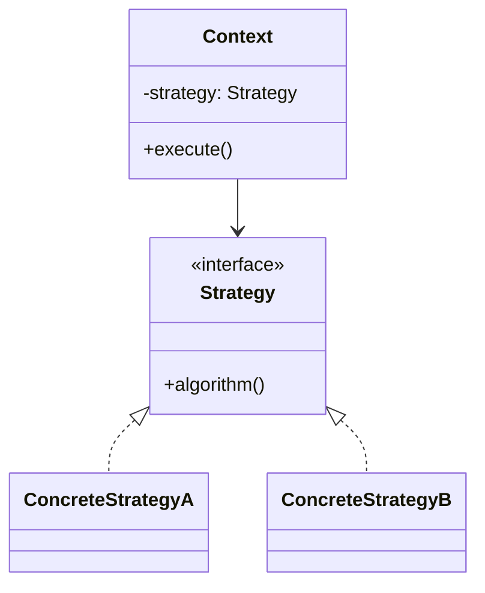

# 05 设计模式与软件构造复习讲义

整理范围：

- `PPT/设计模式.pdf`
- `PPT/代码设计.pdf`
- `PPT/软件构造.pdf`

交叉参考：

- `Exam/2012.pdf`：Singleton、防御式编程、测试驱动、团队管理。
- `Exam/2013A.pdf`：设计模式重构、表驱动、栈测试、税率代码改进。
- `Exam/2013B.pdf`：借阅者多态、有理数黑盒测试、月份天数表驱动。
- `Exam/2014.pdf`：Observer 模式、HCI、白盒与黑盒测试。
- `Exam/2016.pdf`：会员等级积分策略、表驱动、黑盒测试。
- `Exam/2020.pdf`：DAO 设计模式、订货规则代码质量、边界值测试。
- `Exam/2022.pdf`：优惠券和支付方式模式、`doPost` 构造分析、条件覆盖。
- `Exam/2025.pdf`：策略模式、坏代码改写、圈复杂度、分支覆盖。
- `Review/summary-重点.pdf`、`Review/Final_Reference.pdf`：Strategy、Abstract Factory、Iterator、代码质量、重构、测试。

说明：

- 设计模式题要写“问题、模式、类结构、原则、代价”，不能只写模式名。
- 构造题要从命名、布局、控制结构、异常处理、职责、测试和重构多个角度分析。

## 二、3 个课件的主线

| 课件 | 主线 | 必会关键词 |
| --- | --- | --- |
| `设计模式` | 用稳定抽象隔离变化点 | Strategy、Abstract Factory、Factory Method、Singleton、Iterator |
| `代码设计` | 写出可读、可维护、可审查的代码 | 命名、布局、注释、Javadoc、Prompt 四要素 |
| `软件构造` | 从设计到可运行制品的工程活动 | 编码、单元测试、集成测试、调试、代码审查、重构、TDD |

---

# 5. 设计模式

## 5.1 设计模式的构成

一个设计模式通常包含：

- 名称
- 问题
- 解决方案
- 应用场景
- 注意事项

模式不是为了“套模板”，而是把稳定抽象和变化点分开。

## 5.2 Strategy 策略模式

定义：

> 定义一组算法，把每个算法封装起来，并让它们可以互换，使算法变化独立于使用算法的客户。

结构：

- Context：持有 Strategy。
- Strategy：算法接口。
- ConcreteStrategy：具体算法。

类图：

<!-- LATEX_DIAGRAM: strategy-pattern-class -->



适用场景：

- 同一业务存在多种算法。
- 需要运行时切换算法。
- 代码中存在大量按类型分支选择行为。

例子：充值手续费策略

```java
public interface FeeStrategy {
    BigDecimal calculateFee(BigDecimal amount);
}

public class BankCardFeeStrategy implements FeeStrategy {
    public BigDecimal calculateFee(BigDecimal amount) {
        return amount.multiply(new BigDecimal("0.005"));
    }
}

public class AlipayFeeStrategy implements FeeStrategy {
    public BigDecimal calculateFee(BigDecimal amount) {
        return BigDecimal.ZERO;
    }
}
```

Context：

```java
public class RechargeServiceImpl implements RechargeService {
    private final FeeStrategy feeStrategy;

    public RechargeServiceImpl(FeeStrategy feeStrategy) {
        this.feeStrategy = feeStrategy;
    }

    public void recharge(BigDecimal amount) {
        BigDecimal fee = feeStrategy.calculateFee(amount);
        // 执行业务流程
    }
}
```

优点：

- 消除复杂条件分支。
- 新增算法时新增策略类。
- 符合 OCP。

代价：

- 类数量增加。
- 客户端需要选择策略。
- Strategy 与 Context 之间需要约定输入输出。

## 5.3 Abstract Factory 抽象工厂

定义：

> 提供一个创建一组相关或相互依赖对象的接口，而不指定它们的具体类。

结构：

- AbstractFactory
- ConcreteFactory
- AbstractProduct
- ConcreteProduct
- Client

适用场景：

- 系统需要创建一组相关产品。
- 产品族需要整体替换。
- 客户端不应依赖具体产品类。

例子：不同平台 UI 组件族

```java
public interface UIFactory {
    Button createButton();
    Dialog createDialog();
}

public class WebUIFactory implements UIFactory {
    public Button createButton() {
        return new WebButton();
    }

    public Dialog createDialog() {
        return new WebDialog();
    }
}
```

优点：

- 保证同一产品族一起使用。
- 客户端依赖抽象。
- 切换产品族集中在工厂。

缺点：

- 新增产品种类会修改工厂接口。
- 产品族稳定时效果最好。

## 5.4 Factory Method 工厂方法

定义：

> 父类定义创建对象的接口，由子类决定实例化哪一个具体类。

适用场景：

- 父类无法提前确定要创建的具体对象。
- 创建逻辑要延迟到子类。

与抽象工厂区别：

- 工厂方法关注创建一个产品。
- 抽象工厂关注创建一组相关产品。

## 5.5 Singleton 单例

定义：

> 保证一个类只有一个实例，并提供全局访问点。

使用时要谨慎：

- 单例容易形成全局状态。
- 会增加隐式耦合。
- 测试替换不方便。

适合：

- 无状态工具入口。
- 全局唯一资源管理器。
- 配置对象。

不适合：

- 承载业务状态。
- 替代依赖注入。

## 5.6 Iterator 迭代器

定义：

> 在不暴露聚合对象内部表示的前提下，顺序访问其中元素。

结构：

- Iterator
- ConcreteIterator
- Aggregate
- ConcreteAggregate

优点：

- 隐藏集合内部结构。
- 简化聚合对象接口。
- 支持多种遍历方式。
- 支持多个遍历同时进行。

例子：

客户端使用迭代器遍历充值记录，不关心底层是数组、链表、数据库游标还是分页结果。

---

# 6. 代码设计与软件构造

## 6.1 代码设计关注点

代码设计关注可读性、可维护性和可验证性。

主要内容：

- 布局
- 命名
- 注释
- Javadoc
- 小任务拆分
- 复杂决策表达
- 数据使用
- 显式依赖
- 断言

## 6.2 布局

原则：

- 缩进表达逻辑层级。
- 空行分隔不同语义块。
- 长表达式拆行。
- 相似语句对齐。
- 复杂控制结构保持清楚。

坏布局会让正确代码难以审查。

## 6.3 命名

命名要求：

- 表达含义。
- 与领域术语一致。
- 避免误导。
- 避免无意义缩写。
- 避免过长。

Java 约定：

- 包名：小写单词。
- 类名和接口名：PascalCase。
- 变量和方法：camelCase。
- 常量：大写字母加下划线。

语义规则：

- 类、属性、数据对象用名词。
- 接口可用名词或形容词。
- 方法用动词或动词加名词。

示例：

- `RechargeService`
- `CampusCardRepository`
- `findRechargeRecordsByCardNo`
- `MAX_RECHARGE_AMOUNT`

## 6.4 注释与 Javadoc

Java 注释：

- `//`：单行注释。
- `/* */`：普通块注释。
- `/** */`：文档注释。

Javadoc 常用标签：

- `@author`
- `@version`
- `@see`
- `@since`
- `@deprecated`
- `@param`
- `@return`
- `@throws`

注释原则：

- 解释意图、约束和不直观决策。
- 不重复代码表面含义。
- 公共 API 要说明参数、返回值和异常。

## 6.5 AI 代码生成 Prompt

四个元素：

- Context：上下文。
- Goal：目标。
- Format：输出格式。
- Steps：步骤。

示例：

```text
Context:
项目使用 Spring Boot，分层为 controller/service/repository。

Goal:
实现校园卡充值服务接口和实现类。

Format:
输出 Java 接口、实现类和单元测试。

Steps:
先定义 DTO，再定义 Service 接口，再写实现逻辑，最后写测试。
```

## 6.6 软件构造

SWEBOK 中软件构造覆盖：

- 编码
- 验证
- 单元测试
- 集成测试
- 调试

构造不是“写代码”一个动作，而是把设计转化为可运行、可验证、可维护的软件制品。

## 6.7 构造技术

主要技术：

- 可理解的源代码
- 类、枚举、变量、常量
- 控制结构
- 错误处理
- 代码级安全
- 单元测试
- 集成测试
- 调试

## 6.8 代码审查

课程给出的审查经验：

- 每次审查少于 200 到 400 行代码。
- 审查速度控制在每小时 300 到 500 行。
- 单次审查时间控制在 60 到 90 分钟。
- 开发者先对代码做注解。
- 使用检查表。
- 确认缺陷已修复。
- 保持积极的审查文化。
- 借助工具支持轻量化审查。

AI 辅助代码审查适合：

- 识别坏味道。
- 检查安全问题。
- 检查风格问题。
- 发现遗漏测试。

最终结论要由人结合需求、设计和上下文确认。

## 6.9 集成与构建

集成策略：

- 大爆炸集成：一次性集成所有模块。
- 增量集成：逐步集成并验证模块。

增量集成更利于定位问题和控制风险。

构建：

> 将源代码、资源、配置和依赖转化为可执行或可部署制品。

构建依赖配置管理：

- 版本一致。
- 依赖可追踪。
- 构建脚本受控。
- 发布制品可复现。

## 6.10 构造管理

构造管理内容：

- 分配构造任务。
- 跟踪代码进度。
- 度量复杂度。
- 度量代码行数。
- 度量注释比例。
- 管理分支、合并和发布。
- 执行代码审查和测试门禁。

## 6.11 坏味道与重构

重构定义：

> 在不改变软件外部行为的前提下，改善内部结构。

常见坏味道：

- 重复代码。
- 长方法。
- 大类。
- 长参数列表。
- Magic Number 或 Magic String。
- 空 catch。
- 过多注释。
- 某个类过度访问其他类属性。
- Switch 或 if-else 按类型分发行为。

对应改进：

| 坏味道 | 问题 | 重构 |
| --- | --- | --- |
| 重复代码 | 隐式耦合 | 提取方法或提取类 |
| 长方法 | 难理解、难测试 | 提取方法 |
| 大类 | 职责过多 | 提取类、按职责拆分 |
| 长参数列表 | 调用复杂 | 引入参数对象 |
| Magic Number | 含义不清 | 提取常量 |
| 空 catch | 吞掉错误 | 记录日志或抛出业务异常 |
| 过多注释 | 结构表达力不足 | 改名、拆分、重组逻辑 |
| 过度访问其他类属性 | 职责位置错误 | 移动方法或委托 |
| 类型分支 | 违反 OCP | 策略模式或多态 |

## 6.12 TDD

TDD 循环：

1. Red：先写失败测试。
2. Green：写最少代码让测试通过。
3. Refactor：在测试保护下重构。

适合：

- 规则明确的业务逻辑。
- 算法。
- 服务层。
- 状态迁移。

## 6.13 AI 编程原则

使用 AI 写代码时：

- 明确意图。
- 逐步细化。
- 保持对代码的理解。
- 先定义测试或验收标准。
- 经过验证后再提交。

不能把 AI 输出直接当作正确实现。需要用需求、设计、测试和代码审查约束它。

---

# 对应考试模板

## 7.9 设计模式题模板

题目出现大量按类型选择算法：

```text
if (payType.equals("BANK")) { ... }
else if (payType.equals("ALIPAY")) { ... }
else if (payType.equals("WECHAT")) { ... }
```

答：

- 使用 Strategy。
- 抽象 `PaymentStrategy`。
- 每种支付方式一个具体策略。
- `RechargeService` 依赖 `PaymentStrategy` 或策略工厂。
- 新增支付方式时新增策略类，减少修改原业务流程。

题目出现一组相关产品整体替换：

- 使用 Abstract Factory。
- 抽象产品和抽象工厂。
- 具体工厂创建同一产品族。

题目要求隐藏集合结构：

- 使用 Iterator。
- 客户端通过迭代器访问元素。

## 7.10 代码质量题模板

答题结构：

```text
问题：
违反原则：
影响：
重构：
测试：
```

示例：

```text
问题：充值方法过长，同时处理参数校验、支付调用、余额更新、记录保存和异常处理。
违反原则：SRP、SOFA。
影响：代码难理解、难测试、修改支付逻辑会影响余额更新逻辑。
重构：提取校验方法、支付网关、余额更新方法和记录保存方法；支付方式变化使用 Strategy。
测试：为正常充值、支付失败、校园卡挂失、金额非法分别编写单元测试。
```

---

# 高频考点展开

## Strategy 策略模式答题模板

使用场景：

- 同一业务存在多种算法。
- 算法需要运行时切换。
- 代码中存在 `if-else` 或 `switch` 按类型选择行为。

标准结构：

```text
Context 持有 Strategy
Strategy 定义算法接口
ConcreteStrategy 实现具体算法
```

原则：

- OCP：新增策略时新增类，不修改原算法选择代码。
- DIP：Context 依赖 Strategy 抽象。
- SRP：每个策略只负责一种算法。

代价：

- 类数量增加。
- 调用方需要选择策略。
- Strategy 和 Context 之间要有稳定的数据接口。

## Abstract Factory 与 Factory Method

| 模式 | 解决问题 | 关键词 |
| --- | --- | --- |
| Factory Method | 创建一个产品，把实例化延迟到子类 | 一个产品、子类决定 |
| Abstract Factory | 创建一组相关产品，保证产品族一致 | 产品族、整体替换 |

题目出现“数据库从 MySQL 换成 SQL Server”，DAO 层可以用抽象工厂或工厂方法组织创建；业务层依赖 DAO 接口，具体 DAO 由工厂提供。

## Singleton 使用边界

Singleton 解决全局唯一对象问题，但会带来全局状态和隐式耦合。

适合：

- 无状态配置入口。
- 全局唯一资源管理器。
- 需要集中访问的只读服务。

不适合：

- 保存业务状态。
- 替代依赖注入。
- 隐藏可变共享数据。

## 表驱动改写

表驱动适合替换大量规则分支。例：月份天数。

```java
private static final int[] DAYS = {
        0, 31, 28, 31, 30, 31, 30,
        31, 31, 30, 31, 30, 31
};

public int getMonthDays(int month) {
    if (month < 1 || month > 12) {
        throw new IllegalArgumentException("invalid month");
    }
    return DAYS[month];
}
```

优点：

- 规则集中。
- 分支减少。
- 可读性提高。
- 修改规则时只改表。

## 构造题分析清单

看到代码题，按下面角度写：

- 命名：是否表达业务含义。
- 布局：是否易读。
- 常量：是否有 magic number。
- 分支：是否冗长或重复。
- 异常：是否吞掉错误。
- 职责：方法是否过长、类是否过大。
- 耦合：是否直接访问内部结构。
- 测试：是否覆盖边界和异常。

## 圈复杂度与覆盖

圈复杂度常用计算：

```text
V(G) = 判定节点数 + 1
```

覆盖类型：

- 语句覆盖：每条语句至少执行一次。
- 分支覆盖：每个判定的真分支和假分支至少执行一次。
- 条件覆盖：每个基本条件的真值和假值至少出现一次。
- 路径覆盖：覆盖独立路径，成本最高。

Review 高频测试框架：

| 类别 | 重点 |
| --- | --- |
| 单元测试 | 测单个类或方法，常用白盒覆盖和 Mock。 |
| 集成测试 | 测模块协作，关注接口、数据传递和外部依赖替身。 |
| 系统测试 | 把软件作为整体，对照 SRS 验证功能和质量属性。 |
| 验收测试 | 对照用户需求和验收标准，确认用户目标是否满足。 |
| 回归测试 | 变更后重新执行测试，确认旧功能未被破坏。 |

黑盒测试基于规格，不看内部代码，常用等价类划分、边界值分析、决策表、状态转换。白盒测试基于代码结构，常用语句覆盖、分支覆盖、条件覆盖、路径覆盖。题目给出复杂条件和要求“每个判断结果都满足一次”时，按条件覆盖或分支覆盖设计用例。

# 自测题与答案

## 题 1：支付方式未来会增加，用什么模式？

答案：

使用 Strategy。定义 `PaymentStrategy`，微信、支付宝、银行卡分别实现该接口，充值服务依赖 `PaymentStrategy`。新增支付方式时新增策略类，减少修改原有业务流程，符合 OCP 和 DIP。

## 题 2：优惠券有固定金额折扣和比例折扣，用什么模式？

答案：

使用 Strategy。定义 `CouponPolicy` 或 `DiscountStrategy`，固定金额折扣和比例折扣分别实现计算方法。订单或充值上下文调用策略计算优惠金额。

## 题 3：如何评价一段命名为 `aa(int aa)` 的订货规则代码？

答案：

问题包括命名无意义、magic number 多、分支重复、边界条件不清、缺少非法输入处理、可读性差、测试困难。改进方式是使用有意义命名、提取常量或规则表、明确边界、对非法输入抛异常，并补边界值测试。

## 题 4：什么是重构？

答案：

重构是在不改变软件外部行为的前提下改善内部结构。重构目标是提升可读性、可维护性、可测试性和扩展性。重构前后要用测试保证行为不变。

## 题 5：代码审查每次为什么不宜太大？

答案：

审查行数过多会降低注意力和缺陷发现率。课程建议每次审查少于 200 到 400 行，速度控制在每小时 300 到 500 行，单次控制在 60 到 90 分钟，并配合检查表。

## 题 6：边界值测试如何设计？

答案：

对每个输入边界，选择边界值、刚低于边界、刚高于边界。例：订货规则边界是 3、7、10、15、20 天，测试值取 2、3、4、6、7、8、9、10、11、14、15、16、19、20、21。

---

# 快速背诵清单

## 设计模式

- Strategy：封装可互换算法。
- Abstract Factory：创建一组相关产品。
- Factory Method：子类决定创建哪个产品。
- Singleton：唯一实例和全局访问点。
- Iterator：隐藏集合内部结构并顺序访问元素。

## 构造

- 构造 = 编码 + 验证 + 单元测试 + 集成测试 + 调试。
- 代码审查要小批量、限时、用检查表。
- 重构不改变外部行为，只改善内部结构。
- TDD：Red、Green、Refactor。
